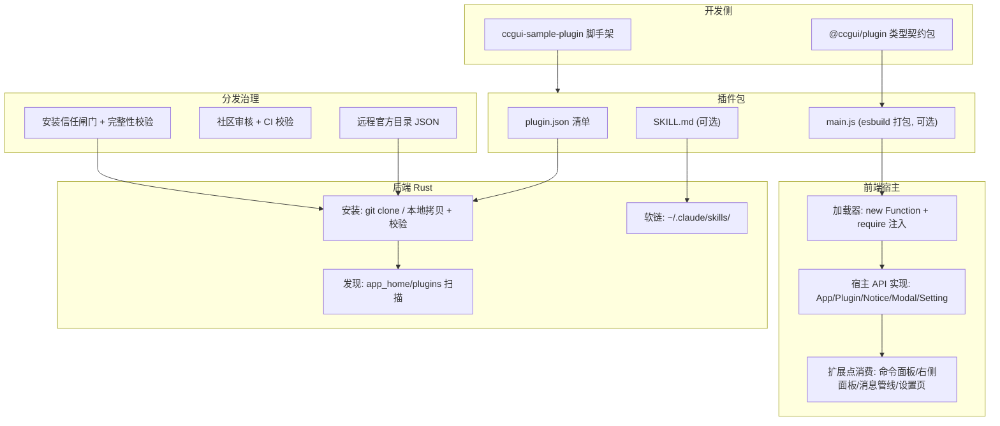

# CC GUI 插件系统技术设计文档

> **状态**：设计中 · 实施进行中
> **最后更新**：2026-07-13
> **性质**：活文档 —— 每推进一个阶段更新 §8 进度区
> **关联**：类型契约代码 `plugin-api/` · 会话任务清单 #1–#7

---

## 1. 概述

### 1.1 背景与目标

CC GUI 现有插件系统是**声明式能力挂载**模型：插件 = `plugin.json` + 资源文件，宿主提供三个固定槽位（skill / viewer / glossary），后端从不执行插件代码。它安全、简单，但**扩展性封闭**（加能力要改 Rust struct + 前端多处 switch）、**开发者体验近零**（无脚手架 / 类型 / 文档）、**无版本兼容协商**。

目标：**对标 Obsidian，建成「可执行插件 + 运行时 API + 完整周边（脚手架 / 类型包 / 文档 / 治理）」的专业插件生态。**

### 1.2 非目标

- 不搬 Obsidian 的笔记语义 API（`Editor` / `Vault` / `MarkdownView` 等）—— 平台不同。
- 不追求沙箱隔离（见 ADR-002：接受同上下文信任模型）。
- v1 不做移动端（桌面 Tauri 优先）。

### 1.3 范式转变

| 维度 | 现状（旧） | 目标（新） |
|---|---|---|
| 插件本质 | 声明式数据包 | 可执行代码（`main.js`） |
| 扩展方式 | 3 个固定槽位 | 开放运行时 API + 扩展点注册 |
| 生命周期 | 仅装 / 卸 | `onload`/`onunload` + `register*` 自动清理 |
| 版本兼容 | `manifestVersion==1` 硬闸门 | `minAppVersion` 协商 |
| 开发者体验 | 无 | 类型包 + 脚手架 + 文档 + lint |

---

## 2. 决策记录（ADR）

### ADR-001 · 采用可执行插件模型
- **决策**：插件是打包成 `main.js` 的可执行代码，在宿主里注册命令 / 视图 / 装饰器，而非声明式数据。
- **理由**：声明式封闭，第三方只能填预设槽；可执行模型让第三方造宿主没预想过的东西，是"专业生态"的前提。
- **后果**：引入无沙箱执行的安全代价（ADR-002）；现有 3 插件需重写（ADR-003）。

### ADR-002 · 信任模型：同上下文无沙箱
- **决策**：插件 JS 与宿主 React 应用**同一 JS 上下文**执行，能访问 `window` / 内部状态 / Tauri IPC；安全靠**审核 + 用户信任提示**，不做沙箱。
- **理由**：这是唯一能真正复刻 Obsidian 开发体验与 API 形态的路；Tauri 下做沙箱会让 API 全异步化、体验大打折扣。与 Obsidian 同样的权衡（也是其最大争议点）。
- **后果**：必须有安装信任闸门 + 来源完整性校验 + 目录审核（阶段 5/6）。**用户已知情接受。**

### ADR-003 · 现有 3 插件彻底切换
- **决策**：`gzh-design` / `tech-glossary` / `tech-glossary-mdn` 重写为可执行插件，下线旧 capabilities 声明式模型（A 方案，非共存过渡）。
- **理由**：用户选择彻底切换，避免长期维护两套模型。
- **后果**：阶段 3 集中迁移；旧 glossary 的宿主匹配逻辑（316 行）搬进 `tech-glossary` 插件。

### ADR-004 · API 借骨架换扩展点
- **决策**：借 Obsidian 的**平台无关骨架**（`Component` 生命周期 + `register*` / `Plugin` / `Notice` / `Modal` / `Setting` / `Command`），**扩展点换成 CC GUI 自己的**（`registerFileViewer` / `registerMessageDecorator`）。平台无关原语采用通用名（不加 `Cc` 前缀），靠 `@ccgui/plugin` 命名空间区隔。
- **理由**：通用原语用通用名降低第三方门槛；笔记语义扩展点对 AI Coding GUI 无意义，换成咱们的宿主表面。
- **后果**：契约包 `plugin-api/` 已按此落地。命名可调（若需品牌区隔加前缀）。

### ADR-005 · 运行时加载依赖 CSP unsafe-eval
- **决策**：后端读 `main.js` 文本，前端 `new Function` 执行 + 注入 `require('@ccgui/plugin')`。
- **理由**：现有 CSP 已含 `script-src 'self' 'unsafe-eval'`，eval 加载可行，**无需改 CSP / iframe / 另起 JS 引擎**。
- **后果**：插件用 esbuild 打包成 CommonJS + external `@ccgui/plugin`。

### ADR-006 · skill 保持声明式软链
- **决策**：skill 能力仍走 manifest 声明 + 后端软链进 `~/.claude/skills`，**不进 JS 运行时 API**。
- **理由**：skill 是给 Claude agent 的静态资源，不需要插件 JS 参与；不为统一而统一。
- **后果**：`main.js` 可选 —— 纯 skill 型插件可几乎无代码。

---

## 3. 整体架构



---

## 4. API 契约

事实源：`plugin-api/src/`。核心：

- **`Component`**（`component.ts`）—— 生命周期 `load/onload/unload/onunload` + `addChild` 级联卸载 + `register`/`registerDomEvent`/`registerInterval` 自动清理。
- **`Plugin extends Component`**（`plugin.ts`）—— `app`/`manifest`/`settings` + `onload` + 扩展点（`addCommand`/`addSettingTab`/`registerFileViewer`/`registerMessageDecorator`）+ `loadData`/`saveData`。
- **`App`**（`app.ts`）—— 精选宿主面：`workspace`/`files`/`notice`，**不暴露 `invoke`/`window`**。
- **UI**（`ui.ts`）—— `Notice`/`Modal`/`Setting`/`PluginSettingTab`。
- **扩展点类型**：`Command`/`FileViewerSpec`/`MessageDecorator` + 各自 Context。

分发：`package.json` `main:""`（无运行时），`types→src/index.ts`；插件 external 本包，宿主 `require` 注入真身（同 Obsidian `obsidian.d.ts` 模型）。

---

## 5. 运行时加载模型（阶段 1）

```
// 后端新增命令
plugin_read_source(id) -> main.js 文本

// 前端加载器
const module = { exports: {} };
const require = (name) => {
  if (name === '@ccgui/plugin') return hostRuntimeApi; // 注入真身
  throw new Error(`插件不可 require: ${name}`);
};
new Function('module', 'exports', 'require', code)(module, module.exports, require);
const PluginClass = module.exports.default;
const plugin = new PluginClass(app, manifest);
plugin.load();   // → onload()
// 卸载
plugin.unload(); // → register* 清理 + onunload()
```

- 插件打包约定：esbuild `--format=cjs --external:@ccgui/plugin`，`export default class extends Plugin`。
- 生命周期由宿主驱动：安装 / 启用 → `load`；停用 / 卸载 → `unload`（自动释放监听）。

---

## 6. manifest 契约与兼容协商

事实源 `plugin-api/src/manifest.ts`。要点：

- 必填：`id` / `name` / `version`（semver）/ `minAppVersion` / `description`。
- `id` 发布后**不可变**（稳定 API）；小写字母数字连字符。
- `main`：JS 入口（默认 `main.js`），可省（纯 skill）。
- `minAppVersion`：宿主安装 / 加载时比对当前 app 版本，不满足则拒绝并提示（阶段 3）。
- `skill`：静态声明，安装时软链。
- `dir`：运行时注入的安装路径。

---

## 7. 安全与信任模型

**现实（ADR-002）**：插件 JS 无沙箱、同上下文。这是已接受的权衡。

**缓解措施（阶段 6）**：
1. **安装信任闸门** —— 展示来源 + 首次安装确认 + 明确告知"此插件会在你的应用内执行代码"。
2. **来源完整性** —— git clone 记录 commit hash；manifest 存 integrity 摘要，重装比对。
3. **目录审核** —— 官方目录 + 社区提交审核 + CI 校验（manifest 字段 / id 唯一 / 版本格式）。
4. **Developer Policies** —— 禁隐藏遥测、禁远程拉码 eval、最小权限、明确披露外部服务。
5. **App 精选面** —— 鼓励插件用稳定 API 而非乱碰内部（约定，非强制）。

---

## 8. 分阶段路线图 + 进度追踪

执行顺序：**4-A → 4-B → 1 → 2 → 3 → 5 → 6**。

| 阶段 | 内容 | 状态 | 任务 |
|---|---|---|---|
| 4-A | `@ccgui/plugin` 类型契约包 | ✅ 完成（typecheck 绿） | #1 |
| 4-B | `ccgui-sample-plugin` 脚手架 | ⬜ 待开始 | #2 |
| 1 | 运行时加载器 + Plugin 基类 + hello-world | ⬜ | #3 |
| 2 | 扩展点补全（fileViewer / messageDecorator / settingTab / register* / loadData） | ⬜ | #4 |
| 3 | manifest 升级 + minAppVersion 兼容 + 3 插件切换 | ⬜ | #5 |
| 5 | 远程官方目录 + 社区审核 + CI 校验 | ⬜ | #6 |
| 6 | 安装信任闸门 + 完整性校验 + Developer Policies | ⬜ | #7 |

---

## 9. 现有 3 插件迁移方案（阶段 3）

| 插件 | 现状能力 | 迁移目标 |
|---|---|---|
| `gzh-design` | skill（公众号排版） | 保留 skill 声明式；若需排版预览，加 `registerFileViewer` + `main.js` |
| `tech-glossary` | glossary（词库） | `main.js`：`onload` 里 `registerMessageDecorator`，宿主 316 行高亮逻辑搬入 |
| `tech-glossary-mdn` | glossary（MDN 580 条） | 同上，词库数据随包 |

后端旧命令 `plugin_read_glossary` 在迁移后废弃（改由插件 `registerMessageDecorator` 消费自带词库）。
