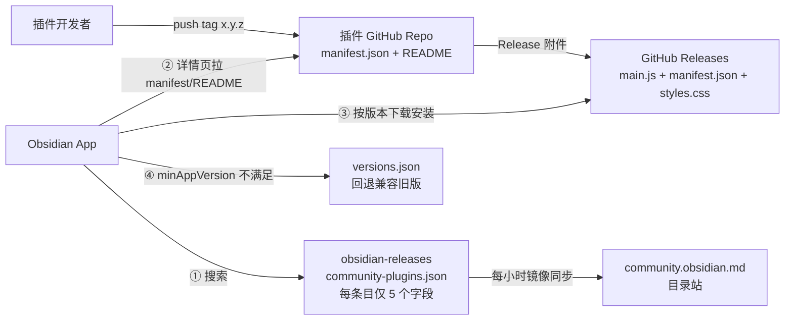
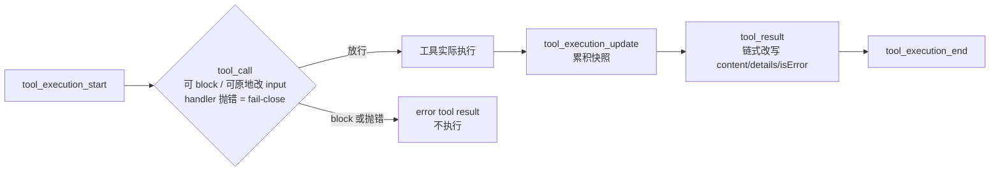
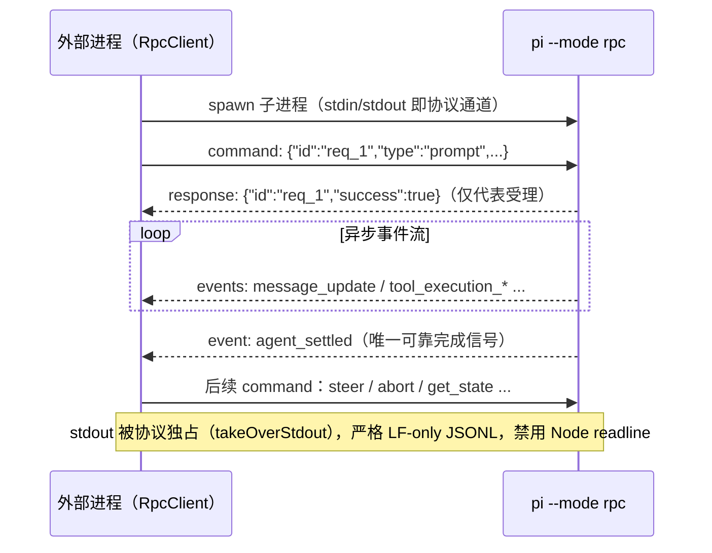
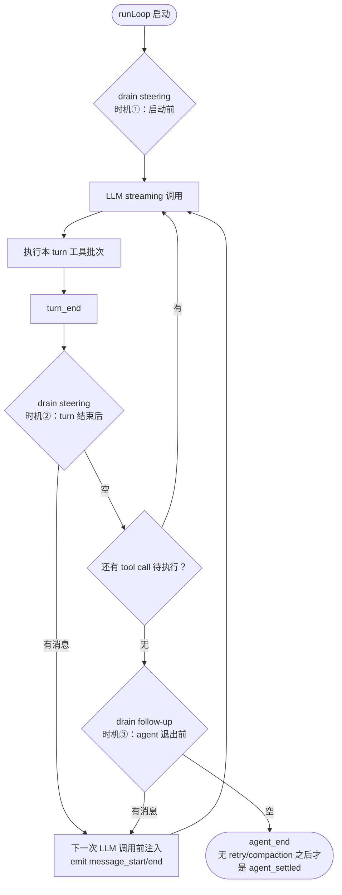
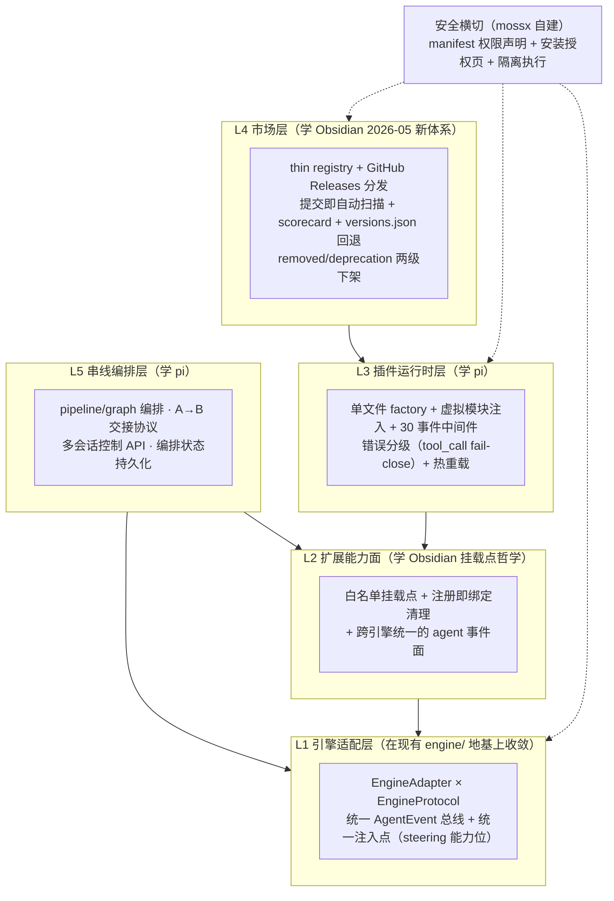
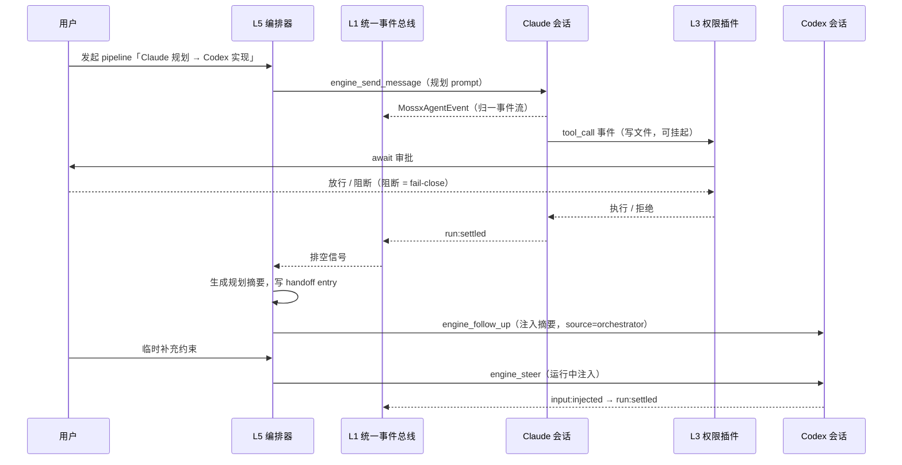
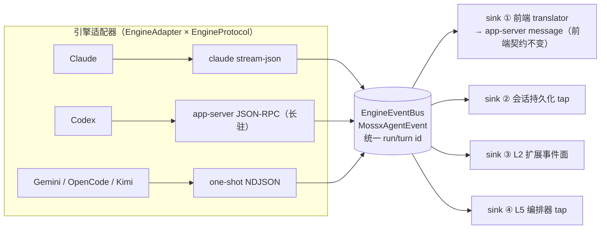
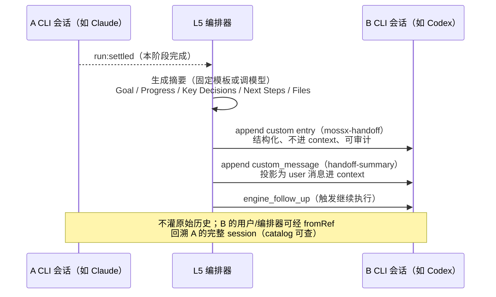
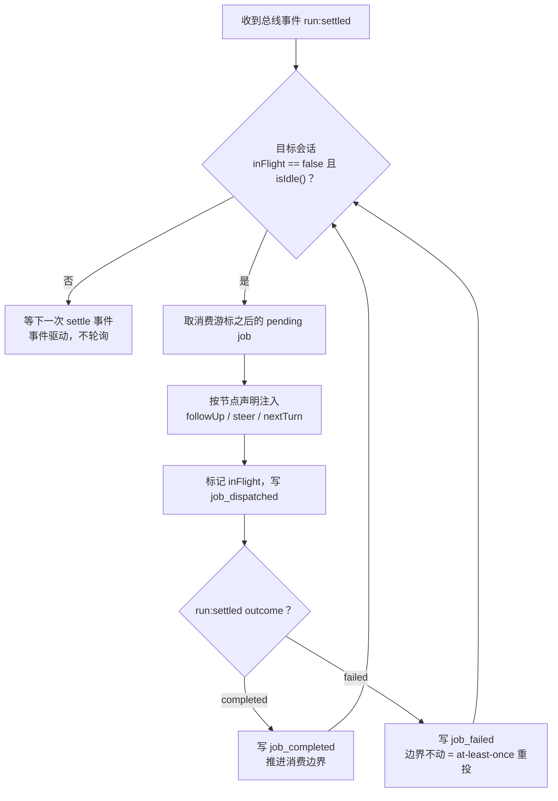
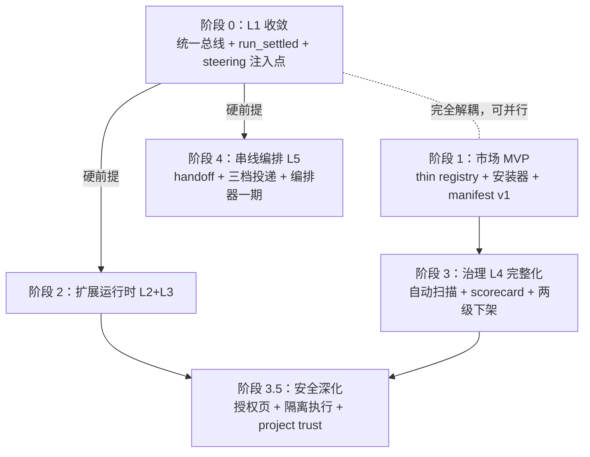

# mossx 插件市场 × 扩展体系 × CLI 基石与串线 —— 设计参考文档

> 内容类型：Exploratory RFC / industry research
> 生命周期：draft；**不是当前产品实现说明，也不是已批准 roadmap**
> 最后校准：2026-08-01 · mossx `0.7.14` · HEAD `26f8065a0c`
> 版本：第三版（合并重写），2026-07；2026-07-25 修订：补充 pi 源码仓库链接、关键章节 Mermaid 流程图/时序图与概念白话注释。
> 调研对象：
> - **Obsidian**（插件市场标杆，web 一手调研：官方仓库 / docs.obsidian.md / help.obsidian.md / 官方博客 / 论坛）
> - **pi**（源码仓库：[github.com/earendil-works/pi](https://github.com/earendil-works/pi)；earendil-works 的 agent harness，本文行号引用对应本地 checkout `/Users/chenxiangning/code/AI/github/pi`，代码级精读：monorepo，`packages/coding-agent` = CLI 主体，`packages/agent` = agent core（pi-agent-core），`packages/ai` = LLM provider 抽象层（pi-ai））
> - **mossx 自身**（`/Users/chenxiangning/code/AI/github/mossx`，引擎适配层与会话/执行现状）
>
> 本文自足：不读其他文件也能看懂。旧的五份素材文档保留在 `docs/research/` 作为附录引用（索引见附录 A）。
> 引用约定：pi / mossx 用**文件绝对路径 + 行号**；Obsidian 用 **URL**。pi 的绝对路径是 [github.com/earendil-works/pi](https://github.com/earendil-works/pi) 的本地 checkout，行号对应当前工作区版本（注意 pi 是 0.x 活跃开发仓库，行号会漂移，引用时请按符号名复核）。

---

## 零、2026-08-01 现网边界与行业时效

这是一份前瞻 RFC。mossx 当前已有 `ExtensionsView`、MCP inventory、curated skills、六引擎 registry 与 onboarding contracts，但**没有**本文设想的通用第三方 plugin runtime、权限沙箱、market registry、installer 或 review pipeline。

| 主题 | 当前事实 | 不应误读为 |
|------|----------|------------|
| Engine registry | 六个 built-in engines；`registerExternalEngine()` 仅创建受校验的 registry entry | 动态插件已能接通 Rust runtime / history / Shared |
| Extensions surface | 有 Extensions UI、MCP 与 curated-skill 管理面 | generic code plugin marketplace |
| Plugin security | 有 Tauri/host 边界可复用 | 已实现 manifest permission sandbox |
| Orchestration | 已有 Shared/collaboration/task 等相邻能力 | 本文 L1–L5 pipeline 全部落地 |

正文的外部数量、产品流程、API 与源码行号是 2026-07 调研快照。2026-08-01 已复核 Obsidian 官方《The future of plugins》入口仍可访问；任何正式立项仍须重新验证源仓库版本、license、security model、维护活跃度与供应链风险。行业方案是 design input，不是 compliance evidence。

当前 engine 集合为 Claude/Codex/Gemini/Grok/Kimi/OpenCode；正文 §mossx 现状中的「五引擎」保留为当时快照，以本节为准。

## 一、文档目的与一页结论

### 1.1 文档目的

mossx（Tauri 2 + React 19 + Rust 桌面 AI 客户端；当前 registry 含 Claude Code / Codex CLI / Gemini CLI / Grok / Kimi / OpenCode）在本文中探索三个未来方向：

1. **Obsidian 式插件市场**（registry + 上架治理 + 分发）；
2. **扩展体系**（第三方代码能安全地扩展 mossx 能力）；
3. **CLI 基石 + 多 CLI 串线**（重点）：让 mossx 成为多 CLI 的统一基石（统一事件流、可被外部工具调用），并能把多个 CLI 引擎串成 pipeline（A 的产物交接给 B）。

本文回答三个问题：① 三条主线各自学谁、学什么、为什么；② 两家都没解决的问题（mossx 必须自建）；③ 落到 mossx 的目标架构与分阶段路径。

### 1.2 一页结论

**运行时学 pi、市场治理学 Obsidian、安全自建、串线学 pi。**

| 主线 | 学谁 | 核心资产（具体机制 → 对方位置） |
|---|---|---|
| 插件运行时（格式 / API 注入 / 事件 / 注册面） | **pi** | 单文件 TS factory + jiti 零构建（`/Users/chenxiangning/code/AI/github/pi/packages/coding-agent/src/core/extensions/loader.ts:411-419`）；虚拟模块注入宿主 API（`loader.ts:48-72`）；30+ 事件中间件（`types.ts:1028-1053`）；错误分级 + `tool_call` fail-close（`agent-session.ts:469-488`） |
| 市场治理（registry / 上架 / 版本兼容 / 分发） | **Obsidian** | thin registry + GitHub Releases（[obsidian-releases README](https://github.com/obsidianmd/obsidian-releases/blob/master/README.md)）；`minAppVersion` + `versions.json` 客户端回退（[Reference/Versions](https://docs.obsidian.md/Reference/Versions)）；2026-05 全自动 review + scorecard（[The future of Obsidian plugins](https://obsidian.md/blog/future-of-plugins/)）；removed/deprecation 两级下架 |
| UI 挂载协议 | **Obsidian** | 挂载点白名单化（`addCommand`/`addRibbonIcon`/`registerView`/`addSettingTab`…）+ `Component.register*` 注册即绑定清理（[obsidian-api/obsidian.d.ts](https://github.com/obsidianmd/obsidian-api/blob/master/obsidian.d.ts)） |
| 安全与信任 | **自建**（两家都不合格） | 两家都是"无沙箱 + review + 用户自担"；mossx 基于 Tauri 2 capability 体系 + manifest 权限声明 + 安装授权页 + 隔离执行，做成差异化 |
| CLI 基石（统一事件流 / 被外部调用） | **pi** | AgentEvent 事件模型（`/Users/chenxiangning/code/AI/github/pi/packages/agent/src/types.ts:422-437`）；RPC JSONL 协议 commands/responses/events（`/Users/chenxiangning/code/AI/github/pi/packages/coding-agent/src/modes/rpc/rpc-types.ts:20-73`）；SDK `createAgentSession` / `createAgentSessionRuntime`（`/Users/chenxiangning/code/AI/github/pi/packages/coding-agent/src/core/sdk.ts:38-85`、`agent-session-runtime.ts:411-429`）；provider 抽象（`/Users/chenxiangning/code/AI/github/pi/packages/ai/src/models.ts:75-120`） |
| 多 CLI 串线（交接 / 编排 / 注入） | **pi** | session JSONL 树 + `branchWithSummary`（`/Users/chenxiangning/code/AI/github/pi/packages/coding-agent/src/core/session-manager.ts:1381-1405`）；steering/follow-up 双队列与注入时机（`/Users/chenxiangning/code/AI/github/pi/packages/agent/src/agent-loop.ts:166-167, 259, 262-274`）；`pi.sendMessage` 三种投递语义（`/Users/chenxiangning/code/AI/github/pi/packages/coding-agent/docs/extensions.md:1386-1435`）；compaction 自定义交接（`session_before_compact`，`/Users/chenxiangning/code/AI/github/pi/packages/coding-agent/src/core/extensions/types.ts:586-596`）；pi-chat 编排案例（[github.com/earendil-works/pi-chat](https://github.com/earendil-works/pi-chat)） |

**为什么运行时学 pi 而不是 Obsidian**：Obsidian 的 API 是笔记编辑器专用（Vault / Workspace / MetadataCache），pi 的 API 是 agent 专用（registerTool / tool_call 事件 / provider 注册 / system prompt 改写）——与 mossx 的 domain 完全吻合。且 pi 的"虚拟模块注入"是运行期保证，比 Obsidian 的 esbuild external（构建期外挂）更彻底地解决宿主 API 版本漂移。

**为什么治理参考 Obsidian 而不是 pi**：2026-07 调研时，pi 的公开生态更接近 npm keyword 聚合；Obsidian 提供 registry、版本兼容与 review/scorecard 模式。文中的生态数量与下载量是带日期快照；mossx 应借鉴机制，不复制规模叙事或未经本项目验证的治理承诺。

**为什么串线学 pi**：pi 是三家调研对象中唯一把"会话可编程"做成一等公民的：append-only session 树、运行中消息注入（steering）、会话级 fork/switch/replacement API、compaction 式摘要交接、以及官方生态里的编排实例（pi-chat）。mossx 的"A CLI → B CLI 交接"在 pi 里有逐条的同构机制。

### 1.3 阅读指南

- 赶时间：读 §1.2 决策表 + §6.1 分层图 + §6.5 阶段路径（约 10 分钟）；
- 做市场/治理设计：第二章 + §4 + §6.2 + §6.5 阶段 1/3/3.5；
- 做扩展体系/插件运行时：§3.1–3.3 + §4.3 + §6.2.1；
- 做 CLI 基石（L1 统一事件流、对外 RPC）：§3.4 + 第五章 + §6.3；
- 做串线编排（L5）：§3.5 + 第五章 + §6.4（本文篇幅最大的部分，落地优先级最高）；
- 需要核对任何引用：附录 B/C/D 是三个仓库/来源的完整索引。
- 需要判断素材时效与口径冲突：先读"附录 F：素材矛盾与口径说明"，再回头采信对应章节数字。

---

## 二、Obsidian 精华（市场治理 + 运行时 + 开发者体验 + 安全模型）

> 本章合并四份 Obsidian 调研报告（附录 A.1–A.4）的结论；所有细节与完整来源清单见原报告。Obsidian 侧引用统一给 URL。

### 2.1 插件物理格式与 manifest：生态爆发的门槛设计

一个 Obsidian community plugin 在磁盘上就是一个文件夹：`<vault>/.obsidian/plugins/<plugin-id>/`，2 个必需文件 + 2 个约定文件（来源：[Anatomy of a plugin](https://docs.obsidian.md/Plugins/Getting+started/Anatomy+of+a+plugin)、[obsidian-sample-plugin](https://github.com/obsidianmd/obsidian-sample-plugin)）：

| 文件 | 必需 | 说明 |
|---|---|---|
| `manifest.json` | ✅ | 插件元数据 |
| `main.js` | ✅ | esbuild 单 bundle，default export 必须是 `Plugin` 子类；宿主运行时 `require` 加载 |
| `styles.css` | 可选 | 存在即自动加载、随插件卸载 |
| `data.json` | 运行时生成 | `loadData()`/`saveData()` 的落点（[Plugin.loadData](https://docs.obsidian.md/Reference/TypeScript+API/Plugin/loadData)） |

`manifest.json` 字段（[Reference/Manifest](https://docs.obsidian.md/Reference/Manifest)）：`id`（仅小写字母+连字符，不得以 `plugin` 结尾，不得含 `obsidian`）、`name`、`version`（SemVer `x.y.z`）、`minAppVersion`、`description`、`author` 为必需；`authorUrl` / `fundingUrl` / `isDesktopOnly`（依赖 NodeJS/Electron API 则 true，移动端禁装）。

**关键设计结论**：Obsidian 插件 = manifest + 单 JS bundle + 可选 CSS，**无 sandbox、无权限声明**。零构建工具要求、零框架绑定，一个文本编辑器就能写插件——这是 6000+ 插件生态的第一推动力。

**mossx 映射**：插件格式的入门形态必须做到"单文件可跑"（pi 同哲学）；manifest 的 id 命名规则、`minAppVersion` 机制直接照搬。对应 L4 市场层的格式契约。

### 2.2 挂载点白名单 + `Component.register*` 注册即绑定清理

**UI 挂载点全部显式 API 化**（来源：[obsidian-api/obsidian.d.ts](https://github.com/obsidianmd/obsidian-api/blob/master/obsidian.d.ts)，Plugin 类全部 public 方法逐一核对）：

- `addCommand`（命令面板 + hotkey，支持 callback / editorCallback / checkCallback 条件可见）
- `addRibbonIcon` / `addStatusBarItem` / `addSettingTab`
- `registerView(type, viewCreator)`（侧栏 / 主编辑区自定义视图，`ItemView` 子类渲染进 `this.contentEl`）
- `registerMarkdownPostProcessor` / `registerMarkdownCodeBlockProcessor`（Reading view DOM 改写）
- `registerEditorExtension`（CodeMirror 6 extension，改 Live Preview 的唯一通道）
- `registerEditorSuggest` / `registerHoverLinkSource` / `registerObsidianProtocolHandler` / `registerExtensions`（自定义文件后缀 → view）
- context menu 走 workspace 事件（`file-menu` / `editor-menu` 等）注入

插件**不能摸任意 DOM**，只能在白名单挂载点内渲染。对 mossx 至关重要：React 应用若不白名单化，第三方插件会直接操作 DOM 破坏渲染一致性（mossx 自身还有 AppShell 根渲染 100~350ms 阻塞的历史教训，见 §6.6）。

**`Component.register*` 自动清理**（`Plugin` extends `Component`，obsidian.d.ts L4901）：`register(cb)` / `registerEvent(eventRef)` / `registerDomEvent(el, type, cb)` / `registerInterval(id)` / `addChild(component)` ——注册时即绑定到组件生命周期，`onunload` 统一回收。这比"插件作者手动在 onunload 清理"可靠一个量级，是插件系统不内存泄漏、不残留监听的工程关键。

**mossx 映射**：L2 扩展能力面。插件基类 / factory ctx 内置等价物（`ctx.register*`），卸载即全量回收；挂载点定义白名单（ExtensionsView tab、sidebar panel、composer、设置页、渲染器）。

### 2.3 版本兼容：`minAppVersion` + `versions.json` 客户端回退矩阵

来源：[Reference/Versions](https://docs.obsidian.md/Reference/Versions)。

- manifest 的 `minAppVersion` 声明插件所需的最低 Obsidian 版本；
- 插件 repo 根目录的 `versions.json` 维护 `{ "插件版本": "minAppVersion" }` 映射；
- 用户 app 版本低于插件要求时，客户端自动回退下载**兼容的最新旧版插件**；
- 官方明确：无需列出全部历史版本，仅在 `minAppVersion` 变化时更新。

这是一套务实的**客户端侧版本协商协议**：目录不存多版本，兼容性解析完全由客户端按声明数据完成。

**API 版本化风格**：Obsidian API 没有独立版本号，跟随 app 版本演进；`obsidian.d.ts` 实测 **859 处 `@since` 标注**、13 处 `@deprecated`（几乎均带 `{@link 替代API}`），弃用风格是"软弃用"（标记 + 文档引导，不硬删）。API 可持续升级而不炸老用户的关键习惯。

**mossx 映射**：L4 市场层。`minClientVersion` + `versions.json` 照搬；mossx ExtensionAPI 从第一天打 `@since` 标签。pi 完全没做这件事（0.x 频繁 breaking），这是 Obsidian 明显领先的一处。

### 2.4 市场治理：thin registry + GitHub Releases + 2026-05 全自动 review

#### 2.4.1 分发模型（thin registry + thick source platform）

来源：[obsidian-releases README](https://github.com/obsidianmd/obsidian-releases/blob/master/README.md)。

- registry（`community-plugins.json`，实测 6,002 条 @2026-07-24）每条目**有且仅有 5 个字段**：`id / name / author / description / repo`（`owner/repo`）；
- App 端消费协议：读 registry 搜索 → 详情页直接从插件 GitHub repo 拉 `manifest.json` 和 `README.md` → repo 的 manifest 只用于判断最新版本号 → 实际安装文件从 **GitHub Releases** 取（tag 与 manifest `version` 完全一致，SemVer `x.y.z` 无 `v` 前缀，附件必含 `main.js` + `manifest.json` + 可选 `styles.css`）→ `minAppVersion` 不满足时查 `versions.json` 回退；
- **官方不托管任何代码**，运维成本极低（7 人团队运营 6000+ 插件、1.2 亿+ 下载）。

> 💡 **大白话**：thin registry 就是一本"通讯录"——市场只记"插件叫什么、谁写的、代码在哪"，软件本体始终放在开发者自己的 GitHub 上。官方不存代码、不做 CDN、不背托管的锅，所以 7 个人就能运营 6000+ 插件。



#### 2.4.2 2026-05 治理大改版（mossx 可直接对标新版）

来源：[The future of Obsidian plugins — 官方博客](https://obsidian.md/blog/future-of-plugins/)、[commit d4f06944](https://github.com/obsidianmd/obsidian-releases/commit/d4f06944)、[mirror-community-json.yml](https://github.com/obsidianmd/obsidian-releases/blob/master/.github/workflows/mirror-community-json.yml)。

- **旧体系（2020–2026.05）已废弃**：fork `obsidian-releases` + 追加 JSON 条目到列表末尾 + PR + 357 行 validation bot（30+ 项自动检查：命名规则 / manifest 一致性 / release 资产 / LICENSE / id 与已下架插件不冲突等）+ 人工 review。崩塌原因：提交免费 + 最终环节人工 + AI 辅助编码导致提交暴增，2025 年 review 积压 1～3+ 个月、2,300+ 排队。
- **新体系（2026-05-12 起，current）**：
  - 新目录站 `community.obsidian.md` + developer dashboard；提交需 Obsidian 账号 + 绑定 GitHub 账号（验证 repo 所有权）；
  - **全自动 review，且扫描每一个版本**（旧体系只审首次提交）：检查政策合规、best practices、known vulnerabilities、malware scanning；基于开源的 [eslint-plugin-obsidianmd](https://github.com/obsidianmd/eslint-plugin)（CEO 在 [HN](https://news.ycombinator.com/item?id=48109970) 确认 open source / reproducible）；
  - **safety scorecard** 向用户公开检查结果（如 Templater 的 scorecard 披露 dynamic code execution、network calls）；
  - 人工 review 保留但转向：popular / featured 插件、社区举报；
  - 存量插件全部 re-scan，不合规老插件给临时 exception、逐步清出目录；
  - `obsidian-releases` 的 `community-plugins.json` 变为目录镜像（GitHub Actions 每小时从新目录站同步，带保留率校验 `MIN_RETENTION_PCT: 95`）；
  - 新体系下**只需提交首个版本**，后续版本用户直接从 GitHub 更新；
  - 配套预告：**Access Disclosure**（开发者声明 network / file system / clipboard 访问，安装前可见）与 **Verified Developer** 标签——仍是"声明 + 展示"，非强制隔离。
- **下架两粒度**：`community-plugins-removed.json`（整插件下架，175 条实测，含 `reason` 如 "No longer functional" / "No longer maintained" / "Archived repository" / "Developer banned from GitHub"）+ `community-plugin-deprecation.json`（按插件 id 封禁**特定问题版本**的版本级熔断，如 `"templater-obsidian": ["0.5.2", "0.5.3"]`——发现某版本有严重问题时阻止其继续分发，而不必下架整个插件）。

#### 2.4.3 旧 validation bot 检查项全还原（mossx 市场 CI 的直接蓝本）

旧体系的 bot 是 repo 内 GitHub Action `validate-plugin-entry.yml`（357 行 JavaScript，`pull_request_target` 触发，2026-05-15 与新流程切换时删除；来源：[历史 validate-plugin-entry.yml @ d4f06944^](https://github.com/obsidianmd/obsidian-releases/blob/d4f06944%5E/.github/workflows/validate-plugin-entry.yml)）。它把结果以 :x: error / :warning: warning 评论到 PR。完整检查项分四类——这份清单的价值在于：**它几乎全部可无人工介入**，是 mossx 市场自动扫描层的第一天 scope：

**结构类（error）**：只能修改 registry 一个文件；必须使用了提交模板（逐句匹配）；新条目必须在列表末尾；提交者必须是 repo owner（GitHub org 需为 public member）；JSON 可解析；条目恰好包含 5 个必需 key 无多余 key；`repo` 格式正确且 GitHub 上真实存在。

**命名类（error）**：`id` 不得含 `obsidian`、不得以 `plugin` 结尾、必须匹配 `^[a-z0-9-_]+$`；`name` 不得含 `Obsidian`（含 `Obsi-`/`-dian` 变体）、不得以 `Plugin` 结尾；`description` 不得含 `Obsidian`、必须以 `.?!)` 之一结尾、≤ 250 字符；`id`/`name`/`repo` 三者均不得与现有条目重复；**`id` 不得与已下架插件的历史 id 冲突**（避免影响仍装着旧插件的用户）。

**manifest 一致性类（error）**：repo 根目录必须存在可解析的 `manifest.json`；manifest 恰好包含必需字段（仅允许额外 `authorUrl/fundingUrl/helpUrl`）；manifest 的 `id`/`name`/`description` 与 registry 条目**逐字一致**；`authorUrl` 不得指向官网或插件 repo 自身；`fundingUrl` 不得为空或指向官网 pricing；`version` 必须匹配 `^[0-9.]+$`。

**release / license 类（error）**：必须存在 tag 与 manifest `version` **完全一致**的 GitHub release，且 assets 中有 `main.js` 和 `manifest.json`；repo 必须含 LICENSE（调 GitHub license API 探测）。

**warning 类（不阻塞）**：repo 未开 issues；`author` 填了邮箱；不允许 maintainer 编辑 PR；描述出现 "This is a plugin..." 句式；与已下架插件重名。

**运营细节**：bot 必须检测到作者完成了修改，PR 才会重新进入人工队列；否则无人查看——自动化与人工的衔接点设计。
- **硬性政策**（[Developer policies](https://docs.obsidian.md/Developer+policies)）：禁混淆代码 / 禁动态广告 / 禁插件界面外静态广告 / 禁客户端遥测 / **禁插件自带更新机制**；付费 / 账号 / 联网 / 访问 vault 外文件 / 服务端遥测 / 闭源须 README 披露。Fork 原则上不许上架（原作者书面同意或失联 ≥ 6 个月）。
- **治理边界**：政策只管官方目录内；beta 渠道外包给社区工具 BRAT（[obsidian42-brat](https://github.com/TfTHacker/obsidian42-brat)），与官方渠道平行互不约束。

**mossx 映射**：L4 市场层几乎全部照此搭建：thin registry（一个 JSON 索引）+ GitHub Releases 分发 + 提交入口的自动化扫描（mossx 的 `check:*` 脚本文化正好承接）+ scorecard + 两级下架。重要预判：PR 模式在提交量数千后必然崩溃，mossx 第一天就应做"提交服务 + 自动扫描"而非"Git 仓库 + PR + 人工"。

### 2.5 用户侧信任交互：Restricted mode 与不自动更新

来源：[Plugin security](https://help.obsidian.md/Extending+Obsidian/Plugin+security)、[Community plugins](https://help.obsidian.md/Extending+Obsidian/Community+plugins)、[v0.15.0 changelog](https://obsidian.md/changelog/2022-06-14-desktop-v0.15.0/)。

- **Restricted mode**（原 Safe mode，v0.15.0 改名）默认开启，阻止第三方代码执行；用户需显式 "Turn on community plugins"；重新打开后插件文件保留但被忽略；
- **插件不自动更新**：官方明示这是安全设计（"For security purposes, community plugins don't update automatically"），用户手动 `Check for updates` → `Update all`；
- 移动端逃生入口："Open Vault in Restricted Mode"（插件导致打不开 vault 时恢复）；
- 能力声明直白文案："Due to technical limitations, Obsidian cannot reliably restrict plugins to specific permissions or access levels. This means that plugins will inherit Obsidian's access levels." 并列举插件可以访问文件 / 联网 / 安装其他程序；对敏感数据用户建议"perform an independent security audit"。
- `isDesktopOnly` 机制性收窄移动端（无 Node/Electron API 环境直接禁装高危插件）。

**mossx 映射**：安装/启用/更新三处交互照搬（默认关闭、显式开启、手动更新）；mossx 应在其上**加一层 Obsidian 没有的**：manifest 权限声明 + 安装授权页（见 §4.1）。

### 2.6 开发者工具链

来源：[obsidian-sample-plugin](https://github.com/obsidianmd/obsidian-sample-plugin)、[Build a plugin](https://docs.obsidian.md/Plugins/Getting+started/Build+a+plugin)、[Release with GitHub Actions](https://docs.obsidian.md/Plugins/Releasing/Release+your+plugin+with+GitHub+Actions)、[eslint-plugin](https://github.com/obsidianmd/eslint-plugin)、[pjeby/hot-reload](https://github.com/pjeby/hot-reload)。

- **官方 template repo**：TypeScript + `obsidian` npm 包（只有 `.d.ts` 类型，无 runtime）；
- **esbuild external 清单是关键设计**：`'obsidian'`、`'electron'`、全套 `@codemirror/*`、`@lezer/*`、Node builtinModules 全部声明 external——宿主运行时通过 `require('obsidian')` 注入 API，插件 bundle 只打包自己的第三方依赖，体积极小，API 升级不需插件重新打包；
- **version-bump.mjs** 挂 `npm version` 钩子：package.json 是版本 single source of truth，自动同步 `manifest.json` + `versions.json`；
- **release workflow**：tag push → build → `gh release create "$tag" main.js manifest.json styles.css`；
- **eslint-plugin-obsidianmd**：把 Developer Policies 变成 40+ 条 lint 规则（`no-nodejs-modules`、`no-unsupported-api`、`validate-manifest`、`sentence-case`…）——**政策前置到开发期而非上架期**，后来成为 2026-05 自动 review 的规则基座；
- **热重载是短板**：内核无内建 hot reload，靠社区插件 Hot-Reload（watch `main.js`，停变 0.75s 后 disable→enable；只作用于含 `.git` 或 `.hotreload` 的目录）。

**mossx 映射**：四件套（template / external 注入 / version-bump / release action）+ 政策 lint 前置直接可用；热重载 mossx 应内建（pi 已有 runner 换绑机制可参考，见 §3.2.6）形成体验优势。

eslint-plugin-obsidianmd 的规则构成值得照抄分类（[eslint-plugin README](https://github.com/obsidianmd/eslint-plugin)，40+ 条）：平台兼容类（`no-nodejs-modules` 要求 Node 内置模块必须 `Platform.isDesktop` 守卫、`regex-lookbehind` iOS 16.4 兼容）；API 误用类（`no-unsupported-api`、`no-sample-code`、`hardcoded-config-path`）；政策合规类（`validate-manifest`、`sentence-case` UI 文案）；安全风险类（禁 `innerHTML`/`outerHTML`/`insertAdjacentHTML` 拼接用户输入——XSS 前置拦截）。mossx 的政策 lint 可按同样四类组织，且规则集必须开源可复现（Obsidian CEO 在 HN 确认其 review 系统基于该开源插件，[HN](https://news.ycombinator.com/item?id=48109970)）——这是开发者信任自动 review 的前提。

### 2.7 安全信任模型及其争议

来源：[Plugin security](https://help.obsidian.md/Extending+Obsidian/Plugin+security)、[The future of Obsidian plugins](https://obsidian.md/blog/future-of-plugins/)、[Elastic Security Labs — Phantom in the vault](https://www.elastic.co/security-labs/phantom-in-the-vault)、[Will Chatham 批评](https://blog.willchatham.com/2025/07/20/obsidian-md-and-plugin-security/)。

- 长期模型：**无沙箱 + 默认 Restricted mode + 一次性人工初审 + 用户自担风险**；插件是跑在 Obsidian 主进程 WebView 里的任意 JavaScript，桌面端可用完整 Node.js / Electron API；
- 6 年运营（2020–2026）：4000+ 插件/主题、1.2 亿+ 下载，无官方目录直接分发恶意软件的公开事件（"未检索到"，非"确认无"）；
- 争议焦点：
  1. **"只审一次"是最大风险敞口**（2026-05 前）：作者 GitHub 账号被劫持即可向数千用户推送恶意更新，且插件不自动更新反而需要用户手动点 Update 把恶意更新拉进来；
  2. **无沙箱 + 全能力继承**，审计责任转移给用户不现实；
  3. **披露靠自觉**：network use / telemetry 靠 README 披露而非技术强制（2026 的 scorecard / Access Disclosure 才开始机器化）；
  4. **社工攻击面无法靠 review 解决**：2026-04 REF6598 / PHANTOMPULSE 事件（Elastic Security Labs 披露）——疑似 DPRK 关联攻击者社工受害者连接恶意云端 vault 并开启 community plugin sync，vault 内预配置的**合法插件 Shell Commands（配恶意 `data.json`）+ Hider** 静默执行 PowerShell / AppleScript 投递 RAT。未利用任何软件漏洞，是"合法功能 + 配置同步 + 社工"。
- **mossx 的两条直接教训**：① 插件配置随工作区/vault 同步是独立攻击面，必须默认关闭 + 明确信任边界；② "事后补权限模型"代价巨大（Obsidian 2026 年才开始补 Access Disclosure，且仍非强制隔离）——mossx 应第一天把权限声明写进 manifest。

---

## 三、pi 精华——按 mossx 三条主线组织（代码级）

> 本章全部结论来自对 `/Users/chenxiangning/code/AI/github/pi` 的实际源码阅读。引用以**绝对路径+行号**给出；同一句/同一表内已点名文件后，紧随的行号引用用短文件名（如该文件已在上文给出全路径，则写 `loader.ts:48-72`）。三个包的分工：`packages/agent` = pi-agent-core（~2200 行，UI 无关 agent core）；`packages/coding-agent` = CLI 主体（session 管理、扩展系统、四种运行模式、SDK）；`packages/ai` = pi-ai（多 provider LLM 抽象）。

### 3.1 运行时骨架：薄 core、AgentEvent 事件模型、全 hook 注入、UI 无关分层

#### 3.1.1 薄 core：pi-agent-core 只做"循环 + 事件"

`packages/agent` 全包约 2200 行，核心就三份文件：`types.ts`（437 行，全部契约）、`agent.ts`（577 行，Agent 类与消息队列）、`agent-loop.ts`（792 行，runLoop）。core **不渲染任何 UI、不内置任何"功能"**——permission gate、plan mode、sub-agent 这些"重磅功能"全部是扩展实现，不在 core 里。这是 pi"灵活"的真正来源，也是 mossx 引擎适配层该学的分寸：core 只提供决策点，决策本身全部可注入。

#### 3.1.2 AgentEvent：统一事件模型（串线的事件流基石）

`AgentEvent` 联合类型定义于 `/Users/chenxiangning/code/AI/github/pi/packages/agent/src/types.ts:422-437`，共 10 个 variant，覆盖 agent / turn / message / tool 四层生命周期：

```typescript
export type AgentEvent =
  | { type: "agent_start" }
  | { type: "agent_end"; messages: AgentMessage[] }
  | { type: "turn_start" }
  | { type: "turn_end"; message: AgentMessage; toolResults: ToolResultMessage[] }
  | { type: "message_start"; message: AgentMessage }
  | { type: "message_update"; message: AgentMessage; assistantMessageEvent: AssistantMessageEvent }
  | { type: "message_end"; message: AgentMessage }
  | { type: "tool_execution_start"; toolCallId: string; toolName: string; args: any }
  | { type: "tool_execution_update"; toolCallId; toolName; args; partialResult }  // 累积快照，非 delta
  | { type: "tool_execution_end"; toolCallId; toolName; result; isError: boolean };
```

三个关键设计：

1. **delta + partial 快照双携带**：`message_update` 里的 `assistantMessageEvent` 是流式增量（`text_delta` / `thinking_delta` / `toolcall_delta`…，定义于 `/Users/chenxiangning/code/AI/github/pi/packages/ai/src/types.ts:491-503`），但每个事件都同时带 `contentIndex` 与完整 `partial: AssistantMessage` 快照——client 可以直接 replace 渲染而不用自己做增量合并。
2. **`tool_execution_update` 是累积快照不是 delta**（`/Users/chenxiangning/code/AI/github/pi/packages/coding-agent/docs/rpc.md:1014` 明示）——同样为了 client 免合并。
3. **`agent_end` 不是"完成"信号**：`agent_end` 之后还可能有 auto-retry / auto-compaction / 队列续跑。coding-agent 层在 `AgentSessionEvent` 上补了 `agent_settled`（`/Users/chenxiangning/code/AI/github/pi/packages/coding-agent/src/core/agent-session.ts:139-181`，共 20+ 个会话层事件，含 `queue_update` / `compaction_start|end` / `auto_retry_start|end` / `bash_execution_update` 等）——**只有 `agent_settled` 才代表彻底安静**（`/Users/chenxiangning/code/AI/github/pi/packages/coding-agent/docs/rpc.md:882-888`）。

> 💡 **大白话**：AgentEvent 就是把 agent 干活的全过程切成一条标准化的"直播弹幕流"——开始了、在打字、在调工具、这一轮干完了。UI、编排器、日志谁想看进展，订阅同一条流即可。注意"这一轮干完"（`agent_end`）不等于"彻底收工"（`agent_settled`）：中间还可能有自动重试、上下文压缩、排队消息续跑，等错信号就会提前宣布任务完成。

**mossx 映射**：L1 引擎适配层的目标事件模型直接以 `AgentEvent` 为蓝本（mossx 现有 `EngineEvent` 已神似，见 §5.1），并在会话层补 `*_settled` 级事件。多 CLI 串线的前提是"任何引擎的运行态都能归一成这个流"。

#### 3.1.3 全 hook 注入：AgentLoopConfig 的决策点清单

agent loop 的所有决策点都是注入 hook。`AgentLoopConfig` 定义于 `/Users/chenxiangning/code/AI/github/pi/packages/agent/src/types.ts:144-287`，逐 hook：

| hook | 行号 | 职责 | 契约 |
|---|---|---|---|
| `convertToLlm` | `types.ts:173` | 每次 LLM 调用前把 `AgentMessage[]` 转成 LLM 兼容 `Message[]`（自定义消息类型在此投影或过滤） | 不得 throw |
| `transformContext` | `types.ts:195` | `convertToLlm` 之前的上下文变换（裁剪 / 注入外部上下文） | 不得 throw |
| `getApiKey` | `types.ts:205` | 每次 LLM 调用动态解析 API key（短命 OAuth token 场景） | 不得 throw |
| `shouldStopAfterTurn` | `types.ts:217` | `turn_end` 后判定是否优雅停止（跳过 steering/follow-up 轮询） | 不得 throw |
| `prepareNextTurn` | `types.ts:224` | `turn_end` 后、下一次 LLM 调用前，可替换 context / model / thinkingLevel | — |
| `getSteeringMessages` | `types.ts:239` | **steering 队列 drain 点**：当前 turn 工具执行完、下一次 LLM 调用前注入运行中消息 | 空返回 `[]` |
| `getFollowUpMessages` | `types.ts:252` | **follow-up 队列 drain 点**：agent 本来要停时续跑 | 空返回 `[]` |
| `toolExecution` | `types.ts:263` | `"sequential" | "parallel"` 工具执行模式（默认 parallel：顺序 preflight、并发执行） | — |
| `beforeToolCall` | `types.ts:271` | 工具参数校验后、执行前；返回 `{ block: true, reason? }` 阻止执行（loop 发 error tool result 替代） | 收 abort signal |
| `afterToolCall` | `types.ts:286` | 工具执行完后、`tool_execution_end` 前；可按字段覆盖 `content / details / isError / usage / terminate` | 浅合并，无 deep merge |

`BeforeToolCallResult` / `AfterToolCallResult` 的精确语义见 `types.ts:61-90`。注意 `AfterToolCallResult.terminate` 的早停语义：只有 batch 内**所有** finalized tool result 都置 true 才提前终止（`types.ts:86-89`）。

**mossx 映射**：这张表就是 mossx L1 统一 loop hook 面的参考全集。其中 `getSteeringMessages` / `getFollowUpMessages` / `beforeToolCall` / `convertToLlm` 四项是串线必需的 minimum viable hooks。

#### 3.1.4 UI 无关分层与四种运行模式

pi 的 mode 解析逻辑（`/Users/chenxiangning/code/AI/github/pi/packages/coding-agent/src/main.ts:100-115`）：`--mode rpc` → rpc；`--mode json` → json；`-p` 或非 TTY → print；否则 interactive（TUI）。四种模式共用**同一个** `AgentSessionRuntime` factory（见 §3.4.3），扩展系统四态共用（`ExtensionMode = "tui" | "rpc" | "json" | "print"`，`/Users/chenxiangning/code/AI/github/pi/packages/coding-agent/src/core/extensions/types.ts:304`），UI 能力差异通过"能翻译的翻译、不能翻译的降级 no-op + `ctx.mode`/`ctx.hasUI` 自查"吸收（详见 §3.4.5 extension UI 子协议）。

四模式对照（扩展作者视角的可见差异）：

| | interactive (tui) | rpc | json | print |
|---|---|---|---|---|
| 传输 | 终端 UI | stdin/stdout JSONL 双向 | stdout JSONL 单向 | stdout 文本 单向 |
| 扩展 `ctx.mode` | `"tui"` | `"rpc"` | `"json"` | `"print"` |
| `ctx.hasUI` | true | true（dialog 走协议） | false | false |
| `ctx.ui` dialog | 原生 TUI 组件 | `extension_ui_request/response` 子协议（§3.4.5） | 降级 no-op/默认值 | 降级 no-op/默认值 |
| session 控制 | 全套 | `new_session/switch_session/fork/clone` 命令 | 单向流，无控制 | 无 |
| 典型用途 | 人用 | 外部进程编排/驱动 | 管道组合、subagent 回采（§3.3.2） | 一次性任务 |

**mossx 映射**：mossx 的"GUI / headless CLI / 被外部工具 RPC 调用"三形态完全可以复用这个结构——同一 runtime factory + 模式感知的 UI 降级。

### 3.2 扩展体系：factory、虚拟模块注入、事件中间件、注册面、错误分级

#### 3.2.1 插件格式：单文件 TS factory，jiti 零构建

扩展就是一个 TypeScript 文件，default export 一个 factory：

```typescript
export default function (pi: ExtensionAPI) {
  pi.on("tool_call", async (event, ctx) => { ... });
  pi.registerTool(...);
  pi.registerCommand(...);
}
```

- 加载器用 **jiti** 运行时加载 TS（`/Users/chenxiangning/code/AI/github/pi/packages/coding-agent/src/core/extensions/loader.ts:17` import `createJiti`，`:411-419` 创建实例并 `jiti.import(extensionPath, { default: true })`）——插件**零构建、零 manifest、零 npm install**，入门形态就是一个文件；
- factory 签名 `ExtensionFactory`，可 async；入口校验"必须导出函数"（`loader.ts:420-427`）；
- 加载方式两种：`pi --extension <path>` 或拷入 `~/.pi/agent/extensions/` 自动发现（`examples/extensions/README.md:7-13`）；project 级扩展从最近的 `.pi/extensions/` 向上递归发现（`loader.ts:636, 696-713`）；package 安装的扩展经 package-manager 解析后并入同一路径表（§3.2.7）——三种来源最终都归一为"路径列表 → `loadExtensions(paths, cwd)`"（`loader.ts:543-549, 503-530`），加载顺序即事件 handler 的执行顺序（链式中间件的序依据，§3.2.3）；
- 也支持 inline factory（SDK 场景 `loadExtensionFromFactory`，`loader.ts:485-498`）——宿主可以在代码里直接塞扩展（mossx 内置功能以同构方式实现时可用此形态，吃同一套事件面）。

**对比 Obsidian**：factory 注入 API 比 `extends Plugin` 基类继承更干净——无基类耦合、可 async、天然支持依赖注入式测试。**mossx 映射**：L3 插件运行时的入口形态照此。

#### 3.2.2 虚拟模块注入机制（loader.ts）——比 Obsidian external 更彻底的一手

插件 `import "@earendil-works/pi-ai"` 等宿主包时，拿到的是**宿主自己已加载的同一份模块对象**，而不是插件自己 node_modules 里的副本。机制分两态（`loader.ts`）：

1. **Bun 编译二进制态**：`VIRTUAL_MODULES` 表（`loader.ts:48-72`）把 `typebox`、`@earendil-works/pi-agent-core`、`@earendil-works/pi-tui`、`@earendil-works/pi-ai`（含 `/compat`、`/oauth`、`/providers/all` 子路径）、`@earendil-works/pi-coding-agent` 以及旧包名 `@mariozechner/*` 全部映射到宿主 bundle 内嵌的模块对象；jiti 以 `virtualModules: VIRTUAL_MODULES, tryNative: false` 启动（`loader.ts:413-416`）——jiti 接管**所有** import，不走文件系统解析。
2. **Node.js/开发态**：改用 jiti `alias` 表（`getAliases()`，`loader.ts:80-138`），把同样的 specifier 解析到宿主的 workspace dist 或 `require.resolve` 出的路径。

效果三连：**免安装**（插件不需要 node_modules）、**无版本漂移**（插件用到的 pi-ai 与宿主逐字节一致）、**无 diamond dependency**（永远单例）。旧包名映射还顺带解决了 rebrand 过渡期的兼容（`loader.ts:65-71`）。

> 💡 **大白话**：插件 import 宿主包时，拿到的不是网上下载的另一份副本，而是宿主手里正在用的那同一份——好比大家共用一个工具箱，而不是各自买一把型号可能不同的锤子。版本漂移、diamond dependency（同一包的多个副本互相打架）从根上消失。

**对比 Obsidian**：esbuild external 是构建期约定（插件作者要正确配置 external 清单），pi 是运行期保证（插件作者根本无需关心）。**mossx 映射**：L3 插件运行时必须有等价机制——mossx 场景可用 Vite/构建期的 import map 或运行期的模块注册表实现"插件 import '@mossx/plugin-api' 时拿到宿主单例"。这是插件市场长期健康的关键设计。

#### 3.2.3 30+ 事件中间件：可阻断、可改写、链式协作

扩展事件的全集是 `ExtensionEvent` 联合类型（`/Users/chenxiangning/code/AI/github/pi/packages/coding-agent/src/core/extensions/types.ts:1028-1053`），共 25 个顶层事件类型（部分按工具细分后 30+），分七族：

| 族 | 事件（types.ts 行号） | 语义 |
|---|---|---|
| 信任/资源 | `project_trust`（513）、`resources_discover`（538） | 项目信任判定（首个 yes/no 生效）；自定义资源发现 |
| session 生命周期 | `session_start`（556）、`session_info_changed`（565）、`session_before_switch`（572）、`session_before_fork`（579）、`session_before_compact`（586）、`session_compact`（599）、`session_shutdown`（610）、`session_before_tree`（633）、`session_tree`（640） | 完整的 session 事件面；`before_*` 系列全部可 cancel |
| LLM 请求 hook | `context`（664）→ provider 三层：`before_provider_headers`（680）→ `before_provider_request`（670）→ `after_provider_response`（686） | 见下表 |
| agent 生命周期 | `before_agent_start`（693）、`agent_start`（706）、`agent_end`（711）、`agent_settled`（717） | `before_agent_start` 可注入消息 + 链式改写 system prompt |
| turn/message | `turn_start`（722）、`turn_end`（729）、`message_start`（737）、`message_update`（743）、`message_end`（750） | `message_end` 可替换整条消息（`MessageEndEventResult`，types.ts:1086-1089） |
| 工具执行 | `tool_execution_start`（756）、`tool_execution_update`（764）、`tool_execution_end`（773）、**`tool_call`**（852-915，按 8 个内置工具细分）、**`tool_result`**（918-959，同细分） | 见下 |
| 用户/模型 | `user_bash`（807）、`input`（825）、`model_select`（788）、`thinking_level_select`（796） | `input` 事件可观测 `event.source: "interactive"|"rpc"|"extension"`——编排注入的消息可被下游识别来源 |

**工具执行管线**（`/Users/chenxiangning/code/AI/github/pi/packages/coding-agent/docs/extensions.md:303-307`）：`tool_execution_start → tool_call (can block) → tool_execution_update → tool_result (can modify) → tool_execution_end`。两个核心中间件：



`ExtensionEvent` 联合的完整构成（`/Users/chenxiangning/code/AI/github/pi/packages/coding-agent/src/core/extensions/types.ts:1028-1053`，25 个顶层成员）：

```typescript
export type ExtensionEvent =
  | ProjectTrustEvent              // 项目信任判定（首个 yes/no 生效）
  | ResourcesDiscoverEvent         // 自定义资源发现
  | SessionEvent                   // 9 个 session 事件的子联合（types.ts:648）
  | ContextEvent                   // 每次 LLM 调用前改 messages
  | BeforeProviderRequestEvent     // 链式替换 provider payload
  | BeforeProviderHeadersEvent     // 原地 mutate headers
  | AfterProviderResponseEvent     // 只读观察响应头
  | BeforeAgentStartEvent          // 注入消息 + 链式改写 systemPrompt
  | AgentStartEvent | AgentEndEvent | AgentSettledEvent
  | TurnStartEvent | TurnEndEvent
  | MessageStartEvent | MessageUpdateEvent | MessageEndEvent
  | ToolExecutionStartEvent | ToolExecutionUpdateEvent | ToolExecutionEndEvent
  | ModelSelectEvent | ThinkingLevelSelectEvent
  | UserBashEvent                  // 用户 `!` 命令三档拦截
  | InputEvent                     // 含 source: interactive|rpc|extension
  | ToolCallEvent                  // 8 个工具细分的子联合（types.ts:898）
  | ToolResultEvent;               // 8 个工具细分的子联合（types.ts:959）
```

- **`tool_call`**：执行前触发，event 含 `toolName / toolCallId / input`；返回 `{ block: true, reason? }` 阻断（`ToolCallEventResult`，`types.ts:1065-1069`）；**`event.input` 可原地 mutation**——多 handler 按扩展加载顺序串联，后执行的能看到前面的 mutation，mutation 后不重新校验（`/Users/chenxiangning/code/AI/github/pi/packages/coding-agent/docs/extensions.md:759-764`）。block 与 input mutation 是同一事件的两个正交能力。runner 实现 `emitToolCall`（`/Users/chenxiangning/code/AI/github/pi/packages/coding-agent/src/core/extensions/runner.ts:919-940`）：逐扩展逐 handler 串行 await，任一返回 `block` 即短路。**注意 `emitToolCall` 没有 try/catch**——handler 抛错直接向上传播（见 §3.2.5 fail-close）。
- **`tool_result`**：执行后链式改结果，handler 返回的 `{ content / details / isError / usage }` 逐字段覆盖并传给下一个 handler（`ToolResultEventResult`，`types.ts:1079-1084`；runner 链式实现 `runner.ts:~870-917`）。

**LLM 请求三层 hook**（每次 LLM 调用的 streamFn 内接线，`/Users/chenxiangning/code/AI/github/pi/packages/coding-agent/src/core/sdk.ts:302-348`）：

| hook | 时机 | 语义 | 引用 |
|---|---|---|---|
| `before_provider_headers` | auth/模型 headers 组装完、HTTP 调用前 | handler **原地 mutate** `event.headers`；赋 `null` 删除该 header；每次请求只触发一次，重试不重复触发 | `types.ts:675-683`；`runner.ts:1037-1066` |
| `before_provider_request` | provider payload 序列化完、发送前 | handler 链式执行，返回值**替换整个 payload** 传给后续 handler | `types.ts:669-673`；`runner.ts:1003-1035` |
| `after_provider_response` | HTTP 响应头到达、body 流消费前 | 只读观察 `{status, headers}` | `types.ts:685-690` |

三者都有 `hasHandlers()` 短路（无 handler 零开销，`sdk.ts:325, 333, 340`），handler 抛错只记 `emitError` 不中断请求（`runner.ts:1021-1031, 1052-1062`）。对 CLI 场景的映射：spawn 前改 env/argv（≈headers）、改 stdin/prompt payload、观察进程元信息。

**mossx 映射**：L2 扩展能力面的 agent 事件面照此裁剪：串线必需 `tool_call`（拦截/改写）、`tool_result`（链式改结果）、`before_agent_start`（prompt 注入）、`context`（上下文改写）、session 生命周期族（`session_start` 初始化 / `session_shutdown` 清理 / `session_before_*` 拦截交接）。

#### 3.2.4 注册面：registerTool / Command / Provider / Renderer / Flag / Shortcut

`ExtensionAPI`（`types.ts`，factory 收到的 `pi` 对象）的注册方法全集：

| 方法 | 行号 | 说明 |
|---|---|---|
| `pi.on(event, handler)` | — | 订阅 §3.2.3 事件 |
| `pi.registerTool(definition)` | `types.ts:1230` | 注册自定义工具（typebox 参数 schema；`ToolDefinition` 见 `types.ts:441`）；同名可 override 内置工具 |
| `pi.registerCommand(name, options)` | `types.ts:1239` | 注册 `/slash` 命令 |
| `pi.registerShortcut` | `types.ts:1242` | 快捷键 |
| `pi.registerFlag(name)` / `pi.getFlag()` | `types.ts:1251` | CLI flag（注意：flag 值在 factory 执行时拿不到，要在 `session_start` 里读，见 §3.3 ssh 示例） |
| `pi.registerMessageRenderer(customType, renderer)` | `types.ts:1268` | 自定义消息的 TUI 渲染器 |
| `pi.registerEntryRenderer(customType, renderer)` | `types.ts:1271` | 自定义 session entry 的渲染器 |
| `pi.registerProvider(provider)` / `pi.registerProvider(name, config)` | `types.ts:1392-1393` | 整体注册自定义 LLM provider（详见 §3.4.6） |
| `pi.unregisterProvider(name)` | `types.ts:1408` | 撤销注册，内置行为恢复 |
| `pi.getActiveTools()` / `pi.setActiveTools(names)` | `types.ts:1312, 1318` | 工具面快照-收窄-恢复 |
| `pi.sendMessage(...)` / `pi.sendUserMessage(...)` | `types.ts:1278, 1287` | 三种投递语义的消息注入（详见 §3.5.3） |
| `pi.appendEntry(customType, data)` | `types.ts:1293` | 扩展状态写进 session 文件（详见 §3.5.6） |

每个注册项都带 **provenance / `sourceInfo`**（`loader.ts:249, 254-258, 443` 的 `createSyntheticSourceInfo`）：来源可区分 user / project / package / temporary / local——做"禁用某插件全部贡献"和审计时必需。

**mossx 映射**：L2 注册面对应 mossx 的 command / skill / panel / renderer / engine（`registerEngine` 对应 `registerProvider`，见 §3.4.6 映射表）。

#### 3.2.5 错误分级隔离：加载失败跳过、普通事件记日志、`tool_call` fail-close

pi 对扩展错误分三级处理：

1. **加载期**：单个扩展加载/factory 执行失败 → 跳过该扩展、记进 `errors` 列表（`loader.ts:454-480, 510-530`），不影响其他扩展；
2. **普通事件 handler**：抛错 → `emitError({extensionPath, event, error, stack})` 记诊断、继续执行（如 `emitUserBash` `runner.ts:949-965`、`emitContext` `runner.ts:980-997`、provider hooks `runner.ts:1021-1031`）；错误经 `extension_error` 事件可被 RPC client 观测（`rpc-mode.ts:347-349`）；
3. **`tool_call` handler：fail-close**。`emitToolCall`（`runner.ts:919-940`）**故意不设 try/catch**；调用点 `agent-session.ts:469-488` 的 `beforeToolCall` 包装里，handler 抛错被转成 `Extension failed, blocking execution` 抛出——**工具执行被阻断**。即：安全 gate 不能因插件 bug 放行。文档明示 "`tool_call` errors block the tool (fail-safe)"（`/Users/chenxiangning/code/AI/github/pi/packages/coding-agent/docs/extensions.md`）。

> 💡 **大白话**：fail-close 就是"门卫系统出故障时锁门，而不是开门"。审批插件自己崩了，宁可这次工具不执行，也绝不能因为看门人摔倒就自动放行——安全闸门的默认值必须是"关"。

**mossx 映射**：L3 必须有同款分级；尤其 mossx 的权限审批 hook（对应 Claude 的 `approval:request` 事件链）必须 fail-close。这是红线（§6.6）。

#### 3.2.6 热重载 runner 换绑 + stale ctx invalidate

- **runner 换绑**：tool hook 只装一次在 Agent 实例上，回调**执行时**读 `this._extensionRunner`（`agent-session.ts:460-468` 注释："extension reload swaps in the new runner without reinstalling hooks"）——reload 只换 runner 不重装 hook；
- **stale ctx invalidate**：session 替换（newSession/fork/switchSession）或 reload 后，旧 `pi` / 旧 `ctx` 的每个方法都被 `assertActive()` 守护（`runner.ts:666-735` 每个 ctx getter 都先 `runner.assertActive()`），stale 调用抛出带修复指引的错误（`runner.ts:540-550`："This extension ctx is stale after session replacement or reload. Do not use a captured pi or command ctx after ctx.newSession()..."）——只能捕获 plain data，不能捕获对象引用。

**mossx 映射**：L3 热重载与 L5 串线的会话替换都需要这套纪律：replacement 后旧句柄一律失效 + 状态只带 plain data（pi-chat 的跨 session 状态携带也是这个原则，见 §3.5.7）。

#### 3.2.7 包管理器：三 source、pin、双 scope

`/Users/chenxiangning/code/AI/github/pi/packages/coding-agent/src/core/package-manager.ts`（2650 行）是 pi 的"准市场"：

- **三种 source**（`parseSource`，`package-manager.ts:1435-1460`）：`npm:<spec>`（name + 可选 version/range）、git URL（`parseGitUrl`，支持 `#ref` pin）、local path；识别顺序 npm → local path → git；
- **pin 语义**：npm 精确版本即 pinned（`isExactNpmVersion`，`:48-50`；`pinned` 字段 `:133`）；git 以配置的 ref 为 checkout 目标，配置变更时 reconcile 已有 clone（`:1089-1091`）；
- **双 scope + temporary**：`SourceScope = "user" | "project" | "temporary"`（`:125`）；settings 持久化与 delta 覆盖；资源优先级排序 project > user > package（`resourcePrecedenceRank`，`:173-184`）；
- **一个包可 bundle 多种资源**：extensions + skills + prompts + themes（`ResolvedPaths`，`:63-73`）；
- npm 更新检查走 registry 查询 latest、离线模式跳过（`npmHasAvailableUpdate`，`:1470-1486`）。

**mossx 映射**：L4 市场层的安装器可参照：source 类型（registry 条目 = git repo）、pin（lock hash）、双 scope（全局 / workspace）。mossx 已有同构原型（curated-skills 的 `skills-lock.json` + agent-catalog 的上游 pin + hash，见 §5.4）。

---

### 3.3 扩展示例模式库：core 没有的能力，扩展怎么实现

> 调研对象：`/Users/chenxiangning/code/AI/github/pi/packages/coding-agent/examples/extensions/`（下文 `$EXT`），官方索引 `examples/extensions/README.md` 列 78 个示例分 10 类。本节逐示例说明"用了哪些 API、实现了什么 core 没有的能力、对 mossx 的映射"。

#### 3.3.1 permission-gate：34 行实现权限门禁（tool_call 拦截）

`$EXT/permission-gate.ts`（34 行单文件）：

- **用到的 API**：`pi.on("tool_call")`、`ctx.hasUI`、`ctx.ui.select()`（:13-33）；
- **机制**：只关心 `bash` 工具（:14 其他立即放行）；正则匹配危险命令（`rm -rf` / `sudo` / `chmod 777`，:11, 17）；命中后 `await ctx.ui.select(...)` **同步挂起执行管线等用户决策**（:25）——handler 可以 await 任意 UI 交互，管线会等；选 No → `{ block: true, reason }`（:27-29）；
- **fail-closed 默认**：`!ctx.hasUI`（json/print/rpc 模式）时无 UI 可确认 → 直接 `{ block: true }`（:20-23）；
- **对 mossx 的映射**：mossx 的权限体系不需要内置规则引擎，只要 core 提供**可挂起、可 block 的 pre-execution hook**，34 行扩展即可实现门禁。对应 mossx 现有的 `approval:request` 事件链改造方向。

#### 3.3.2 subagent：扩展层实现子代理（串线最有参考价值的示例）

`$EXT/subagent/`（index.ts 1015 行 + agents.ts 126 行 + agent/workflow markdown）：

- **用到的 API**：`pi.registerTool()`（含 `renderCall`/`renderResult` 自定义渲染，index.ts:700-1015）、typebox `Type.Object`/`StringEnum` 参数 schema（index.ts:443-446）、`ctx.ui.confirm`（index.ts:518-526）、pi-tui 组件、`withFileMutationQueue`（index.ts:243）；
- **核心模式 = "CLI 自举 + JSON event stream 回采"**：
  1. **隔离单位 = 子进程**：不做 in-process agent loop，spawn 新 `pi` 进程 `--mode json -p --no-session`（index.ts:294）跑一次性任务——天然获得独立 context window、独立 session 存储；
  2. **能力裁剪 = CLI flag**：`--model` / `--tools a,b,c` / `--append-system-prompt <tmpfile>`（0600 权限临时文件，index.ts:239-247, 295-296, 322-328）；
  3. **agent 定义 = 声明式 markdown frontmatter**（`name/description/tools/model` + body 为 systemPrompt，agents.ts:52-71），发现机制：`~/.pi/agent/agents/*.md`（user 级）+ 最近的 `.pi/agents/`（project 级，向上递归，agents.ts:85-95），project 覆盖同名 user agent，project 级默认要交互确认（index.ts:505-528）——信任分级；
  4. **结果回采 = NDJSON 行解析**：逐行 `JSON.parse` 子进程 stdout，按 `message_end` / `tool_result_end` 归集消息与 usage（index.ts:342-377），最终输出 = 最后一条 assistant text（`getFinalOutput`，index.ts:170-180）；
  5. **流式回传父会话**：子进程事件 → `emitUpdate()` → 父工具 `onUpdate(partialResult)` → 父会话 UI 实时渲染子代理轨迹（index.ts:313-320）；parallel 模式用共享结果数组 + `exitCode: -1` 占位聚合刷新（index.ts:596-622）；
  6. **生命周期对齐**：父 abort → 子 SIGTERM，5s 后 SIGKILL 兜底（index.ts:399-409）；
  7. **三种编排模式**：single / parallel（`MAX_PARALLEL_TASKS=8`、`MAX_CONCURRENCY=4`，index.ts:33-34，`mapWithConcurrencyLimit` index.ts:219-237）/ chain（`{previous}` 占位符串接，index.ts:536）；
  8. **输出截断**：对 model 截断 50KB/task 但完整保留在 result `details`（`PER_TASK_OUTPUT_CAP`，index.ts:36, 193-202）——fork 安全（README.md:196-213 固化的工程规约）。
- **对 mossx 串线的映射**：这条链路（`spawn CLI → NDJSON event 回采 → onUpdate 转发 → details 持久化`）是**通用 adapter 模式**——把 pi 换成 claude/codex/gemini CLI 时，只有 `getPiInvocation()`（index.ts:249-263 的 CLI 入口自举定位）和 event 解析两处需要替换；父侧的并发控制、截断、渲染全部可复用。mossx L5 编排器的 single/parallel/chain 三模式可以直接抄。

#### 3.3.3 plan-mode：工具面收窄 + bash allowlist + prompt 注入三件套

`$EXT/plan-mode/`（index.ts 390 行 + utils.ts 168 行）：

- **用到的 API**：`pi.registerFlag` / `pi.registerCommand("plan"/"todos")` / `pi.registerShortcut` / `pi.getActiveTools()`/`pi.setActiveTools()`（index.ts:104-113）/ `pi.appendEntry`（index.ts:116-123）/ `pi.on("tool_call"|"context"|"before_agent_start"|"turn_end"|"agent_end"|"session_start")` / `ctx.ui.*`；
- **三层机制叠加**：
  1. **工具面收窄**：进入 plan mode 时 `getActiveTools()` 快照，调 `setActiveTools()` 移除 `edit`/`write`（`PLAN_MODE_DISABLED_TOOLS`，index.ts:24, 90-108）；
  2. **bash allowlist**：`tool_call` 拦截 + `isSafeCommand()`（destructive denylist ∩ safe allowlist 双名单，utils.ts:7-101）；
  3. **prompt 注入**：`before_agent_start` 返回 `{ message: { customType, content, display: false } }` 注入 `[PLAN MODE ACTIVE]` 约束（index.ts:201-228），并用 `context` 事件在非 plan 模式下**清理残留注入**（index.ts:177-198）——状态失效时的注入回收范式；
- **状态持久化**：`appendEntry("plan-mode", ...)` + `session_start` 重建（含 resume 重扫 `[DONE:n]` 进度标记，index.ts:340-389）；
- **对 mossx 的映射**：mossx 的 plan mode / 审批模式可作为扩展实现而非内置；"注入-清理"配对是 prompt 工程类插件的标准做法。

#### 3.3.4 ssh：user_bash 执行路由（双通道路由到远端）

`$EXT/ssh.ts`（220 行单文件）：

- **用到的 API**：`pi.registerFlag("ssh")` / 四个内置工具工厂（`createReadTool/WriteTool/EditTool/BashTool` + 各自 `*Operations` 接口）/ `pi.on("session_start"|"user_bash"|"before_agent_start")`；
- **双通道路由**（LLM 工具调用 + 用户 `!` 命令都走远端）：
  1. **工具通道（Operations 注入）**：内置工具工厂接受 `operations` 参数（`ReadOperations`/`WriteOperations`/`EditOperations`/`BashOperations`，`/Users/chenxiangning/code/AI/github/pi/packages/coding-agent/docs/extensions.md:2054-2081`）。ssh.ts 为每个工具注册同名代理工具，保留原名/schema/render，只换 `execute`；执行时**惰性判断** SSH 是否启用——启用则 `createReadTool(cwd, { operations: createRemoteReadOps(...) })` 现场构造远端工具，否则回落本地（ssh.ts:128-140）。Operations 实现就是把 FS 原语翻译成 `ssh remote "command"`（`readFile → cat`、`writeFile → base64 管道`避免引号转义，ssh.ts:67-70）；
  2. **用户命令通道（user_bash 事件）**：handler 返回 `{ operations: createRemoteBashOps(...) }`，core 就用这套 operations 执行用户的 `!` 命令（ssh.ts:203-207）。user_bash 的三档拦截能力：`{ operations }` 换执行后端 / 包装 `createLocalBashOperations()` / `{ result }` 全替换（`/Users/chenxiangning/code/AI/github/pi/packages/coding-agent/docs/extensions.md:858-878`）；
  3. **环境一致性**：CLI flag 在 factory 里拿不到，`session_start` 里惰性解析（ssh.ts:123-124, 184-200）；`before_agent_start` 改写 system prompt 的 cwd 行让 model 感知远端（ssh.ts:210-219）；
- **对 mossx 的映射**：mossx 的远程工作区 / SSH 后端不需要动引擎 core——"同名工具 + 换 operations 重新注册"即可换执行后端；`user_bash` 保证 LLM 与用户命令走同一后端。

#### 3.3.5 sandbox / gondolin：隔离执行（同一模式两个隔离级别）

| | `$EXT/sandbox/`（321 行） | `$EXT/gondolin/`（531 行，依赖 `@earendil-works/gondolin`） |
|---|---|---|
| 隔离级别 | OS 进程级（macOS sandbox-exec / Linux bubblewrap，经 `@anthropic-ai/sandbox-runtime`） | micro-VM 级（QEMU） |
| 覆盖面 | 只包 `bash` + `user_bash` | 全部 7 个内置工具 + `user_bash` |
| 实现 | `SandboxManager.wrapWithSandbox(command)` 包装命令字符串后仍本地 spawn（sandbox/index.ts:139-146） | 每个 FS 原语直接调 `vm.fs.*`，bash 走 `vm.exec()`（gondolin/index.ts:84-135, 324-363） |
| 路径处理 | 无（cwd 不变） | host↔guest 路径双向映射 `toGuestPath()`，cwd 挂 `/workspace`（gondolin/index.ts:47, 68-82） |
| 生命周期 | `session_start` init / `session_shutdown` reset（sandbox/index.ts:234-295） | `session_start` 惰性 `ensureVm()` / `session_shutdown` `vm.close()`（gondolin/index.ts:379-425） |
| 配置 | 双层 JSON 合并（global + project）+ `--no-sandbox` flag + 平台 fallback（sandbox/index.ts:234-256） | 无配置，随扩展加载即启用 |

gondolin 还示范：guest 无现成命令时用 guest FS API 重写整工具逻辑（`executeGondolinGrep`，复用 core 的 `truncateHead/truncateLine/formatSize` 保持输出契约，gondolin/index.ts:239-313）；`before_agent_start` 改写 system prompt cwd 行保持 model 认知一致（gondolin/index.ts:522-530）。

**对 mossx 的映射**：隔离执行路由不动 core——这是 mossx 安全模型（§4.1）第三条腿"隔离执行"的技术参照。sandbox 注释还明示更轻量的替代路径："Alternatively, you could sandbox `bash` via `tool_call` input mutation without replacing the tool"（sandbox/index.ts:9-11）。

#### 3.3.6 custom-provider：provider 注册的两种形态

- `$EXT/custom-provider-anthropic/`（604 行）：**完整自定义**——`pi.registerProvider(name, {...})` 注册新 api id + 两个 model 定义（index.ts:568-603）；自实现 PKCE OAuth 流（login/refresh，index.ts:59-153）；自写 SSE → `AssistantMessageEventStream` 翻译（`streamCustomAnthropic`，index.ts:334-562，含 usage/cost 累计、stopReason 映射、abort 传播）；
- `$EXT/custom-provider-gitlab-duo/`（404 行）：**轻量复用**——不自写协议适配，只做认证换取 + baseUrl 重写 + header 注入，然后委托内置 `anthropicMessagesApi().streamSimple()` / `openAIResponsesApi().streamSimple()`（index.ts:326-343），一个 provider 桥接两种后端协议，用 `compat.forceAdaptiveThinking` 微调（index.ts:330-335）。
- **对 mossx 的映射**：`registerEngine` 的两档——完整 adapter（新 CLI）vs 复用现有 protocol 只换 endpoint（OpenAI 兼容服务）。

#### 3.3.7 可归纳的 8+2 模式库

从这批示例归纳出可复用模式（mossx 扩展设计时直接选用）：

1. **Pre-execution Gate（前置门禁）**：`tool_call` → `{ block, reason }`，同步可挂起，fail-closed。实例：permission-gate、plan-mode bash allowlist。
2. **Input Mutation（参数改写）**：`tool_call` 原地改 `event.input.*`，链式可见、不重新校验。
3. **Operations Injection（执行后端替换）**：`createXTool(cwd, { operations })` + 同名 `registerTool` override，执行时惰性路由。接口面：`Read/Write/Edit/Bash/Ls/Grep/FindOperations` 七族。
4. **User Command Intercept（用户命令路由）**：`user_bash` 三档返回——`{ operations }` / 包装本地 / `{ result }` 全替换。
5. **Prompt Rewriting（提示词改写）**：`before_agent_start` 返回 `{ systemPrompt }` 或注入 `{ message }`；配合 `context` 事件在状态失效时清理残留注入。
6. **Subprocess Delegation（子进程委派）**：spawn 同构 CLI（`--mode json`）→ NDJSON 回采 → `onUpdate` 流式转发 → `details` 持久化（fork 安全）。
7. **State Persistence & Resume（状态持久化与恢复）**：`pi.appendEntry` 写 session；`session_start` 读 `ctx.sessionManager.getEntries()` 重建——append-only log + consumer-side replay。
8. **Session Lifecycle Resource（会话生命周期资源）**：`session_start` 惰性初始化 + `session_shutdown` 确定性清理；CLI flag 必须 `session_start` 才能读。

变体两个：**Provider Registration**（全自写 streaming vs 复用内置只换 baseUrl/headers）；**Tool Surface Narrowing**（`getActiveTools()/setActiveTools()` 快照-收窄-恢复）。

#### 3.3.8 从示例库推出的三个设计判断

基于以上代码事实，对 mossx 扩展体系有三个直接判断：

1. **pi 证明了一个 34 行的扩展就能实现权限门禁——前提是 core 提供可挂起、可 block 的 pre-execution hook，而不是内置一套权限规则引擎。** mossx 的权限体系可以同样下沉为"hook + 示例扩展"：core 只做决策点与 fail-close 语义，具体规则（危险命令名单、路径保护、plan mode allowlist）全部交给扩展，官方以示例形式提供参考实现。好处是权限策略可以按用户/团队差异演化，不需要动内核。
2. **"工具同名重注册 + operations 替换"一条 API 同时支撑了 SSH、OS 沙箱、micro-VM 三种执行路由，且 `user_bash` 共用同一 operations 通道。** mossx 若要对齐多 CLI 串线与远程执行，这条"执行后端可插拔"的接口面是 minimum viable surface——它意味着未来加"远程工作区"、"容器执行"都不需要动引擎 core。
3. **subagent 的 "spawn CLI + NDJSON 回采" 模式对 CLI 类型无感知，是多 CLI 串线的现成参照**：父侧只需统一 event 归一化层，编排（single/parallel/chain）、并发上限、截断、渲染都可一次实现多次复用。这直接支撑 §6.4 的编排器设计——编排器不该关心目标引擎是 Claude 还是 Codex，只关心归一后的事件流。

---

### 3.4 CLI 基石参考：RPC 协议、SDK 能力面、print/JSON 事件流、provider 抽象

> 本节回答"mossx 如何成为多 CLI 的统一基石"：① 统一事件/协议长什么样；② mossx 如何暴露自己给其他工具调用；③ 多模型/多端点如何抽象。

#### 3.4.1 RPC 协议：传输模型与 framing（逐字段）

启动：`pi --mode rpc [options]`，进程以 stdin/stdout 为传输 headless 运行（`/Users/chenxiangning/code/AI/github/pi/packages/coding-agent/docs/rpc.md:9-11`）。三类消息：**Commands**（stdin 入）、**Responses**（stdout 出，`type: "response"`）、**Events**（stdout 出，异步流）。



**Framing 细节（协议健壮性的关键）**：

- **严格 JSONL**：唯一 record 分隔符是 LF（`\n`）；输入容忍 `\r\n`（strip 尾部 `\r`）；**明确禁止用 Node `readline`**——它按 `U+2028`/`U+2029` 分割，而这俩是 JSON string 内合法字符（`/Users/chenxiangning/code/AI/github/pi/packages/coding-agent/docs/rpc.md:28-37`）。实现：`serializeJsonLine(v) = JSON.stringify(v) + "\n"`（`/Users/chenxiangning/code/AI/github/pi/packages/coding-agent/src/modes/rpc/jsonl.ts:10-12`）；读取用 `StringDecoder("utf8")` + 手动 buffer + `indexOf("\n")` 切分（`jsonl.ts:21-58`）；
- **stdout 被协议独占**：`runRpcMode` 第一行 `takeOverStdout()`（`/Users/chenxiangning/code/AI/github/pi/packages/coding-agent/src/modes/rpc/rpc-mode.ts:54`），把 `process.stdout.write` 重定向到 stderr，协议帧走保存的 raw stdout write（`/Users/chenxiangning/code/AI/github/pi/packages/coding-agent/src/core/output-guard.ts:45-70`），带 backpressure 等待（`rpc-mode.ts:360-362`）——解决"库代码/扩展随手 console.log 污染协议流"这一嵌入头号坑；
- **request/response correlation**：所有 command 支持可选 `id` 字段；`bash_execution_update` event 也带发起它的 `bash` command 的 `id`（`/Users/chenxiangning/code/AI/github/pi/packages/coding-agent/docs/rpc.md:20-26`）。

**Commands（`RpcCommand` union，`/Users/chenxiangning/code/AI/github/pi/packages/coding-agent/src/modes/rpc/rpc-types.ts:20-73`）**：

| 分组 | command | 字段（除 `id?: string; type` 外） |
|---|---|---|
| Prompting | `prompt` | `message; images?; streamingBehavior?: "steer"\|"followUp"`（L22） |
| | `steer` / `follow_up` / `abort` / `new_session` | `new_session` 带 `parentSession?`（L23-26） |
| State | `get_state` | 无（L29） |
| Model | `set_model` / `cycle_model` / `get_available_models` | `set_model` 带 `provider; modelId`（L32-34） |
| Thinking | `set_thinking_level` / `cycle_thinking_level` / `get_available_thinking_levels` | level 七档 `"off"…"max"`（L37-39） |
| Queue modes | `set_steering_mode` / `set_follow_up_mode` | `mode: "all"\|"one-at-a-time"`（L42-43） |
| Compaction | `compact` / `set_auto_compaction` | `compact` 带 `customInstructions?`（L46-47） |
| Retry | `set_auto_retry` / `abort_retry` | （L50-51） |
| Bash | `bash` / `abort_bash` | `bash` 带 `command; excludeFromContext?`（L54-55） |
| Session | `get_session_stats` / `export_html` / `switch_session` / `fork` / `clone` / `get_fork_messages` / `get_entries` / `get_tree` / `get_last_assistant_text` / `set_session_name` | `get_entries` 带 `since?: string`（entry id 作 durable cursor）（L58-67） |
| Messages | `get_messages` | （L70） |
| Commands | `get_commands` | （L73） |

关键语义：

- `prompt` 的 response 在 **preflight 成功时**（accepted/queued/immediately handled）就发出，不等 agent 跑完；后续成败走 event 流（`rpc-mode.ts:393-415`；`/Users/chenxiangning/code/AI/github/pi/packages/coding-agent/docs/rpc.md:71-76`）——**"response 只代表受理"的语义边界**，比"每条命令都等完成"更适合流式 agent；
- streaming 中再发 `prompt` 必须带 `streamingBehavior`，否则 error（`/Users/chenxiangning/code/AI/github/pi/packages/coding-agent/docs/rpc.md:56-65`）；
- 未知 command → `{type:"response", command, success:false, error:"Unknown command: ..."}`（`rpc-mode.ts:695-698`）；JSON parse 失败返回 `command: "parse"` 的 error response（`rpc-mode.ts:732-746`）。

**Responses（`RpcResponse` union，`rpc-types.ts:115-231`）**：统一形状 `{id?, type:"response", command, success, data? | error}`；成功无 data 时省略 `data`（`rpc-mode.ts:63-72` 的 `success()` helper）。各命令 `data` 形状：

| command | data 形状 | 引用 |
|---|---|---|
| `new_session` / `switch_session` / `clone` | `{cancelled: boolean}`——cancelled 由 `session_before_switch`/`session_before_fork` 扩展 handler 产生（**外部进程的控制也能被扩展拦截**） | `rpc-types.ts:117-228` |
| `fork` | `{text: string; cancelled: boolean}`（text 是放回编辑器的原文） | 同上 |
| `get_state` | `RpcSessionState`：`model? / thinkingLevel / isStreaming / isCompacting / steeringMode / followUpMode / sessionFile? / sessionId / sessionName? / autoCompactionEnabled / messageCount / pendingMessageCount` | `rpc-types.ts:95-108` |
| `set_model` / `get_available_models` | 完整 `Model` / `{models: Model[]}`；`cycle_model` → `{model, thinkingLevel, isScoped} \| null` | 同上 |
| `compact` | `CompactionResult`：`summary / firstKeptEntryId / tokensBefore / estimatedTokensAfter / usage? / details` | `/Users/chenxiangning/code/AI/github/pi/packages/coding-agent/docs/rpc.md:388-411` |
| `bash` | `BashResult`：`output / exitCode / cancelled / truncated / fullOutputPath?` | `/Users/chenxiangning/code/AI/github/pi/packages/coding-agent/docs/rpc.md:466-496` |
| `get_session_stats` | `SessionStats`：`sessionFile / sessionId / userMessages / assistantMessages / toolCalls / toolResults / totalMessages / tokens / cost / contextUsage?` | `/Users/chenxiangning/code/AI/github/pi/packages/coding-agent/docs/rpc.md:539-572` |
| `get_entries` / `get_tree` | `{entries: SessionEntry[], leafId}` / `{tree: SessionTreeNode[], leafId}`——`leafId` 让 client 一次往返判断 active branch 是否移动；`since` 不匹配任何 entry id 时返回 `success: false` | `/Users/chenxiangning/code/AI/github/pi/packages/coding-agent/docs/rpc.md:694-722`；`rpc-mode.ts:618-629` |
| `get_commands` | `{commands: RpcSlashCommand[]}`，每项 `{name, description?, source: "extension"\|"prompt"\|"skill", sourceInfo}`；内建 TUI 命令（`/settings` 等）不含在内 | `rpc-types.ts:80-89`；聚合 `rpc-mode.ts:662-693`；`/Users/chenxiangning/code/AI/github/pi/packages/coding-agent/docs/rpc.md:830` |

**Events（stdout，不带 `id`，唯一例外 `bash_execution_update`）**：RPC mode 对 `session.subscribe()` 的每个 event **原样 `JSON.stringify` 写 stdout**（`rpc-mode.ts:354-359`）——event schema 与 SDK 内存事件 schema **完全同构**（`AgentEvent` + 会话层 `AgentSessionEvent`，见 §3.1.2）。另有 `extension_error` 事件（`{type, extensionPath, event, error}`，由 RPC mode 的 `onError` hook 发出，`rpc-mode.ts:347-349`；`/Users/chenxiangning/code/AI/github/pi/packages/coding-agent/docs/rpc.md:1130-1141`）——**扩展错误对远端 client 可观测**，mossx 插件系统应照此设计。

**`bash` 命令的上下文语义**（容易被忽略的设计细节）：`bash` 立即执行并返回 `BashResult`，内部生成 `BashExecutionMessage` 存入 message state，在**下一次 prompt** 时转换为 `UserMessage`（"Ran \`cmd\` ```output```"）进入 LLM context（`/Users/chenxiangning/code/AI/github/pi/packages/coding-agent/docs/rpc.md:498-514`）；`excludeFromContext: true`（对应 TUI 的 `!!` 前缀）则只执行不进 context。这是"宿主代执行命令并注入认知"的标准做法，mossx 编排器代用户跑命令时可参照。

#### 3.4.2 第三方进程如何用 RPC 驱动一个完整 agent 会话

官方 typed client `RpcClient`（`/Users/chenxiangning/code/AI/github/pi/packages/coding-agent/src/modes/rpc/rpc-client.ts`）的生命周期即标准答案：

1. **启动**：`spawn("node", [cliPath, "--mode", "rpc", ...])`，stdio 全 pipe（`rpc-client.ts:73-139`）；
2. **收事件**：`attachJsonlLineReader(child.stdout, handleLine)`；按 `data.type === "response" && pendingRequests.has(data.id)` 分流 response，其余视为 event 广播（`rpc-client.ts:507-526`）；
3. **发消息**：`prompt()` 分配 `req_${++requestId}`，pending map 等回包，30s 超时（`rpc-client.ts:539-588`）；`promptAndWait()` = 收事件直到 **`agent_settled`**（`rpc-client.ts:455-501`）——协议里最重要的同步点；
4. **中断**：`abort()` / `abort_bash()` / `abort_retry()`；
5. **切换 session**：`newSession(parentSession?)` / `switchSession(path)` / `fork(entryId)` / `clone()`；返回 `{cancelled}` 表示被扩展拦截；成功后服务端自动 rebind session（`rpc-mode.ts:432-439, 585-611`）；历史回放用 `get_entries(since?)` 增量同步、`get_tree()` 拿全树；
6. **恢复**：`getState()` + `getMessages()` 用于 client 重启后重建 UI；
7. **关闭**：stdin `end` 触发服务端 shutdown（`rpc-mode.ts:784-787`）；client 侧 SIGTERM → 1s 后 SIGKILL 兜底（`rpc-client.ts:144-166`）；服务端 SIGTERM/SIGHUP 退出码 143/129（`rpc-mode.ts:365-379`）；进程主体是 `return new Promise(() => {})` 永久存活（`rpc-mode.ts:799-800`）；
8. **Extension UI 应答**：client 需在 event loop 里识别 `extension_ui_request`，渲染 dialog，把用户选择以 `extension_ui_response` 写回 stdin；不应答则靠 agent 侧 `timeout` 兜底（`/Users/chenxiangning/code/AI/github/pi/packages/coding-agent/docs/rpc.md:1143-1164`）；完整样例见 `examples/rpc-extension-ui.ts`（`/Users/chenxiangning/code/AI/github/pi/packages/coding-agent/docs/rpc.md:1524`）。

**协议完整性的旁证**：pi 随 docs 提供 Python 最小 client（`/Users/chenxiangning/code/AI/github/pi/packages/coding-agent/docs/rpc.md:1484-1518`）与 Node 交互例（`/Users/chenxiangning/code/AI/github/pi/packages/coding-agent/docs/rpc.md:1526-1575`，含正确的 JSONL reader 写法）——一个协议如果 30 行 Python 就能驱动，说明 framing 与语义边界设计是干净的。mossx 设计自己的 RPC 协议时可以用同样的"30 行 Python 测试"做验收。

**协议设计完整性的试金石**：官方把 `waitForIdle` / `collectEvents` / `promptAndWait` 这类"协议上每个用户都要自己写一遍"的惯用法做成一等 API。

#### 3.4.3 SDK：`createAgentSession` / `createAgentSessionRuntime` 能力面

**`createAgentSession(options?)`**（`CreateAgentSessionOptions`，`/Users/chenxiangning/code/AI/github/pi/packages/coding-agent/src/core/sdk.ts:38-85`，全部可选）：`cwd` / `agentDir` / `modelRuntime` / `model` / `thinkingLevel` / `scopedModels` / `noTools: "all"|"builtin"` / `tools`（allowlist）/ `excludeTools` / `customTools`（`defineTool()` + typebox 注入自定义工具）/ `resourceLoader` / `sessionManager` / `settingsManager` / `sessionStartEvent`。返回 `{session, extensionsResult, modelFallbackMessage?}`。

**`AgentSession` 能力面**（`/Users/chenxiangning/code/AI/github/pi/packages/coding-agent/docs/sdk.md:71-111`）：`prompt(text, PromptOptions)` / `steer()` / `followUp()` / `subscribe()` / `setModel/cycleModel/setThinkingLevel` / `navigateTree()` / `compact()` / `abort()` / `dispose()`；属性 `agent`（直达 core）/ `messages` / `isStreaming` / `sessionFile`。`PromptOptions = {expandPromptTemplates?, images?, streamingBehavior?, source?, preflightResult?}`（`/Users/chenxiangning/code/AI/github/pi/packages/coding-agent/docs/sdk.md:185-192`）——streaming 中 `prompt()` 必须指定 `streamingBehavior` 否则 throw（`sdk.md:212-220`）。

**`SessionManager` 静态工厂与树 API**（`/Users/chenxiangning/code/AI/github/pi/packages/coding-agent/docs/sdk.md:737-821`）：`inMemory() / create(cwd) / continueRecent(cwd) / open(path) / list() / listAll()`；树 API 含 `getEntries / getTree / getPath / branch / branchWithSummary / createBranchedSession`——SDK 消费者可以**不进进程内 session 也能读、分叉、物化任何 session 文件**。这组 API 是"外部工具读写 agent 会话"的完整表面，mossx 的 session 层（目前只有只读 catalog，§5.4）应以此为目标形态。

**`ResourceLoader` 可覆盖点**（`/Users/chenxiangning/code/AI/github/pi/packages/coding-agent/docs/sdk.md`）：`systemPromptOverride` / `additionalExtensionPaths` / `extensionFactories`（inline extension）/ `skillsOverride` / `agentsFilesOverride` / `promptsOverride` / 共享 `eventBus`——宿主可以整体替换资源发现，这是"同一个 core、不同产品形态"的关键。

**`createAgentSessionRuntime(factory, options)`**（`/Users/chenxiangning/code/AI/github/pi/packages/coding-agent/src/core/agent-session-runtime.ts:411-429`）：拥有当前 session 并负责**整体替换**（teardown 旧 runtime → 重建 cwd-bound services → 创建新 session → rebind 回调）：

- `newSession({parentSession?, setup?, withSession?})`（L223-257）
- `switchSession(sessionPath, {cwdOverride?, withSession?})`（L193-221）
- `fork(entryId, {position: "before"|"at", withSession?})`——`position:"at"` 即 clone（L259-349）
- `importFromJsonl(inputPath, cwdOverride?)`（L358-393）
- 替换前 emit `session_before_switch` / `session_before_fork`，可 `{cancelled: true}`（L133-165）
- **重要行为**：替换后 `runtime.session` 指向新对象，event subscription 必须重挂、extension 必须重新 `bindExtensions()`（`/Users/chenxiangning/code/AI/github/pi/packages/coding-agent/docs/sdk.md:161-178`）；RPC/print 两种 mode 都通过 `runtimeHost.setRebindSession()` 注册重绑逻辑（`rpc-mode.ts:312-363`）。

**mossx 映射**：mossx 的"会话替换"（切换引擎 session / fork 会话 / 串线时切换目标会话）应该收敛到一个 Runtime 对象统一做 teardown→重建→rebind，而不是散在各命令 handler 里。

#### 3.4.4 print mode 与 JSON 事件流输出格式

`/Users/chenxiangning/code/AI/github/pi/packages/coding-agent/src/modes/print-mode.ts`：

- **text 模式**（`pi -p "prompt"`）：只输出最后一条 assistant message 的 text blocks；`stopReason` 为 error/aborted 时写 stderr 且 exit code = 1（`print-mode.ts:129-146`）；
- **json 模式**（`pi --mode json "prompt"`）：第一行输出 session header（`{"type":"session","version":3,"id","timestamp","cwd"}`），随后把每个 `AgentSessionEvent` 原样一行 JSON 写 stdout（`print-mode.ts:104-117`；格式文档 `/Users/chenxiangning/code/AI/github/pi/packages/coding-agent/docs/json.md:62-86`）；
- 与 RPC 的区别：print/json 是**单向只出**（无 stdin 命令、无 response 关联、无 extension UI 子协议）；扩展绑定的 mode 是 `"json"` 或 `"print"`。

**mossx 映射**：mossx 各引擎 one-shot 模式（claude `-p --output-format stream-json` 等）就是 print/json 形态；`--mode json` 的"header 行 + 事件流"格式是 subagent 回采（§3.3.2）与串线 tap 的现成参照。

#### 3.4.5 Extension UI 子协议：UI 能力的协议化降级

扩展调 `ctx.ui.select()/confirm()/input()/editor()` 时，RPC mode 注入的 `ExtensionUIContext` 实现（`rpc-mode.ts:135-310`）把 UI 调用翻译成协议：

- **Request（stdout）** `{type:"extension_ui_request", id: uuid, method, ...}`：dialog 类（`select/confirm/input/editor`，需回包）+ fire-and-forget 类（`notify/setStatus/setWidget/setTitle/set_editor_text`）；
- **Response（stdin）** `{type:"extension_ui_response", id, value | confirmed | cancelled: true}`；`cancelled` 使 select/input/editor 收 `undefined`、confirm 收 `false`（`/Users/chenxiangning/code/AI/github/pi/packages/coding-agent/docs/rpc.md:1327-1333`）；
- **超时由 agent 侧处理**：到期 auto-resolve 默认值，client 不需要自己计时（`rpc-mode.ts:90-130` 的 `createDialogPromise`）；stdin 按 `id` 查 `pendingExtensionRequests` resolve（`rpc-mode.ts:748-762`）；
- **无法翻译的 TUI 能力统一降级**：`custom()` → `undefined`、`setFooter/setHeader` → no-op、`getEditorText()` → 恒 `""`（同步方法无法等回包）、theme 系列 → 空/报错、`setWidget()` 只支持 `string[]`（`rpc-mode.ts:162-309` 逐方法；`/Users/chenxiangning/code/AI/github/pi/packages/coding-agent/docs/rpc.md:1154-1162`）；扩展用 `ctx.mode` / `ctx.hasUI` 做精细 guard。

**设计要点**：同一套扩展 API 四态共用（tui/rpc/json/print），"能翻译的翻译，不能翻译的降级为 no-op/默认值"。**mossx 映射**：mossx 插件系统"同一插件 API 在 GUI 与 headless 两种宿主下都能跑"的直接范本；也提示 mossx 插件的 UI 契约必须设计"可协议化"的子集（dialog/widget/status 可翻译，任意 React 组件不可翻译）。

#### 3.4.6 provider 抽象（pi-ai）：多模型/多端点的统一骨架

pi-ai 的核心决策是把 **provider（谁、在哪、怎么认证、有哪些模型）与 api（线路协议）正交分离**：

- **API 层**：`src/api/` 每模块导出 `stream`/`streamSimple`，满足 `ProviderStreams`（`/Users/chenxiangning/code/AI/github/pi/packages/ai/src/types.ts:229-232`）；已知 10 种 API（`anthropic-messages`/`openai-completions`/`openai-responses`/`google-generative-ai`/`bedrock-converse-stream` 等）；
- **Provider 接口**（`/Users/chenxiangning/code/AI/github/pi/packages/ai/src/models.ts:75-120`）：`id/name/baseUrl?/headers?/auth`（必填，`{apiKey?, oauth?}`）+ `getModels()`（同步返回当前已知模型，**不得抛**）+ `refreshModels?(context)`（动态发现：先恢复磁盘缓存、有 credential 再联网拉新、失败保留旧列表）+ `filterModels?`（按 credential 裁剪）+ `stream()/streamSimple()`；
- **`Model` 是数据对象**：`id/name/api/provider/baseUrl/reasoning/thinkingLevelMap/input/cost/contextWindow/maxTokens/headers/compat`（`types.ts:749-776`）；`compat` 是 30+ 个 quirk 布尔开关表，吸收厂商差异（`/Users/chenxiangning/code/AI/github/pi/packages/coding-agent/src/core/model-config.ts:72-137`）；
- **auth 解析三优先级**（`/Users/chenxiangning/code/AI/github/pi/packages/ai/src/auth/resolve.ts:37-69`）：请求级 override > stored credential（拥有 provider，不做 env 静默回退）> ambient（env/config）；OAuth 刷新用 double-checked locking + 每 provider 互斥的 `CredentialStore.modify` 唯一写路径（`auth/types.ts:60-88`）；
- **错误编码进流而非抛出**：`lazyStream` 同步返回流、异步做 auth，auth 失败编码为 stream 的 error 事件（`/Users/chenxiangning/code/AI/github/pi/packages/ai/src/api/lazy.ts:41-61`）——上层不需要 try/catch；
- **静态 catalog + 动态 overlay + 磁盘缓存三层**：内置 catalog 由生成脚本从 models.dev 烘焙成类型安全常量（`/Users/chenxiangning/code/AI/github/pi/packages/ai/scripts/generate-models.ts`）；`refreshModels` 联网刷新并持久化到 `~/.pi/agent/models-store.json`（`/Users/chenxiangning/code/AI/github/pi/packages/coding-agent/src/core/models-store.ts:24-57`）；动态与静态按 id 合并覆盖（`models.ts:561-569`）；
- **models.json 零代码加端点**：`~/.pi/agent/models.json` 一个 JSON 就能加 OpenAI/Anthropic 兼容端点（最小例：Ollama 只需 `baseUrl + api + apiKey + models`，`/Users/chenxiangning/code/AI/github/pi/packages/coding-agent/docs/models.md:21-35`）；密钥支持 `!command`（执行 shell 取 stdout，如 1Password `op read`）/`$ENV` 插值（`/Users/chenxiangning/code/AI/github/pi/packages/coding-agent/docs/models.md:147-176`）；三层合成：built-in → models.json → 扩展 `registerProvider`，按 id upsert（`/Users/chenxiangning/code/AI/github/pi/packages/coding-agent/src/core/provider-composer.ts:161-228, 412-499`）；
- **`registerProvider` 扩展点**：完整 Provider 或 provider-config 两形态（`/Users/chenxiangning/code/AI/github/pi/packages/coding-agent/docs/custom-provider.md:31-89`）；OAuth 流用 `ExtensionOAuthConfig`（`login(callbacks)/refreshToken/getApiKey/modifyModels?`），`adaptOAuth` 把 UI 回调映射到 pi-ai 的 `AuthInteraction`（`provider-composer.ts:230-248`）；加载期后注册立即生效无需 reload（`runner.ts:385-386`）；`unregisterProvider` 完整恢复内置行为（`/Users/chenxiangning/code/AI/github/pi/packages/coding-agent/src/core/model-runtime.ts:586-591`）。

**对 mossx 引擎适配层的映射**（pi 抽象 HTTP API provider ↔ mossx 适配 CLI 子进程，骨架一一对应）：

| pi-ai 概念 | mossx 对应 |
|---|---|
| `Provider<TApi>` | `EngineAdapter`（id/name/auth/getModels/refreshModels/stream/streamSimple） |
| `Api` / `ProviderStreams`（线路协议） | `EngineProtocol`（claude stream-json / codex app-server JSON-RPC / gemini / opencode / kimi，各为一个 protocol 实现） |
| `Models` 集合 | `EngineRegistry`（auth 解析 + 分发 + refresh + login/logout） |
| `CredentialStore` | Rust 侧 credential store（文件锁/Keychain，`modify` 互斥写） |
| `models.json` + `modelOverrides` | 用户 `engines.json`（零代码加兼容端点/自定义二进制 + per-model override） |
| `models-store.json` | 动态模型目录缓存（app 数据目录） |
| `compat` quirk 表 | per-engine/per-model 协议差异开关表 |
| 三个请求层 hook | 插件 hook：`before_engine_spawn`（env/argv）、`before_engine_payload`（stdin/prompt）、`after_engine_response`（只读观察） |
| `registerProvider` | `registerEngine(adapter 或 config)` |
| `lazyStream` 错误进流 | spawn 失败/二进制缺失/非零退出统一为流内 error 终止事件 |

**静态 catalog 生成机制**（值得单独展开，因为它是"模型表可维护性"的工程答案）：生成脚本 `/Users/chenxiangning/code/AI/github/pi/packages/ai/scripts/generate-models.ts`（2697 行）从 [models.dev](https://models.dev) 的 `/api.json` 拉权威数据，叠加少量 provider 直连补充（OpenRouter/NVIDIA/Vercel AI Gateway），含大量手工修正规则（成本、别名剔除、包名纠错）；产物三类——`src/providers/data/<provider>.json`（按 API 分组 + `.manifest.json` 时间戳）、`src/providers/<provider>.models.ts`（8 行壳，import JSON 后 `flattenModelCatalog` 摊平，`ModelCatalog` 类型从 JSON 字面量推导每个 model id 的 api 类型，实现**编译期类型化的模型表**）、`src/models.generated.ts` 聚合器（`BuiltinProvider = keyof typeof MODELS`，38 个内置 provider，`/Users/chenxiangning/code/AI/github/pi/packages/ai/src/providers/all.ts:51, 87-137`）。生成用 staging 目录 + 校验 + 原子 rename，失败可回滚。**mossx 映射**：mossx 的"各引擎可用模型表"应采同款——生成脚本从各 CLI 探测 + 权威源烘焙成内置表，动态探测结果 overlay，缓存放 app 数据目录（对应 `models-store.json`，`/Users/chenxiangning/code/AI/github/pi/packages/coding-agent/src/core/models-store.ts:24-57`）。

需要裁剪：OAuth 设备码/浏览器流多数已由 CLI 自己完成（claude/codex 登录态在 CLI 侧），mossx 的 auth 实现可以更薄（"运行 CLI login 命令并检测成功"）；TypeScript 泛型 `Model<TApi>` 在 Rust+TS 边界退化为判别字符串联合 + runtime guard（等价 pi 的 `hasApi`，`models.ts:635-637`）；pi 的 `cost`/`calculateCost` 对订阅制 CLI 多数为 0，但字段保留可统一 usage 展示。

---

#### 3.4.7 对"mossx 暴露自己给其他工具调用"的可借鉴点清单

从 pi 的 RPC/SDK/print 三形态归纳，mossx 未来把"一个完整 agent 会话"暴露给外部工具（脚本、其他 CLI、IDE、编排器）时，应逐条吸收：

1. **三种嵌入形态分层**：同进程 SDK（类型安全、可定制 tools/extensions）vs 子进程 RPC（跨语言、进程隔离）vs 单发 print/json（管道组合）。pi 自己明确了选型标准（`/Users/chenxiangning/code/AI/github/pi/packages/coding-agent/docs/sdk.md:1123-1132`）。mossx 对应：内部编排走 Rust 侧 in-process API；外部工具走 `mossx --mode rpc` 形态的子进程 JSONL；一次性任务走 `--mode json` 单发。
2. **stdout 协议独占 + takeOverStdout**：`stdout.write` 重定向到 stderr，协议帧走 raw write 并处理 backpressure（`output-guard.ts:45-70`、`rpc-mode.ts:54, 360-362`）。库代码/插件随手 `console.log` 污染协议流是嵌入头号坑，必须照搬。
3. **严格 LF-only JSONL framing 并写进协议文档**，明确拒绝 Node readline（`jsonl.ts:14-21`、`/Users/chenxiangning/code/AI/github/pi/packages/coding-agent/docs/rpc.md:28-37`）——payload 含 `U+2028/2029` 是真实踩坑点。
4. **`id` 可选关联 + "response 只代表 preflight 受理"的语义边界**：长任务（prompt）的 response 立即返回，结果走 event 流；短任务（get_state 等）同步返回 data（`rpc-mode.ts:393-415`、`/Users/chenxiangning/code/AI/github/pi/packages/coding-agent/docs/rpc.md:71-76`）。这比"每条命令都等到完成"更适合流式 agent，也避免 client 超时参数满天飞。
5. **`agent_settled` 作为唯一可靠完成信号**（`agent-session.ts:146`、`/Users/chenxiangning/code/AI/github/pi/packages/coding-agent/docs/rpc.md:882-888`）：`agent_end` 之后还有 retry/compaction/队列续跑，client 等错信号会提前认为任务完成。mossx 的统一事件流同样需要"settled"级事件（已纳入 §6.3）。
6. **delta + partial 快照双携带**：每个 `message_update`/`tool_execution_update` 既带增量又带累计快照，client 直接 replace 渲染而不用做增量合并（`/Users/chenxiangning/code/AI/github/pi/packages/coding-agent/docs/rpc.md:1014`、`ai/types.ts:491-503`）。对 GUI client 与机器 client 都友好。
7. **Extension UI 子协议 = UI 能力的协议化降级**：dialog 类（select/confirm/input/editor）走 request/response + agent 侧 timeout 兜底；fire-and-forget 类（notify/status/widget/title）单向广播；无法翻译的 TUI 能力统一降级 no-op/默认值 + `ctx.mode` 供扩展自查（`rpc-mode.ts:90-310`、`/Users/chenxiangning/code/AI/github/pi/packages/coding-agent/docs/rpc.md:1147-1164`）。mossx 插件"同一 API 在 GUI 与 headless 两种宿主下都能跑"的直接范本。
8. **Session 树模型外化到协议**：`get_entries(since)` 把 entry id 当 durable cursor（跨 client 重启增量同步）、`leafId` 一次往返判断分支是否移动（`/Users/chenxiangning/code/AI/github/pi/packages/coding-agent/docs/rpc.md:694-722`）、`fork/clone/switch_session` 带 `cancelled` 回包让扩展可拦截。append-only tree + cursor 比线性 message list 更适合多分支会话的远端 UI——mossx 的 catalog + shared session 协议设计应吸收。
9. **Runtime/Session 两层对象 + rebind 模式**：session 替换（new/switch/fork）由 `AgentSessionRuntime` 统一做 teardown→重建→`setRebindSession` 回调重挂订阅与扩展（`agent-session-runtime.ts:74-131`、`rpc-mode.ts:312-363`），三种 mode 复用同一 runtime factory。mossx 多会话切换/串线换绑复用此结构。
10. **官方 typed client 随包发布**：把 `waitForIdle`/`collectEvents`/`promptAndWait` 这类"协议上每个用户都要自己写一遍"的惯用法做成一等 API（`rpc-client.ts:455-501`）——协议设计完整性的试金石，也是给第三方最好的文档。mossx 发布 RPC 协议时应同步发布 Rust/TS client crate/package。
11. **协议 single source of truth 是类型定义文件**：pi 的 `/Users/chenxiangning/code/AI/github/pi/packages/coding-agent/docs/rpc.md` 漏写了 `bash` 的 `excludeFromContext` 字段（`rpc-types.ts:54` 源码有）与 `entry_appended`/`session_info_changed`/`thinking_level_changed` 三个事件（`agent-session.ts:153-155` 代码有）——手写文档必然漂移。mossx 的协议文档应从类型定义生成。

---

### 3.5 串线参考：session 树、消息队列语义、控制流 API、compaction 交接、pi-chat 编排

> 本节回答"mossx 如何把多个 CLI 串成 pipeline"：session 怎么存、消息怎么注入运行中的会话、会话怎么切换/fork、A→B 的产物怎么交接、真实编排项目长什么样。

#### 3.5.1 session JSONL 树格式：id/parentId 树结构 + 全 entry 类型

**存储**：`~/.pi/agent/sessions/--<path>--/<timestamp>_<uuid>.jsonl`（cwd 把 `/` 换 `-`；`/Users/chenxiangning/code/AI/github/pi/packages/coding-agent/docs/session-format.md:7-11`；目录编码 `/Users/chenxiangning/code/AI/github/pi/packages/coding-agent/src/core/session-manager.ts:476-489`）。当前版本 `CURRENT_SESSION_VERSION = 3`（`session-manager.ts:30`）；v1=线性、v2=树、v3=role 改名，加载时自动原地迁移（`migrateV1ToV2` `:231-257`、`migrateV2ToV3` `:260-275`）。

**树结构**：所有非 header entry 继承 `SessionEntryBase { type, id, parentId, timestamp }`（`session-manager.ts:46-51`）；`byId: Map` 索引 + `leafId` 指针表示当前位置；**append-only**——entry 不可修改/删除，分支只通过移动 leaf 指针实现（`branch()`，`:1360-1365`）。

**Entry 类型全集**（`SessionEntry` union，`session-manager.ts:144-153`）：

| type | 行号 | 语义 | 进 LLM context？ |
|---|---|---|---|
| `session`（header，文件首行） | `:32-39` | `{version, id, timestamp, cwd, parentSession?}`；`parentSession` 记 fork 来源文件路径 | 否（不进树） |
| `message` | `:53-56` | 包裹 `AgentMessage`（user/assistant/toolResult/bashExecution/custom/branchSummary/compactionSummary） | 是 |
| `thinking_level_change` / `model_change` | `:58-67` | 切换记录 | 否 |
| `compaction` | `:69-80` | `{summary, firstKeptEntryId, tokensBefore, details?, usage?, fromHook?}` | 投影为 CompactionSummaryMessage |
| `branch_summary` | `:82-92` | `{summary, fromId, details?, usage?, fromHook?}`，`fromId` = 被放弃分支的 old leaf | 投影为 BranchSummaryMessage |
| `custom` | `:104-108` | `{customType, data?}`，**扩展状态持久化** | **否** |
| `custom_message` | `:135-141` | `{customType, content, display, details?}` | **是**（转成 user 消息） |
| `label` | `:111-115` | `{targetId, label}`，书签 | 否 |
| `session_info` | `:118-121` | `{name?}` | 否 |

**context 回放管线**：`buildSessionPath`（从 leaf 沿 parentId 走到 root，`:334-360`）→ `buildContextEntries`（有 compaction 时只取"最新 compaction + 从 `firstKeptEntryId` 起的前段 + 之后全部"，`:418-454`）→ `sessionEntryToContextMessages`（entry→message 投影，`custom`/`label` 等返回 `[]`，`:383-408`）→ `convertToLlm`（bashExecution→user 文本、branchSummary/compactionSummary→带固定前后缀的 user 消息，`/Users/chenxiangning/code/AI/github/pi/packages/coding-agent/src/core/messages.ts:148-195`）。

**`AgentMessage` 的内部类型**（理解投影规则的前提）：基础三类（user/assistant/toolResult，定义于 `/Users/chenxiangning/code/AI/github/pi/packages/ai/src/types.ts`）+ coding-agent 经 declaration merging 扩展的四类（bashExecution / custom / branchSummary / compactionSummary，`/Users/chenxiangning/code/AI/github/pi/packages/coding-agent/src/core/messages.ts:29-77`）。entry → LLM message 的投影规则全表：

| entry type | 投影结果（`sessionEntryToContextMessages` + `convertToLlm`） |
|---|---|
| `message`（user/assistant/toolResult） | 原样进 context |
| `message`（bashExecution） | 转 user 文本 "Ran \`cmd\` ```output```"；`excludeFromContext` 的跳过（`messages.ts:152-156`） |
| `message`（custom）→ 即 `custom_message` entry | 转 user 消息 |
| `branch_summary` | 转 user 消息，包 `BRANCH_SUMMARY_PREFIX` 前后缀（`messages.ts:11-24, 170-175`） |
| `compaction` | 转 user 消息，包 `COMPACTION_SUMMARY_PREFIX` 前后缀（`messages.ts:170-183`） |
| `custom` / `label` / `model_change` / `thinking_level_change` / `session_info` | `[]`——不进 context |

**持久化细节**：首条 assistant message 出现前不落盘（避免空 session 文件，`:1015-1042`）；坏行直接跳过（`:299-314`）。

**mossx 映射**：`custom` / `custom_message` 双轨是**跨 CLI 结构化产物通道**的直接参照——A CLI 把产物写成不进 context 的 `custom` entry，B 启动时按 `customType` 扫描重建，再按需把摘要部分以 `custom_message` 注入自己的 context。`details`（不进 LLM 的元数据）与 `content`（进 LLM）的分离设计直接可抄。

#### 3.5.2 /tree /fork /clone：一个原语三种形态

三个命令在存储层只有两个原语——"移动 leaf 指针（branch）"和"把 root→leaf 路径物化成新文件（`createBranchedSession`）"：

- **/tree（同文件内分支切换，可带摘要）**：`AgentSession.navigateTree(targetId, {summarize, customInstructions})`（`agent-session.ts:2891-3077`）：找 old leaf 与 target 的 common ancestor、收集被放弃段 → 触发 `session_before_tree`（可 cancel / 自定义 summary / 覆盖 instructions/label，`:2942-2969`）→ 需要摘要时 `generateBranchSummary` → leaf 落点规则（目标是 user message 时 leaf=其 parent、文本放回编辑器，`:3014-3025`）→ `branchWithSummary(newLeafId, ...)`（`session-manager.ts:1381-1405`）：移 leaf 并在目标位置追加 `branch_summary` entry（`fromId` 记旧 leaf）；
- **/fork（分叉到新 session 文件）**：`AgentSessionRuntime.fork`（`agent-session-runtime.ts:259-349`）：`session_before_fork`（可取消）→ `createBranchedSession(targetLeafId)`（`session-manager.ts:1412-1512`）**新建 session 文件**，header 带 `parentSession: <原文件路径>`，内容只有 root→targetLeaf 一条路径 → teardown 旧 runtime、以新文件建 runtime（`session_start` reason: `"fork"`）；
- **/clone**：`fork(leafId, { position: "at" })` 的特例；
- 另有跨项目 fork：`SessionManager.forkFrom(sourcePath, targetCwd)`（`session-manager.ts:1579-1630`）——把别的项目的 session 全量 entries 复制进当前项目新文件。**分支永远不产生数据复制，只有 fork/clone 才物化新文件。**

**mossx 映射**：mossx 现有 `forkClaudeSession` 等是引擎各自的实现；统一 session 层应吸收"branch 零复制 + fork 物化 + parentSession 溯源"三件套——串线时的"从 A 的某个节点分叉给 B"就是 fork 语义。

#### 3.5.3 steering / follow-up 消息队列：完整语义与注入时机（串线核心）

> 💡 **大白话**：三档"插话优先级"——steer 是"队友干活时你插嘴，他干完手头这一摊、下一步动手前就听你的"；followUp 是"等他彻底交活了再追一句'再来一版'"；nextTurn 是"下次轮到你说话时悄悄塞张纸条"。串线注入的所有场景都能归入这三档。

**数据结构**（`/Users/chenxiangning/code/AI/github/pi/packages/agent/src/agent.ts:123-157`）：`PendingMessageQueue` = FIFO 数组 + `mode: QueueMode`。`QueueMode = "all" | "one-at-a-time"`（`/Users/chenxiangning/code/AI/github/pi/packages/agent/src/types.ts:44-50`）：drain 时 `"all"` 一次取空，`"one-at-a-time"`（默认）只取最旧一条、其余留给后续 drain 点。`Agent` 持有 `steeringQueue` 与 `followUpQueue` 两条独立队列（`agent.ts:174-175, 224-225`）。API：`steer()`（`:276-278`）/ `followUp()`（`:281-283`）/ `clearSteeringQueue` 等（`:286-299`）/ `hasQueuedMessages`（`:302-304`）。

**注入时机**（`/Users/chenxiangning/code/AI/github/pi/packages/agent/src/agent-loop.ts` 的 `runLoop`，`:155-275`）：

- **steering 三个 drain 点**：① 循环启动前（`:166-167`，"用户可能在等待期间已经输入了内容"）；② **每个 turn 结束后**（tool calls 执行完、`turn_end` 发出、`prepareNextTurn`/`shouldStopAfterTurn` 之后，`:259`）；③ 取到的消息在**下一次 LLM 调用之前**注入——inner loop 开头 emit `message_start`/`message_end` 并 push 进 context（`:181-190`），然后才 `streamAssistantResponse`（`:193`）。inner loop 条件 `while (hasMoreToolCalls || pendingMessages.length > 0)`（`:174`）保证有 steering 时 loop 不停。
  - **语义**：不打断正在进行的 assistant 流式响应和 tool 执行批次，但在"当前 turn 的工具全部执行完、下一次 LLM 调用前"插入。
- **follow-up 一个 drain 点**：inner loop 退出（agent 本来要停了）之后 drain（`:263`），非空则作为 pendingMessages 继续 outer loop（`:264-267`），为空才 break 并 emit `agent_end`（`:271-274`）。
- **Agent 层接线**：`createLoopConfig`（`agent.ts:434-469`）把 drain 接进 loop config（`:460-467`）；细节 `skipInitialSteeringPoll`（`:461-464`）——`Agent.continue()` 已先 drain steering 时以 `skipInitialSteeringPoll: true` 重跑 loop，避免重复消费（`:360-371`）。
- **用户语义**（`agent-session.ts`）：streaming 中 `prompt()` 必须显式 `"steer"` 或 `"followUp"` 否则抛错（`:1158-1172`）；TUI 里 Enter = steer、Alt+Enter = followUp（`interactive-mode.ts:2806-2812, 3725-3728`）；steered/follow-up 消息不单独持久化，注入 context 时和正常消息一样走 `message_end` → 落盘管线。



**`pi.sendMessage` 三种投递**（扩展 API，`/Users/chenxiangning/code/AI/github/pi/packages/coding-agent/docs/extensions.md:1386-1435`）：

- `pi.sendMessage(content, { deliverAs })`（custom message，参与 LLM context 但**不伪装用户**）：
  - `"steer"`（默认）：当前 turn 工具执行完后、下一次 LLM 调用前投递（:1404）；
  - `"followUp"`：agent 彻底完成才投递（:1405）；
  - `"nextTurn"`：排到下一个 user prompt，不打断不触发（:1406）；
  - `triggerTurn: true`：idle 时立即触发，仅 steer/followUp 有效（:1407）。
- `pi.sendUserMessage`：真 user message，总是触发 turn；streaming 时必传 `deliverAs` 否则 throw（:1411, 1429-1433）。
- `input` 事件可观测 `event.source: "interactive"|"rpc"|"extension"` 与 `event.streamingBehavior`（`/Users/chenxiangning/code/AI/github/pi/packages/coding-agent/docs/extensions.md:898-901`）——**编排注入的消息可被下游识别来源**。

**mossx 映射（串线消息协议的三档优先级原语）**：
- 跨会话接力（A 完成 → B 继续）→ **followUp**；
- 实时干预运行中的 B（A 产出中间补充产物）→ **steer**（B 当前 turn 结束后注入）；
- 被动上下文铺垫 → `sendMessage` + `nextTurn`（custom message 不伪装用户、customType 可标记编排来源）。

配套可直接照搬的工程细节：`hasQueuedMessages()` 续跑判定（`agent-session.ts:1100-1102`）、`skipInitialSteeringPoll` 防重复消费（`agent.ts:360-365, 460-466`）、QueueMode 控制批量/逐条。

#### 3.5.4 控制流 API：编排器驱动多会话的完整 API 面

**Extension 层**（`/Users/chenxiangning/code/AI/github/pi/packages/coding-agent/docs/extensions.md:1079-1327`；可用性约束：session 控制方法只挂在 `ExtensionCommandContext`——"only available in commands because they can deadlock if called from event handlers"，:1079-1081）：

| API | 语义 | 引用 |
|---|---|---|
| `ctx.waitForIdle()` | 等 agent 完全 settle（含重试、auto-compaction、queued continuation） | extensions.md:1096-1107 |
| `ctx.isIdle() / ctx.abort() / ctx.hasPendingMessages()` | 控制流辅助 | extensions.md:1014-1016 |
| `ctx.newSession({parentSession, setup, withSession})` | 新建 session；`result.cancelled` 表示被扩展取消 | extensions.md:1109-1140 |
| `ctx.fork(entryId, {position, withSession})` | 从 entry fork 新 session 文件 | extensions.md:1142-1166 |
| `ctx.navigateTree(targetId, {summarize, ...})` | session 树内原地跳转，不产生新文件 | extensions.md:1168-1185 |
| `ctx.switchSession(sessionPath, {withSession})` | 切换 session 文件；发现用 `SessionManager.list()/listAll()` | extensions.md:1187-1228 |
| `ctx.compact({...})` | 触发压缩 | extensions.md:1051-1061 |
| `ctx.reload()` | 重载资源；handler 内视为 terminal | extensions.md:1273-1295 |

**Replacement footguns**（extensions.md:1230-1271）：`withSession` 收到 fresh `ReplacedSessionContext`；执行时旧 session 已 teardown、新 session 已 rebound；**捕获的旧 `pi` / 旧 `ctx` / 旧 `sessionManager` 均 stale 且会 throw**（§3.2.6），只能捕获 plain data。

**RPC 层同语义**（`/Users/chenxiangning/code/AI/github/pi/packages/coding-agent/docs/rpc.md`）：`new_session`（可带 parentSession，:137-157）、`switch_session`（:597-612）、`fork`（:615-637）、`get_entries?since=` durable cursor 增量拉取（含 pre-compaction 与废弃分支，:696-722）、`agent_end`/`agent_settled` 作"该 session 空闲"信号（:884）。

**SDK 层分层**：会话内 API 在 `AgentSession`（`prompt/steer/followUp/subscribe/abort/compact/navigateTree`），**replacement API 在 `AgentSessionRuntime`**（`newSession/switchSession/fork/importFromJsonl`）——replacement 后必须 re-subscribe + 重新 `bindExtensions()`（`/Users/chenxiangning/code/AI/github/pi/packages/coding-agent/docs/sdk.md:114-178`）。

**mossx 映射**：mossx L5 编排器的 API 面对照此表逐条设计（见 §6.4.3）。特别要吸收的两条纪律：① 控制 API 与事件 handler 分离（防死锁）；② replacement 后旧句柄一律 stale。

#### 3.5.5 compaction 与 `session_before_compact`：自定义交接的扩展点

**触发**（三种 reason，`agent-session.ts:152-177`）：manual（`/compact [instructions]`）/ threshold（`contextTokens > contextWindow - reserveTokens`，默认 reserve 16384、keepRecent 20000，`/Users/chenxiangning/code/AI/github/pi/packages/coding-agent/src/core/compaction/compaction.ts:132-136, 235-238`）/ overflow（LLM 报 context overflow 或 usage 超窗，自动 compact + 重试被中断的 turn，只允许一次恢复，`agent-session.ts:1979-2011`）。

**摘要管线**（`compaction.ts`）：`prepareCompaction`（`:710-789`）迭代合并上一条摘要——若最后一个 entry 已是 compaction 则返回 undefined 防连续 compact（`:714-716`），上一条 compaction 的 `previousSummary` 作为迭代摘要输入，summarize 起点是上一条的 `firstKeptEntryId`（找不到则 fallback 到其后一条，`:728-733`）；`findCutPoint`（`:403-461`）从最新往回累计 token 到 keepRecentTokens，**只能在 user/assistant/bashExecution/custom/branchSummary/compactionSummary 处切，绝不在 toolResult 处切**（`isCutPointMessage`，`:308-321`——保证 tool call 与 result 不被拆散），切在 turn 中间即 `isSplitTurn`（`:451-460`）；split turn 时分别生成 history summary（`UPDATE_SUMMARIZATION_PROMPT` 迭代合并旧摘要，`:500-537`）与 turn-prefix summary（专用 prompt，`:795-808`）再合并（`:845-882`），非 split 用 `SUMMARIZATION_PROMPT`（`:467-498`，固定输出 `## Goal / ## Constraints & Preferences / ## Progress / ## Key Decisions / ## Next Steps / ## Critical Context` 结构）；`serializeConversation` 把对话转成 `[User]: ... [Assistant tool calls]: read(path="...")` 文本、tool result 截断 2000 字符防续聊（`/Users/chenxiangning/code/AI/github/pi/packages/coding-agent/docs/compaction.md:255-269`）；`extractFileOperations`（`:42-70`）合并上一条 compaction 的 `details.readFiles/modifiedFiles` 与本轮 tool call 文件操作，最终 `summary += formatFileOperations(...)` 存进 `details`（`:904-918`）；摘要请求隔离（每次新 `uuidv7()` sessionId + `cacheRetention: "none"` 不写 prompt cache + `retryAssistantCall` 重试瞬时断流，`:562-581`）；落盘后 `buildSessionContext()` 重建、`agent.state.messages` 整体替换（`agent-session.ts:1872-1875, 2153-2156`）；**历史 entry 不删除**，只是 context 构建时被跳过（`session-manager.ts:418-454`）——可回溯性是交接设计的基石。

**扩展点 `session_before_compact`**（`SessionBeforeCompactEvent`，`/Users/chenxiangning/code/AI/github/pi/packages/coding-agent/src/core/extensions/types.ts:586-596`）携带完整 `CompactionPreparation`（messagesToSummarize / isSplitTurn / tokensBefore / previousSummary / fileOps / firstKeptEntryId / settings）；返回 `SessionBeforeCompactResult`（`types.ts:1106-1109`）：

- `{ cancel: true }` → 整个 compaction 取消；
- `{ compaction: { summary, firstKeptEntryId, ... } }` → **完全替换默认摘要**，落盘记 `fromHook: true`（`agent-session.ts:1827-1830, 1839-1845, 1872`）；换模型自定义摘要的标准做法：`serializeConversation(convertToLlm(preparation.messagesToSummarize))` 后送自己的模型（`/Users/chenxiangning/code/AI/github/pi/packages/coding-agent/docs/compaction.md:312-345`，完整示例 `examples/extensions/custom-compaction.ts`）。

对称的 tree 侧扩展点：`session_before_tree`（可 cancel / 自定义 branch summary / 覆盖 instructions 与 label，`types.ts:633, 1111-1124`）。

**mossx 映射（A→B 交接的核心机制）**：交接 = "带摘要换轨"。A CLI 的 session log 是 append-only JSONL；交接时在 B 的 session 里 append 一条 `handoff_summary` entry，复用 pi 的固定摘要结构（Goal/Progress/Key Decisions/Next Steps + read-files/modified-files）；B 的 context 构建器把它投影成 user 消息（等价 `BRANCH_SUMMARY_PREFIX` 包装，`messages.ts:170-175`）。**关键优点：不改历史、可回溯、交接产物本身是可审计的 log entry；异构 CLI 串线不灌原始历史，避免爆 context/丢语义。**（⚠️ 注意：pi 文档 `/Users/chenxiangning/code/AI/github/pi/packages/coding-agent/docs/session-format.md:235-246` 描述的 `CompactionEntry.retainedTail` 字段在当前代码 checkout 中不存在，以 `firstKeptEntryId` 机制为准——文档领先于代码，引用时以类型定义为准。）

#### 3.5.6 `pi.appendEntry`：扩展状态持久化与回放

- API：`appendEntry<T>(customType: string, data?: T)`（`types.ts:1293`）；实现 = `sessionManager.appendCustomEntry` + emit `entry_appended`（`agent-session.ts:2377-2383`）；
- 落盘即 `CustomEntry`：树中的正式节点（占一个 parentId 链接位），但 `sessionEntryToContextMessages` 对它返回 `[]`——**不进 LLM context**；
- **回放是 consumer-side 的**：pi 不做事件回放/状态重建；扩展在 `session_start` 里自己扫 `ctx.sessionManager.getEntries()`，按 `customType` 过滤、从 `entry.data` 重建内部状态（官方范式 `/Users/chenxiangning/code/AI/github/pi/packages/coding-agent/docs/extensions.md:1437-1453`）——append-only log + 状态是扩展对 log 的物化视图；

> 💡 **大白话**：consumer-side replay 就是"只记流水账，不存当前余额"。系统只追加 log、从不回写状态；重启后谁需要状态，自己把流水账翻一遍重新算出来。账本唯一、人人可算，崩溃恢复天然可靠。
- 变体：`pi.sendMessage` 写 `custom_message`（进 context）；`pi.setSessionName` / `setLabel` 写 `session_info` / `label` entry；所有扩展写入复用同一 `_appendEntry` 原语（`session-manager.ts:1044-1049`）。

**mossx 映射**：串线编排器自身的状态（路由表、交接记录、消费游标）应走同款机制——写进 session 文件（或独立的编排 log），重启后 consumer-side 重建，不放内存闭包。

#### 3.5.7 pi-chat 编排案例：真实世界的多会话编排

[github.com/earendil-works/pi-chat](https://github.com/earendil-works/pi-chat)（earendil-works 官方生态项目）是一个 **pi extension**，把 Discord / Telegram 频道桥接到跑在 Gondolin micro-VM 沙箱里的 pi session。每个频道 = 一个独立 pi 进程 + 一个独立 VM。架构：

```
Discord/Telegram ←→ Live Adapter ←→ Runtime (log, jobs, slices) ←→ pi agent
                                        ↕
                                   Gondolin VM (Alpine + bash)
```

**入站**：adapter 收消息 → `runtime.ingestInbound()` 追加到每频道一份的 JSONL 日志 `channel.jsonl`（`src/runtime.ts:199-237`）→ trigger 判定（DM 每条触发；频道 @mention 触发；access policy 过滤）→ 写 `job_queued` 入 `pendingJobs`。日志 record 类型：`checkpoint / inbound / job_queued / outbound / job_completed / job_failed / error`。

**出站**：串行闸门 `tryDispatch`（`index.ts:1075-1099`）：`if (!runtime || chatTurnInFlight || !ctx.isIdle()) return;`——一频道同时只跑一个 job；取 job 后 `pi.sendUserMessage(next.prompt)`；回复回收靠 `pi.on("agent_end")` 按 `stopReason` 成败分支（`index.ts:1396-1466`），成功后写 `outbound` + `job_completed` 并递归 `tryDispatch` 排空队列。

**关键机制（逐条对 mossx 可搬）**：

1. **Job/slice 路由模型**：append-only 日志作路由事实源；dispatch 时按最后 `job_completed` 边界切 slice 拼 transcript；**失败的 job 不推进消费边界 = at-least-once 语义**。
2. **串行闸门 + settle 事件排空**：in-flight 标志 + `isIdle()` 双 guard，`agent_end` 后递归 drain——事件驱动，不轮询。
3. **abort-then-defer**：agent 忙时收到 stop/compact/new → 先 `ctx.abort()`，动作存入 `pendingControlAction`，在 `agent_end` 的 aborted 分支再执行（`index.ts:704-747, 1403-1413`）。
4. **异步上下文触发 replacement 的官方绕行**：session 控制 API 只在 command context 可用，pi-chat 用 `pi.sendUserMessage("/chat-new", { deliverAs: "followUp" })` 排队一个 command，由 command handler 调 `ctx.newSession`（`index.ts:736, 1272-1284`）。
5. **跨 session replacement 状态携带**：`sm.appendCustomEntry("pi-chat-state", { conversationId })` 写进新 session 文件，新 session 启动时读回（`index.ts:1279`）——只携带 plain data。
6. **多会话编排 = 一频道一进程 + tmux + 文件系统状态总线**：**没有用 RPC mode**；`/chat-spawn-all` 为每频道 spawn detached tmux session 各跑一个交互式 pi（`index.ts:353-384`）；worker 每 15s 写状态快照到 `worker-status/<id>.json`（`index.ts:824-858`）；`chat_workers` tool 让一个**编排者 pi agent** 通过工具监督全部 worker——meta-orchestration：agent 管 agent，进程隔离 + 文件总线。
7. **Per-dispatch prompt 注入与工具门控**：`before_agent_start` + one-shot 标志实现"仅路由 turn 追加路由上下文"（`index.ts:1371-1394`）；`tool_call` 事件按来源 block 工具（`index.ts:1123-1133`）——"被串线驱动的会话用受限工具集/专用 prompt 段"。

**对 mossx 的三形态嵌入结论**（pi 官方选型标准 `/Users/chenxiangning/code/AI/github/pi/packages/coding-agent/docs/sdk.md:1123-1132` + pi-chat 实证）：

| 形态 | 适用 | pi 参照 | mossx 对应 |
|---|---|---|---|
| 进程内 SDK | 同语言、类型安全、深度定制 | `createAgentSessionRuntime` × N | mossx 内部编排器（Rust 侧直接持有各引擎 session 句柄） |
| 跨进程 RPC JSONL | 跨语言、进程隔离 | `pi --mode rpc` + `RpcClient` | mossx 暴露自己给外部工具调用（`mossx --mode rpc` 形态） |
| 进程即会话 + 文件状态总线 | 无长连接、简单粗暴 | pi-chat（tmux + worker-status JSON） | 低成本 fallback；也说明编排不强依赖 RPC |

---

#### 3.5.8 串线机制 → mossx 映射总表

把 §3.5 的全部借鉴点收敛为一张映射表——这是 L5 设计的 checklist：

| pi 机制 | pi 位置 | mossx 映射 | mossx 现状差距 |
|---|---|---|---|
| append-only session 树（id/parentId + leafId） | `session-manager.ts:46-51, 863, 1360-1365` | 统一会话模型：逻辑会话 + 引擎 native thread 绑定 | shared_sessions 有雏形但仅 Claude+Codex（`shared_sessions.rs:30-32`）；catalog 是只读投影 |
| `custom` / `custom_message` 双轨 entry | `session-manager.ts:104-108, 135-141` | 交接产物（`custom`）与交接摘要（`custom_message`）分离 | 无；mossx 需要定义自己的 entry 层（或复用引擎原生格式 + 外部 sidecar） |
| `branchWithSummary` 带摘要换轨 | `session-manager.ts:1381-1405`；`agent-session.ts:3027-3051` | A→B 交接协议（§6.4.1） | 无；现有 shared session 只做 8-turn/4000 字符有界 delta sync（`shared_sessions.rs:23-24`） |
| steering 队列（三 drain 点） | `agent-loop.ts:166-167, 259`；`agent.ts:123-157` | `engine_steer`（运行中注入） | 最痛缺口 ②：四引擎无 mid-turn 通道，现状是 kill+resume 或 interrupt+重发 |
| follow-up 队列（单 drain 点） | `agent-loop.ts:263-274` | `engine_follow_up`（结束追话） | 前端 `useQueuedSend` 有部分语义但只在 Codex 路径 |
| `QueueMode` all/one-at-a-time | `types.ts:44-50` | 编排器批量/逐条注入策略 | 无 |
| `pi.sendMessage` 三档投递 + `nextTurn` | `/Users/chenxiangning/code/AI/github/pi/packages/coding-agent/docs/extensions.md:1386-1435` | 编排消息优先级原语 | 无 custom message 概念 |
| `input.source` 来源可观测 | `/Users/chenxiangning/code/AI/github/pi/packages/coding-agent/docs/extensions.md:898-901` | 编排注入消息带 `source: "orchestrator"` | 无 |
| `skipInitialSteeringPoll` 防重复消费 | `agent.ts:360-365, 460-466` | steer 实现的工程细节 | 无 |
| 控制流 API（waitForIdle/newSession/fork/switchSession/navigateTree） | `/Users/chenxiangning/code/AI/github/pi/packages/coding-agent/docs/extensions.md:1079-1327` | 编排器 API 面（§6.4.3） | 只有零散命令（forkClaudeSession 等），无统一语义 |
| 控制 API 只挂 command context（防死锁） | `/Users/chenxiangning/code/AI/github/pi/packages/coding-agent/docs/extensions.md:1079-1081` | 编排控制与事件订阅分离 | 需设计时遵守 |
| replacement 后 stale 句柄失效 | `runner.ts:540-550`；`/Users/chenxiangning/code/AI/github/pi/packages/coding-agent/docs/extensions.md:1230-1271` | 会话换绑纪律：只带 plain data | 无统一 replacement 概念 |
| `session_before_compact` 自定义摘要 | `types.ts:586-596, 1106-1109`；`agent-session.ts:1827-1845` | 交接摘要可自定义/换模型生成 | 无 compaction 机制（各引擎自行处理） |
| `pi.appendEntry` + consumer-side replay | `types.ts:1293`；`/Users/chenxiangning/code/AI/github/pi/packages/coding-agent/docs/extensions.md:1437-1453` | 编排状态持久化与恢复 | 无 |
| `agent_settled` 完成信号 | `agent-session.ts:146`；`/Users/chenxiangning/code/AI/github/pi/packages/coding-agent/docs/rpc.md:882-888` | 编排器排空信号 `run_settled` | 无 settled 级事件（缺口 ①） |
| `get_entries?since=` durable cursor | `/Users/chenxiangning/code/AI/github/pi/packages/coding-agent/docs/rpc.md:696-722` | 编排器 tail 任意会话进展 | catalog 无增量游标 |
| 串行闸门 + settle 排空 + abort-then-defer | pi-chat `index.ts:1075-1099, 1403-1413` | 编排器调度核心 | 无 |
| job/slice at-least-once | pi-chat `src/runtime.ts:222-257` | 编排 job 失败语义 | 无 |
| per-dispatch prompt 注入 + 工具门控 | pi-chat `index.ts:1123-1133, 1371-1394` | 被编排会话的受限工具集/专用 prompt | 无（L2 事件面就位后可实现） |
| 进程即会话 + 文件状态总线 | pi-chat `index.ts:353-384, 824-858` | 低成本编排 fallback 形态 | mossx 多 workspace 已是多进程模型，天然接近 |

---

## 四、两家共同短板与 mossx 自建项

### 4.1 安全模型（最重要的自建项）

**两家现状都不合格**：

- Obsidian：无沙箱、无权限声明。官方原话："Due to technical limitations, Obsidian cannot reliably restrict plugins to specific permissions or access levels. This means that plugins will inherit Obsidian's access levels."（[Plugin security](https://help.obsidian.md/Extending+Obsidian/Plugin+security)）。靠 Restricted mode 默认开 + review + 用户自担；2026-04 REF6598/PHANTOMPULSE 社工事件（[Elastic Security Labs](https://www.elastic.co/security-labs/phantom-in-the-vault)）暴露"合法插件 + 恶意配置 + vault 同步"的攻击面；2026-05 才开始补 Access Disclosure（声明式披露，仍非强制隔离，[官方博客](https://obsidian.md/blog/future-of-plugins/)）。
- pi：扩展就是跑在宿主进程里的任意 TypeScript，官方文档把责任交给用户（自己审源码），沙箱留给扩展层自己接（sandbox/gondolin 两个扩展示例证明可行但非内置）。

**mossx 的机会（三条腿）**：

1. **manifest 权限声明**：从第一天把 `permissions` 写进 manifest（文件读写 / 网络 / shell / LLM provider / 引擎控制），哪怕初期只是声明式披露（对标 Obsidian Access Disclosure），也为后续强制隔离留好数据结构。避免重蹈 Obsidian"事后补权限模型"的被动。
2. **安装授权页**：安装/升级时展示权限清单 + scorecard 信号（自动扫描结果），用户显式授权；Restricted mode 式默认关闭第三方插件。
3. **隔离执行**：mossx 基于 Tauri 2，天然有两家没有的杠杆——
   - Tauri 2 的 **capability/permission 体系**（Rust 侧 command 的细粒度授权）可约束插件可达的 IPC 面：插件 WebView/Worker 只被授予它声明过的 command 子集（如 `plugin:read-registry` 允许、`engine:interrupt` 按 `engineControl` 声明授权），未授权调用在 IPC 边界即被拒；
   - 插件 JS 可跑在**隔离 WebView / Worker** 里，与主窗口 DOM 隔离；UI 贡献经 §4.3 的声明式 schema 桥接到主窗口；
   - 高权限操作（shell / fs.write / network）经 Rust 侧代理执行，代理层按 manifest permissions 逐次校验、可审计、可拦截（fail-close）；
   - pi 的 sandbox/gondolin 示例证明"隔离执行路由不动 core"可行（§3.3.5）——mossx 可以把隔离做进宿主而不是留给插件。

**另一条独立教训**：插件配置随工作区同步是攻击面（REF6598 的攻击载体就是同步过来的恶意 `data.json`）——mossx 的工作区级插件配置同步必须默认关闭 + 明确信任边界（对应 pi 的 `project_trust` 事件机制，`types.ts:513`，首个 yes/no 生效的项目信任判定，值得引入）。

### 4.2 API 版本化承诺

- Obsidian 有 `minAppVersion` + `versions.json` 机制 + 859 处 `@since` + 软弃用习惯，但**无正式弃用周期政策文档**（实证观察，非成文承诺）；
- pi 是 0.x 活跃开发仓库，频繁 breaking，无任何兼容承诺（本文大量行号引用会随版本漂移即为佐证）。

**mossx 自建**：① ExtensionAPI 语义化版本，manifest 声明 `minClientVersion`（+ `versions.json` 回退）；② 每个公开 API 从第一天打 `@since` 标签；③ 弃用周期承诺（标记 `@deprecated` 后保留 N 个 minor 版本 + 迁移指南义务）；④ 协议/契约以**类型定义文件为 single source of truth**（pi 的教训：`/Users/chenxiangning/code/AI/github/pi/packages/coding-agent/docs/rpc.md` 漏写 `bash` 的 `excludeFromContext` 字段与三个会话事件，代码里却有——手写文档必然漂移）。

### 4.3 UI 契约

两家都不能直接用：Obsidian 的挂载点是笔记编辑器专用（ribbon/status bar/CM6），pi 的 `ctx.ui` 是终端组件模型（pi-tui 的 Box/Text/overlay/theme JSON，且 RPC 模式下大面积降级 no-op）。

**mossx 自建**：**声明式 panel/widget schema + React 组件协议**——

- 插件不直接写 DOM/React 组件树，而是提交**声明式 widget 描述**（类型 + props + 数据绑定），宿主用自己的组件库渲染——这与 §3.4.5 的启示一致（可协议化的 UI 子集：dialog/widget/status 可翻译，任意组件不可翻译），也天然兼容未来 headless/RPC 宿主的降级；
- 挂载点白名单化（ExtensionsView tab、sidebar panel、composer 附件区、设置页、消息渲染器、工具结果渲染器）；
- `Component.register*` 式注册即绑定清理（学 Obsidian §2.2），卸载全量回收；
- 高频数据通道（流式渲染）走宿主受控管道，禁止插件直接挂高频 setState 到根组件（mossx 自身渲染红线，见 §6.6）。

---

## 五、mossx 现状地基（引擎适配层与会话/执行现状盘点）

> 本章基于对 mossx 仓库的实际代码阅读（`/Users/chenxiangning/code/AI/github/mossx`，下文路径省略该前缀）。结论先行：**类型层有统一抽象，运行时层各自为政；Codex 更是完全独立于 engine 抽象的另一套长驻 JSON-RPC 体系。**

### 5.1 引擎适配现状：薄统一抽象 + 三条进程路线

**统一抽象层（2026-07 快照，现已扩展）**：当时 `src-tauri/src/engine/mod.rs` 定义五个 `EngineType`。2026-08-01 当前集合已加入 Grok，并由 `engineIds.json`、TS `EngineType`、Rust registry 与 capability matrix 共同约束；行号只作历史导航，按 symbol 重搜。

但统一**止步于类型层**。"如何起进程、如何解析输出、如何发事件"是三条完全不同的路线：

| 引擎 | 进程模型 | 输出解析 | 引用 |
|---|---|---|---|
| Claude | **每 turn 一个新进程** one-shot（`active_processes: Mutex<HashMap<String, Child>>` 按 turn_id 注册，注释明确 "supports concurrent turns"）；命令 `claude -p --output-format stream-json --input-format stream-json --verbose [--resume/--fork-session]` | stdout 逐行 NDJSON → `parse_claude_stream_json_line` → `convert_event` → `EngineEvent` → broadcast | `src-tauri/src/engine/claude.rs:876-1023, 311-312, 1308-1317`；`claude_stream_helpers.rs:79`；`claude/event_conversion.rs:164, 584` |
| Codex | **每 workspace 一个长驻 `codex app-server` 进程**（完全不同物种）；换行 JSON-RPC over stdio，`{id, method, params}` + oneshot 响应 + initialize 握手 | app-server stdout 通知直接转 `AppServerEvent` 进 `EventSink`；**engine 层入口对 Codex 是空转发**（`engine_send_message` Codex 分支返回 `{"delegateTo": "send_user_message"}`） | `src-tauri/src/backend/app_server.rs:483-515, 554-595, 1128-1172, 1217-1249`；`src-tauri/src/engine/commands.rs:1784-1791`；`src-tauri/src/shared/codex_core.rs:506, 957, 1062` |
| Gemini | one-shot 进程（`gemini -p --output-format stream-json [--resume]`）；**当前被运行时策略整体禁用**（`engine_enabled_in_settings` 恒返回 `GEMINI_RUNTIME_ENABLED`） | `parse_gemini_event` → `EngineEvent` | `src-tauri/src/engine/gemini.rs:817-864, 1265`；`mod.rs:103`；`manager.rs:119` |
| OpenCode | one-shot 进程（`opencode run --format json [--session/--continue]`） | `parse_opencode_event` → `EngineEvent`；**OpenCode 没有 token 级 delta，mossx 自己合成 TextDelta**（`OPENCODE_SYNTHETIC_STREAM_DELAY = 24ms`） | `src-tauri/src/engine/opencode.rs:279-321, 1141, 27, 566-597` |
| Kimi | one-shot 进程（`kimi -p --output-format stream-json`）；**stdin 直接 `Stdio::null()`——连写入通道都没有** | NDJSON 四种行型 → `parse_kimi_stream_line` → `EngineEvent` | `src-tauri/src/engine/kimi.rs:1-13, 300-327, 118, 333` |

**事件 forwarder 是五份拷贝**：`engine_send_message`（`commands.rs:1434`）里 Claude（`:1634-1714`）、OpenCode（`:1862-1911`）、Gemini（`:2017+`）、Kimi（`:2260+`）各自内联 spawn 一个 forwarder task：subscribe 自己 session 的 broadcast → `engine_event_to_app_server_event_with_turn_context`（`events.rs:387`）→ `app.emit("app-server-event", payload)`；Codex 走独立的 `EventSink` 批量通道（见 §5.3）。Claude 有独立 forwarder 模块（`claude_forwarder.rs`，带 segment 聚合），其余三引擎是简化版 inline 拷贝。**统一翻译层存在（`events.rs:387-899`，把 `EngineEvent` 翻译成 Codex app-server 风格 JSON-RPC message），但汇聚点之后的管线是五份拷贝。**

另一个"统一抽象未维持"的直接证据：`engine/codex_adapter.rs` 里有 codex event → `EngineEvent` 的 `convert_event`（`codex_adapter.rs:159-315`），但 GUI 主路径已不使用它——`manager.rs:257-258` 注释 "The GUI runtime no longer tracks Codex adapters locally. Keep cleanup callers stable."

### 5.2 capability matrix 与 unified-exec 规范现状

**capability matrix**：

- Rust 投影 `src-tauri/src/engine/capability_matrix.rs`：9 个 `CAPABILITY_KEYS`（`streaming.text / streaming.reasoning / streaming.tool-output / tool.use / tool.mcp / reasoning.effort / collaboration.mode / session.continuation / image.input`，`:3-13`），`capability_state()` 从 `EngineFeatures` 投影（`:15-36`）；
- **关键事实：该模块是 `#[cfg(test)]` 挂载**（`mod.rs:10-11`）——只编译进测试 target，生产二进制里没有；运行时前端拿到的是 `EngineStatus.features` 随 detect 下发；
- **Single source of truth 是 OpenSpec spec**：`openspec/specs/engine-capability-matrix/spec.md`（四值状态 `supported / compat-input / unsupported / unknown`，`:23-31`；TS 与 Rust matrix 必须与 spec-owned matrix 一致，`:9`；fixture `openspec/specs/engine-capability-matrix/fixtures/matrix.json`）；CI 门禁 `npm run check:engine-capability-matrix`（`scripts/check-engine-capability-matrix.mjs`）；
- 另有独立的引擎级 enable 门禁 `engine_enabled_in_settings`（`mod.rs:98-136`）+ `detect_engines_with_gates`（`manager.rs:143-199`），与 capability matrix 是两套机制。

**unified-exec 命名澄清（重要）**：仓库里的 "unified-exec" 专指 **Codex CLI 官方 `[features].unified_exec` 特性开关的治理 contract**（指南 `.trellis/spec/guides/codex-unified-exec-override-contract.md`；spec `openspec/specs/codex-unified-exec-override-governance/spec.md`；实现 `types.rs:1315-1317, 1947-1949` + 三个 Tauri command + 前端导出 `src/services/tauri.ts:168`），**不是 mossx 的"统一执行层"规范**。mossx 级 unified execution 规范**尚不存在**——最接近的现存物就是 §5.1 的 `engine/mod.rs` 抽象 + `EngineEvent` → app-server 事件契约。本文 §6 的目标架构即为补这份空白。

### 5.3 事件流现状：Rust → 前端

- **统一翻译**：`engine_event_to_app_server_event_with_turn_context`（`events.rs:387-899`）把 `EngineEvent` 翻译成 **Codex app-server 风格 JSON-RPC message**（`thread/started`、`turn/started`、`item/agentMessage/delta`、`item/started`、`item/completed`、`item/commandExecution/outputDelta`、`item/fileChange/requestApproval`、`item/tool/requestUserInput`、`turn/completed`、`thread/tokenUsage/updated`、`collaboration/modeBlocked`、`thread/compacting` 等），包成 `AppServerEvent { workspace_id, message }`（`src-tauri/src/backend/events.rs:4-8`）。**前端契约就是 Codex app-server 的事件 schema**——`events.rs:371-373` 注释明说这是"让前端 useAppServerEvents hook 对 Claude 事件与 Codex 事件一视同仁"；
- **两条 Tauri channel**：① 单事件 `app-server-event`（非 Codex 引擎 inline forwarder 直接 `app.emit`，`commands.rs:1694, 1893, 2093, 2103, 2287, 2297`）；② 批量 `app-server-event-batch`（Codex 走 `EventSink` → `BatchedTauriEventSink`：per-workspace `VecDeque` 保序、40ms 周期 flush，critical method 立即 bypass，`src-tauri/src/event_sink.rs:15, 18-26, 61-139`；env `CCGUI_APP_SERVER_EVENT_BATCH=0` 回退单事件）；
- **前端消费**：`src/services/events.ts` 的 `appServerHub` / `appServerBatchHub`（带 backpressure：maxEventsPerFlush 64 / 128KB / queueDepth 4000，`events.ts:273-305`）→ `useAppServerEvents` → thread reducer；
- **运行时标识不统一**：turn/thread/item id 由各 forwarder 本地造 UUID（`claude-turn-<uuid>` 等，`commands.rs:1619-1623`），native session id 到来后 threadId 改写为 `claude:{session_id}`（`claude_forwarder.rs:356-368`）。**没有跨引擎统一的 run/turn id 模型。**

### 5.4 各引擎 session 存储与统一 session 层

**各引擎原生存储（mossx 只做扫描读取）**：

| 引擎 | 位置 | 格式 | 读取代码 |
|---|---|---|---|
| Claude | `<claude-home>/projects/{encoded-path}/{session-id}.jsonl` | JSONL | `src-tauri/src/engine/claude_history.rs:1-4, 252-253`；subagent 扫描 `:1148-1178` |
| Codex | `<codex-home>/sessions/**`、`archived_sessions/**`，`rollout-<ts>-<id>.jsonl`；含托管 provider homes | rollout JSONL | `src-tauri/src/local_usage.rs:94-99, 206-217`；`src-tauri/src/codex/thread_listing.rs` |
| Gemini | `~/.gemini/{tmp,history}/**/chats/session-*.json` | 单文件 JSON | `src-tauri/src/engine/gemini_history.rs:1, 223, 273` |
| Kimi | `~/.kimi-code/session_index.jsonl` + `sessions/<wdKey>/<sessionId>/{state.json, wire.jsonl}` | index + state + wire | `src-tauri/src/engine/kimi_history.rs:1-7, 235, 262` |
| OpenCode | 无独立 scanner；走 CLI 子命令 `opencode session list` | CLI 输出 | `src-tauri/src/engine/commands_opencode.rs:107-155` |

**mossx 的统一 session 层：有，但是"只读 catalog 投影 + 元数据 overlay"，不是统一存储/执行层**：

- **Workspace Session Catalog**：`list_workspace_sessions`（`src-tauri/src/session_management.rs:101-120, 469`）按引擎分别扫描后合并成统一 `WorkspaceSessionCatalogEntry`，entry id 带引擎前缀（`claude:{id}` 等，`:2501, 2586, 2663`），overlay archive/folder/自定义 title，带 per-engine `sourceStatuses`；治理 contract `.trellis/spec/guides/workspace-session-catalog-contract.md`（stable key = `engine + ownerWorkspaceId + canonicalSessionId`，`:48`）；
- **Shared Sessions（跨引擎串线的已有雏形）**：`src-tauri/src/shared_sessions.rs`——mossx 自有目录 `shared-sessions`（`:19`），`SharedSessionMeta { selected_engine, bindings_by_engine: HashMap<EngineType, SharedEngineBinding{native_thread_id,...}> }`（`:53-74`），即**一个逻辑会话绑定 Claude + Codex 两条 native thread**。但仅支持 Claude/Codex 两引擎（`is_supported_shared_session_engine`，`:30-32`），且 delta sync 有界（`MAX_DELTA_SYNC_TURNS=8` / `MAX_DELTA_SYNC_CHARS=4000`，`:23-24`）。

### 5.5 市场货架与供应链原型

- **货架**：`src/features/extensions/components/ExtensionsView.tsx`（9 个 tab 骨架等货）；
- **供应链原型**：curated-skills（`src-tauri/src/curated_skills.rs` + `skills-lock.json`：版本/hash/license/category/minClientVersion + build 校验）与 agent-catalog（`scripts/agent-catalog/sync-agency-agents.mjs`：GitHub 上游 pin + hash + overrides）——把"build 期打包"换成"运行时下载到用户目录"即是市场 MVP；
- **contract 门禁文化**：`check:*` 脚本体系（如 `check-engine-capability-matrix`）正好用来约束第三方插件（manifest schema 校验、权限扫描、政策 lint）。

### 5.6 距"统一 AgentEvent 流 + steering 队列"的三个最痛缺口

**缺口 1：事件"统一"只到翻译格式，没有 Rust 侧统一事件总线。** 所有引擎最终都翻译成 Codex app-server message（`events.rs:387`），但汇聚点之后的管线是五份拷贝（四个 inline forwarder + Codex EventSink 两条 channel）；没有单一的 Rust 侧 event bus 可以在一个点做 tap / 持久化 / replay / 多路转发——而"A 引擎事件喂给 B 引擎"正是串线的前提。标识模型也不统一（各 forwarder 本地造 UUID）；`CodexSessionAdapter` 这个曾经的统一尝试已废弃闲置（`manager.rs:257-258`）。

**缺口 2：没有 mid-turn 输入通道，steering 现状是"打断重开"。** Claude/Gemini/OpenCode/Kimi 全是 one-shot 进程/turn：Claude stdin 写完 prompt 即关闭，Kimi 直接 `Stdio::null()`；turn 运行中唯一可注入的是 AskUserQuestion 的答复，且默认路径是 **kill 进程 + `--resume` 重开**（`src-tauri/src/engine/claude/user_input.rs:42-79`；仅 B2 MCP 直答跳过 kill，`claude.rs:353-357`）。现行 "steering" 是前端队列 + fusion：`useQueuedSend.ts`（`src/features/threads/hooks/useQueuedSend.ts`）由 `experimental_steer_enabled` 开关控制（`types.rs:1310-1313`，默认 false），底层靠 Codex `turn/interrupt`（`shared/codex_core.rs:1472`）后把排队消息作为新 turn 发出——语义是"打断+重发"，不是 pi 式 `getSteeringMessages` 的"运行中注入、agent 在下一个决策点消费"。要做串线 steering 队列，需要给每个引擎适配器定义统一的"注入点"（stdin 写 / JSON-RPC 新 method / kill-resume 封装），目前四引擎各缺各的。

**缺口 3：进程/会话生命周期模型二元分裂，session 层是只读投影而非可执行 registry。** Codex 是长驻 per-workspace app-server + 独立 runtime pool（`app_server.rs:483`；`src-tauri/src/runtime/` 整目录）；其余四引擎是 per-turn ephemeral 进程 + per-workspace 轻量 session 对象（只持 session_id 与 broadcast channel）。`EngineManager` 对 Codex 没有任何句柄（`remove_codex_adapter` 是空函数，`manager.rs:258`）。统一 session 层（catalog）只是历史文件合并扫描 + 元数据 overlay，entry 不是可执行句柄；shared_sessions 虽有跨引擎 binding 雏形但只支持 Claude+Codex、只做 8-turn/4000 字符有界 delta sync。此外 capability matrix 是 test-only，"steering 注入"、"mid-turn input" 这类新 capability 在现有 9 位 key 模型里无处声明——串线时无法做能力协商与降级。

**补充观察（统一事件流设计时必须消化的引擎异质性）**：

- **OpenCode 没有 token 级 delta**，mossx 自己合成 TextDelta（`OPENCODE_SYNTHETIC_STREAM_DELAY = 24ms`，`opencode.rs:27, 566-597`）——统一事件 schema 的 `message:delta` 必须容忍"合成 delta"并在 capability 里如实标注（`streaming.text = compat-input` 而非 `supported`），否则编排器与插件会误判流式能力；
- **Kimi 连 stdin 写入通道都没有**（`Stdio::null()`，`kimi.rs:333`）——`input.midTurn` 对 Kimi 是硬 `unsupported`，不是"未实现"；
- **Claude 的 AskUserQuestion 答复默认走 kill + `--resume`**（`claude/user_input.rs:42-79`）——这是当前唯一存在的 mid-turn 注入路径，证明"kill-resume 封装"在工程上可行（只是慢），可作为 steer 的兜底实现；
- **Gemini 被运行时策略整体禁用**（`mod.rs:103`）——能力协商机制必须把"策略禁用"与"能力缺失"区分开（现有 `engine_enabled_in_settings` 与 capability matrix 是两套独立机制，统一时建议合并为一张"引擎可用性 × 能力"表）。

### 5.7 现状资产 → 目标架构对照表

把 §5 的盘点与 §6 的目标架构对齐，明确每块现状的去向：

| 现状资产（位置） | 状态判断 | 在目标架构中的去向 |
|---|---|---|
| `engine/mod.rs` 类型层统一（EngineType/EngineFeatures/SendMessageParams） | 保留但薄 | 演化为 L1 `EngineAdapter` 接口（§6.3.2） |
| `EngineEvent` 16 variant（events.rs:34-200） | 保留 | 演化为 `MossxAgentEvent`（§6.3.1），补 `run:settled` 与 `input:injected` |
| `engine_event_to_app_server_event_with_turn_context`（events.rs:387-899） | 保留 | 变为总线的一个 translator subscriber，前端契约不变 |
| 五份 inline forwarder（commands.rs:1634-2297） | **收敛对象** | 替换为单一 `EngineEventBus` + sink（缺口 ①） |
| `BatchedTauriEventSink`（event_sink.rs，40ms flush + critical bypass） | 保留 | 总线的前端 sink 之一，机制沿用 |
| Codex app-server 长驻体系（app_server.rs / codex_core.rs / runtime/） | 保留 | 成为 `EngineProtocol: codex-app-server-jsonrpc` 的实现；`EngineManager` 必须持有其句柄（填补 `remove_codex_adapter` 空函数的空洞） |
| capability_matrix.rs（test-only） | **提升对象** | runtime 可查 + 新增 `input.midTurn` / `session.fork` 能力位（缺口 ③） |
| Workspace Session Catalog（session_management.rs） | 保留 | 从只读投影升级为可执行 registry（加 `since` 游标与句柄解析） |
| shared_sessions.rs（Claude+Codex 双绑定） | **扩展对象** | 扩展为全引擎绑定；delta sync 升级为 §6.4.1 交接协议（缺口 ③） |
| `useQueuedSend` + `experimental_steer_enabled` | 过渡方案 | 被 `engine_steer` 的统一注入点取代（缺口 ②） |
| ExtensionsView 9-tab 货架 | 保留 | L4 市场 UI 的落点（阶段 1） |
| curated-skills / skills-lock.json / agent-catalog 同步链 | 保留 | L4 安装器与 lock 校验的原型（阶段 1） |
| `check:*` 门禁脚本文化 | 保留 | L4 自动扫描层的工程模板（阶段 3；检查项蓝本见 §2.4.3） |
| codex-unified-exec 治理 contract | 无关保留 | 与本文方案无冲突；注意命名不混淆（§5.2 澄清） |

---

## 六、目标架构与落地方案

### 6.1 五层目标架构

```
┌─────────────────────────────────────────────────────────────────┐
│ L5 串线编排层（学 pi：session 树 + steering + compaction 交接）      │
│    pipeline/graph 编排、A→B 交接协议、多会话控制 API、编排状态持久化    │
├─────────────────────────────────────────────────────────────────┤
│ L4 市场层（学 Obsidian 2026-05 新体系）                             │
│    thin registry（元数据指针）+ GitHub Releases 分发                │
│    + 提交即自动扫描 + scorecard + versions.json 回退                │
│    + removed/deprecation 两级下架                                  │
├─────────────────────────────────────────────────────────────────┤
│ L3 插件运行时层（学 pi）                                            │
│    单文件 factory + 虚拟模块注入宿主 API + 30 事件中间件             │
│    + 错误分级（tool_call fail-close）+ provenance                  │
│    + 热重载 runner 换绑 + stale ctx invalidate                     │
├─────────────────────────────────────────────────────────────────┤
│ L2 扩展能力面（mossx 定义，学 Obsidian 挂载点哲学）                   │
│    白名单挂载点（panel/widget/command/skill/renderer/engine）       │
│    + Component 式注册即绑定清理                                     │
│    + agent 事件面（tool_call/tool_result/before_agent_start/       │
│      context/session 生命周期，跨引擎统一语义）                       │
├─────────────────────────────────────────────────────────────────┤
│ L1 引擎适配层（在现有 engine/ 地基上收敛）                            │
│    EngineAdapter × EngineProtocol 两层分离（学 pi-ai）              │
│    各 CLI 归一成统一 AgentEvent 流 + 统一注入点（steering 能力位）    │
│    统一事件总线（tap/持久化/转发）+ 统一 run/turn id 模型            │
└─────────────────────────────────────────────────────────────────┘
  安全横切（mossx 自建）：manifest 权限声明 + 安装授权页 + 隔离执行
```

同一张分层图的 Mermaid 版本（依赖关系一目了然）：



**每层职责与来源**：

| 层 | 职责 | 主要借鉴 |
|---|---|---|
| L1 | 把每个 CLI 引擎的进程/协议/事件归一为统一抽象；提供统一注入点与能力声明 | pi-ai 的 Provider×API 两层分离（§3.4.6）；pi 的 AgentEvent（§3.1.2） |
| L2 | 定义"插件能对 mossx 做什么"的完整表面：挂载点 + 事件 + 注册面 | Obsidian 挂载点白名单 + register* 清理（§2.2）；pi 事件中间件（§3.2.3） |
| L3 | 安全地加载、执行、热重载、卸载第三方代码 | pi loader/runner（§3.2.1-3.2.6） |
| L4 | 发现、安装、更新、下架插件；治理与信任 | Obsidian 2026-05 新体系（§2.4） |
| L5 | 驱动多个引擎会话协作：路由、交接、注入、编排 | pi session 树/队列/控制流（§3.5.1-3.5.5）；pi-chat（§3.5.7） |

**端到端数据流走查**（用一个"插件审批 + 双引擎串线"场景把五层串起来）：

1. 用户在编排器（L5）发起 pipeline："Claude 规划 → Codex 实现"；
2. L5 写 `job_queued` 进编排 log，经 L1 `EngineAdapter` 启动/绑定 Claude 会话，`engine_send_message` 下发规划 prompt；
3. Claude 运行中产生的事件经 L1 `EngineProtocol` 解析归一为 `MossxAgentEvent` 进总线（§6.3.1）；总线 translator 转 app-server message 推前端（用户体验不变）；
4. Claude 发起一个写文件的 tool call → L1 适配器在执行前触发 L2 `tool_call` 事件面 → L3 里某权限插件（permission-gate 式）的 handler 被调用、`await` 用户审批 → 放行/阻断（阻断即 fail-close 路径）；
5. Claude `run:settled` → L5 调度循环收到总线信号、生成规划摘要（固定模板或调模型），按 §6.4.1 协议写 `handoff_summary` → `engine_follow_up` 注入 Codex 会话（附 `source: "orchestrator"`）→ 写 `job_completed` 推进消费边界；
6. Codex 运行中，用户临时补充约束 → L5 `engine_steer`（Codex 能力内 `turn/interrupt` 封装）→ 事件总线发 `input:injected`；
7. 全程的交接 entry、编排 log、各引擎 session 文件都可回溯审计；重启后 L5 consumer-side replay 恢复调度状态。

对应的时序图：



### 6.2 融合两家的 manifest 草案

```jsonc
{
  // —— 学 Obsidian（§2.1）：身份与版本 ——
  "id": "my-plugin",                    // 小写字母+数字+连字符；不得以 plugin 结尾；不得含 mossx
  "name": "My Plugin",                  // Basic Latin；不含 "mossx"/"Plugin"
  "version": "1.0.0",                   // SemVer x.y.z；GitHub release tag 必须完全一致
  "minClientVersion": "0.9.0",          // 学 minAppVersion；配 versions.json 回退
  "description": "一句话描述，以句号结尾。",
  "author": "...",
  "authorUrl": "...",
  "fundingUrl": "...",
  "license": "MIT",

  // —— 学 pi（§3.2.1）：入口 ——
  "main": "index.ts",                   // 单文件 factory 入口；无构建要求
                                        // export default function (mx: MossxExtensionAPI) {}

  // —— mossx 自建（§4.1）：权限声明（第一天就进 schema） ——
  "permissions": {
    "filesystem": ["read", "write"],    // none | read | write
    "network": ["api.anthropic.com"],   // 域名白名单；[] = 无网络
    "shell": false,                     // 是否可触发 shell/子进程
    "engineControl": ["sendMessage"],   // 引擎控制面：sendMessage | steer | fork | switchSession
    "llmProvider": false                // 是否注册自定义 provider/engine
  },

  // —— 白名单挂载点声明（静态可扫描，学 Obsidian 注册面 + VSCode contributes 风格） ——
  "contributes": {
    "commands": [{ "id": "hello", "title": "Hello" }],
    "panels": [{ "id": "main", "title": "My Panel", "location": "extensions-tab" }],
    "skills": ["skills/my-skill"],
    "renderers": [{ "messageType": "my-custom-message" }],
    "engines": []                        // 注册新引擎适配器（对应 pi registerProvider/registerEngine）
  },

  // —— 运行时能力需求（对应 capability matrix 思想） ——
  "requires": {
    "capabilities": ["streaming.text", "session.continuation"]  // 引擎能力位，安装时按当前引擎检查
  }
}
```

配套文件约定（对标 Obsidian 三件套）：`manifest.json` + `index.ts`（或编译后 `main.js`）+ 可选 `README.md`；release 附件清单固定；`versions.json` 维护 `"插件版本": "minClientVersion"`。

`versions.json` 示例（客户端回退协议，学 [Reference/Versions](https://docs.obsidian.md/Reference/Versions)）：

```jsonc
{
  "1.0.0": "0.8.0",   // 插件 1.0.0 需要 mossx ≥ 0.8.0
  "1.1.0": "0.8.0",
  "2.0.0": "0.9.0"    // 2.0.0 起门槛提高到 0.9.0；0.8.x 客户端自动回退装 1.1.0
}
```

**schema 设计的两条纪律**：① `permissions` 与 `contributes` 必须**静态可扫描**（不执行插件代码即可提取），这是自动 review 与授权页的数据基础；② 所有字段的校验规则（id 命名 / SemVer / tag 一致性）照抄 Obsidian validation bot 的 30+ 项检查清单（§2.4.3 旧体系还原，见 [历史 validate-plugin-entry.yml](https://github.com/obsidianmd/obsidian-releases/blob/d4f06944%5E/.github/workflows/validate-plugin-entry.yml)），这些检查几乎全部可无人工介入，应作为 mossx 市场 CI 的第一层。

### 6.2.1 MossxExtensionAPI 注册面草案（L2）

融合 pi 的注册面（§3.2.4）与 Obsidian 的挂载点白名单（§2.2），插件 factory 收到的 `mx` 对象建议形状：

```typescript
interface MossxExtensionAPI {
  // —— 事件订阅（学 pi §3.2.3；返回值即取消订阅，等价 Component.registerEvent） ——
  on(event: "tool_call", handler: ToolCallHandler): Unsubscribe;        // 可 block / 可 mutate input；fail-close
  on(event: "tool_result", handler: ToolResultHandler): Unsubscribe;    // 链式改结果
  on(event: "before_agent_start", handler: BeforeAgentStartHandler): Unsubscribe; // prompt 注入/改写
  on(event: "context", handler: ContextHandler): Unsubscribe;           // LLM 调用前上下文改写
  on(event: "session_start" | "session_shutdown", handler: SessionHandler): Unsubscribe;
  on(event: "engine_event", handler: EngineEventHandler): Unsubscribe;  // 总线只读 tap（L1 事件流）

  // —— 注册面（每项自动带 provenance/sourceInfo + 随卸载回收，学 pi loader.ts:249-258 与 Obsidian register*） ——
  registerCommand(cmd: { id: string; title: string; run(ctx): void }): void;
  registerSkill(dir: string): void;                                     // 复用 curated-skills 格式
  registerPanel(panel: PanelDeclaration): void;                         // 声明式 widget schema（§4.3），不给裸 DOM
  registerMessageRenderer(messageType: string, renderer: RendererDecl): void;
  registerToolResultRenderer(toolName: string, renderer: RendererDecl): void;
  registerEngine(adapter: EngineAdapterDecl | EngineConfigDecl): void;  // 学 registerProvider 两形态（§3.4.6）

  // —— 自动清理（学 Obsidian Component.register* §2.2） ——
  register(disposable: { dispose(): void }): void;
  registerInterval(id: number): void;
  registerEvent(unsub: Unsubscribe): void;

  // —— 消息注入（学 pi 三档投递 §3.5.3；受 permissions.engineControl 约束） ——
  sendMessage(sessionId: string, content: string, opts?: { deliverAs?: "steer" | "followUp" | "nextTurn"; customType?: string }): Promise<void>;

  // —— 状态持久化（学 pi.appendEntry §3.5.6；consumer-side replay） ——
  appendEntry(customType: string, data?: unknown): void;

  // —— 宿主信息（学 pi ctx.mode/ctx.hasUI §3.4.5） ——
  readonly mode: "gui" | "headless";
  readonly hasUI: boolean;
  readonly clientVersion: string;   // 配合 minClientVersion 自查
}
```

**设计要点**：① 注册即绑定生命周期——所有 register*/on 的产出物随插件卸载统一回收，不要求插件作者手动清理；② 凡是安全相关 hook（`tool_call`）handler 抛错 = 阻断（fail-close，§3.2.5）；③ `sendMessage` 等引擎控制面按 manifest `permissions.engineControl` 做运行时门禁，越权调用抛权限错误；④ 该 API 从 v1 起每个成员打 `@since` JSDoc 标签（§4.2 纪律）。

### 6.3 L1/L2：统一 AgentEvent 流 schema 方向

以 pi 的 `AgentEvent`（§3.1.2）为蓝本，在 mossx 现有 `EngineEvent`（§5.1）基础上收敛。**关键决策建议**：

1. **schema 归属**：当前前端契约是 Codex app-server schema（历史选择，§5.3）。建议保持"前端契约不动"，但把 **Rust 侧统一事件总线**建在 `EngineEvent` 层（翻译之前）——总线事件以 mossx 自有 schema 为准（向 pi 的 AgentEvent 对齐：agent/turn/message/tool 四层 + delta 携带 partial 快照 + `*_settled` 级完成信号），Codex app-server message 只是总线的一个 subscriber（translator）。这样串线 tap、持久化、扩展订阅都不依赖 Codex 语义。
2. **统一事件总线**：单一 `EngineEventBus`（broadcast + 可持久化 tap），替代五份 inline forwarder；两个前端 channel（单事件/批量）统一为总线的两个 sink；总线上新增 subscriber 类型：① 前端 translator sink；② 会话持久化 sink；③ 扩展事件面（L2）；④ 编排器 tap（L5）。
3. **统一 id 模型**：`run_id`（一次 prompt 到 settled）/ `turn_id` / `item_id` 由总线统一分配（不再各 forwarder 本地造 UUID），native session id 映射集中到一处（吸收现有 `claude_forwarder.rs:356-368` 的改写逻辑）。
4. **能力声明扩展**：capability matrix 从 test-only 提升为 runtime 可查；新增能力位候选：`input.midTurn`（steering 注入）、`session.fork`、`session.switch`、`session.tree`、`rpc.server`；每个引擎适配器如实声明，编排器做能力协商与降级（如 Claude 的 midTurn = compat-input：kill+resume 封装）。
5. **注入点统一**：每引擎定义 `steer(message)` 的实现方式——Codex：`turn/interrupt` + 新 turn 封装为 steer 语义；Claude：优先利用 `--input-format stream-json` 的 stdin 保活（当前每 turn 新进程是最大障碍，需评估改为长驻进程或 kill-resume 封装）；Gemini/OpenCode/Kimi：一期标记 `unsupported`，走 followUp（结束后投递）降级。这与 pi 的 QueueMode/降级思想一致。

统一事件总线的形态（一条总线、四类 subscriber，替代五份 inline forwarder）：



#### 6.3.1 统一 AgentEvent schema 草案

以 pi `AgentEvent`（`/Users/chenxiangning/code/AI/github/pi/packages/agent/src/types.ts:422-437`）为蓝本、兼容 mossx 现有 `EngineEvent` 16 variant（`src-tauri/src/engine/events.rs:34-200`）的总线事件建议形状：

```typescript
type MossxAgentEvent =
  // run 生命周期（run = 一次 prompt 到 settled；新增 settled 级，学 pi §3.1.2）
  | { type: "run:start";    runId: string; session: SessionRef; input: InputRef }
  | { type: "run:settled";  runId: string; outcome: "completed" | "failed" | "aborted" }
  // turn 生命周期
  | { type: "turn:start";   runId: string; turnId: string }
  | { type: "turn:end";     runId: string; turnId: string; stopReason: StopReason; usage?: Usage }
  // 消息流（delta + partial 快照双携带，学 pi rpc.md:1014，见 §3.1.2）
  | { type: "message:start";  turnId: string; itemId: string; kind: ItemKind }
  | { type: "message:delta";  turnId: string; itemId: string; delta: Delta; partial: ItemSnapshot }
  | { type: "message:end";    turnId: string; itemId: string; final: ItemSnapshot }
  // 工具执行
  | { type: "tool:start";   turnId: string; toolCallId: string; toolName: string; args: unknown }
  | { type: "tool:update";  turnId: string; toolCallId: string; partialResult: unknown }  // 累积快照
  | { type: "tool:end";     turnId: string; toolCallId: string; result: unknown; isError: boolean }
  // 交互（mossx 特有，现有 approval:request / userInput:request 的归一）
  | { type: "approval:request";  turnId: string; approvalId: string; payload: unknown }
  | { type: "user_input:request"; turnId: string; requestId: string; payload: unknown }
  // 注入（串线新增：steer/followUp 消息被消费时发出，带 source 标记，学 pi input.source）
  | { type: "input:injected"; runId: string; deliverAs: "steer" | "followUp" | "nextTurn"; source: "interactive" | "orchestrator" | "extension" }
  // 兜底
  | { type: "raw"; engine: EngineType; payload: unknown };

interface SessionRef { engine: EngineType; nativeSessionId?: string; logicalSessionId: string; workspaceId: string }
```

**映射关系**：现有 `EngineEvent` → app-server message 翻译层（`events.rs:387-899`）改为 `MossxAgentEvent` 的一个 translator subscriber；前端双 channel（`app-server-event` / `app-server-event-batch`）成为总线的两个 sink，schema 对前端不变。`run:settled` 的判定规则直接学 pi：`turn:end` 后无 auto-retry、无 compaction、无 queued follow-up 才发出（pi `agent_settled` 语义，`/Users/chenxiangning/code/AI/github/pi/packages/coding-agent/docs/rpc.md:882-888`）。

#### 6.3.2 EngineAdapter / EngineProtocol 接口草案（L1，学 pi-ai §3.4.6）

```rust
// EngineProtocol ≈ pi 的 Api/ProviderStreams：线路协议层，可复用
// 例：claude-stream-json、codex-app-server-jsonrpc、gemini-stream-json、
//     opencode-json、kimi-stream-json、openai-http（未来直连 HTTP provider）
trait EngineProtocol {
    fn parse_line(&self, line: &str) -> Option<MossxAgentEvent>;        // NDJSON/JSON-RPC 行解析
    fn build_spawn(&self, req: &SpawnRequest) -> SpawnSpec;             // argv/env/stdin 形态
    fn stdin_writer(&self) -> Option<Box<dyn ProtocolWriter>>;          // 有则可 mid-turn 注入
}

// EngineAdapter ≈ pi 的 Provider：身份/能力/生命周期层
trait EngineAdapter {
    fn id(&self) -> EngineType;
    fn detect(&self) -> EngineStatus;                                   // 现有 detect 逻辑收敛
    fn capabilities(&self) -> CapabilitySet;                            // runtime 可查（现状 test-only，§5.2）
    fn start_session(&self, req: StartSessionRequest) -> EngineSessionHandle;
    fn steer(&self, session: &SessionRef, msg: &str) -> SteerResult;    // 能力内封装降级（kill-resume 等）
    fn follow_up(&self, session: &SessionRef, msg: &str) -> Result<()>;
    fn fork(&self, session: &SessionRef, entry: &EntryRef) -> Result<SessionRef>;
    fn interrupt(&self, session: &SessionRef) -> Result<()>;            // 现有 engine_interrupt
    fn list_sessions(&self, workspace: &WorkspaceRef, since: Option<&str>) -> SessionPage; // since 游标
}
```

**对应关系**：现有 `engine/mod.rs` 的类型层统一（`EngineFeatures`/`SendMessageParams`/`EngineManager`）演化为 `EngineAdapter`；三条进程路线（one-shot NDJSON / 长驻 JSON-RPC / 合成 delta）演化为三个 `EngineProtocol` 实现；`CodexSessionAdapter` 的废弃教训（`manager.rs:257-258`）说明 adapter 必须由 `EngineManager` 统一持有句柄，不允许"另一套体系"再长出来。

### 6.4 L5：串线编排的具体设计建议

#### 6.4.0 串线场景一览（最终用户体验长什么样）

> 💡 **大白话**：串线不是"把 A 的聊天记录全文搬给 B"（会爆 context、丢语义），而是**换班留交接单**——摘要进 B 的 context，全量历史留引用可回溯。最终用户能玩出这些花样：

| 场景 | 例子 | 大白话 | 依赖机制 |
|---|---|---|---|
| 换引擎续聊 | Claude 聊了几句，切 Codex 继续聊（mossx 已有雏形：shared_sessions 双绑定，§5.4） | 换班，留交接单 | §6.4.1 交接协议 + 会话 registry |
| 流水线接力 | Claude 出方案 → Codex 写代码 → 第三家 review，编排器自动跑 | 接力赛，棒是摘要 | `run:settled` 排空 + followUp 注入 |
| 并行 fan-out | 同一任务三家 CLI 各做一版，挑最好的（并发上限 4） | 赛马，挑冠军 | subagent parallel 模式（§3.3.2） |
| 运行中插话 | Codex 正跑着，插一句"别动测试文件"，它忙完这步就听你的 | 递小纸条，不打断重开 | steer 注入点（§6.3 第 5 条，最痛缺口） |
| fork 分叉 | 从第 5 轮撕下来交给 B 另起一条线，两版对比 | 撕一页另起一本 | branch 零复制 + fork 物化（§3.5.2） |
| mossx 当插座 | 外部脚本/IDE 经 `mossx --mode rpc` 驱动任一 CLI 会话 | mossx 变成多 CLI 统一插座 | RPC 协议（§3.4.1 借鉴清单） |
| DAG 编排（二期） | 规划 → 并行{模块A、模块B} → 汇总 → review，图式定义 | 流程图直接变成执行计划 | §6.4.2 二期 graph 模型 |

**场景排序的依据**：换引擎续聊与流水线是一期主战场（用户价值最直接）；运行中插话是体验差距最大的点（现状是 kill+resume）；DAG 放二期。全部场景的硬地基是阶段 0 的统一事件总线与 `run:settled`（§6.5）。

#### 6.4.1 A→B 交接的消息协议：摘要 + 引用全量历史

核心原则（学 pi compaction 的分寸，§3.5.5）：**交接走摘要，不灌原始历史；全量历史留在各自 session 里可回溯。**

建议的交接 entry（写进 B 的 session 或 shared session 元数据，复用 pi `custom`/`custom_message` 双轨，§3.5.1）：

```jsonc
// handoff custom entry（不进 B 的 LLM context，结构化、可审计）
{
  "type": "custom",
  "customType": "mossx-handoff",
  "data": {
    "from": { "engine": "claude", "sessionId": "...", "leafEntryId": "...", "workspaceId": "..." },
    "to":   { "engine": "codex",  "sessionId": "..." },
    "kind": "handoff",                 // handoff | intermediate | final
    "artifacts": [{ "path": "src/x.ts", "action": "modified" }],
    "summaryEntryId": "h8i9j0k1"       // 指向对应的 custom_message entry
  }
}

// handoff_summary custom_message entry（进 B 的 LLM context，投影为 user 消息）
{
  "type": "custom_message",
  "customType": "mossx-handoff-summary",
  "display": true,
  "content": "[Handoff from claude session abc123]\n## Goal\n...\n## Progress\n...\n## Key Decisions\n...\n## Next Steps\n...\n## Files\nread: ...\nmodified: ...",
  "details": { "fromRef": { "engine": "claude", "sessionId": "...", "leafEntryId": "..." } }
}
```

- 摘要结构复用 pi 的 `## Goal / ## Constraints & Preferences / ## Progress / ## Key Decisions / ## Next Steps / ## Critical Context`（`compaction.ts:467-498`）+ readFiles/modifiedFiles 累积追踪（`compaction.ts:42-70`）；
- 摘要可由 A 引擎自己生成（调 A 的 summarize 能力，等价 pi 的 `serializeConversation` 后送模型），也可由编排器用固定模板生成（无模型成本）；
- `details.fromRef` / `data.from` 提供**全量历史引用**：B 的用户/编排器可以回溯 A 的 session（mossx catalog 已有跨引擎 session 定位能力，§5.4）；
- 交接产物本身是 append-only log entry——不改历史、可审计、fork 安全（pi README 工程规约，§3.3.2）。

> 💡 **大白话**：交接像换班——不给下一班灌几千字流水账，只留一页"交接单"（目标是什么、干到哪了、定了什么、接下来干什么），想看细节就去翻上一班的原始记录。B 的 context 不爆、语义不丢，还能随时回溯。



#### 6.4.2 编排模型：pipeline / graph + 三档投递 + 串行闸门

- **编排模式**：一期实现 single / parallel（并发上限 + 结果聚合）/ chain（`{previous}` 占位符串接）——直接参照 subagent 示例的三模式与并发参数（§3.3.2）；二期 DAG/graph。
- **投递语义三档**（学 pi §3.5.3）：跨会话接力 → `followUp`；实时干预运行中会话 → `steer`（能力不允许时降级 followUp）；被动铺垫 → `nextTurn` custom message。所有编排注入的消息带 `source: "orchestrator"` 标记（学 pi 的 `input.source: "extension"` 可观测性），下游扩展可识别。
- **串行闸门 + settle 排空**（学 pi-chat §3.5.7）：每目标会话 in-flight 标志 + `isIdle()` 双 guard；以统一事件总线的 `turn_completed` + 新增 `run_settled` 事件为排空信号，递归 drain 队列——事件驱动，不轮询。
- **abort-then-defer**：对忙碌会话的控制动作（stop/switch/compact）先 abort、settle 后执行。
- **失败语义**：编排 job 失败不推进消费边界（at-least-once，学 pi-chat 的 job/slice 模型）；编排状态（路由表、游标、交接记录）持久化到 shared session 或独立编排 log（consumer-side replay，学 `pi.appendEntry` 机制 §3.5.6）。
- **交接时上下文隔离**：被编排驱动的会话用受限工具集 + 专用 prompt 段（学 pi-chat 的 per-dispatch `before_agent_start` 注入 + `tool_call` 门控）。

编排器调度循环（串行闸门 + settle 排空，事件驱动不轮询）：



**二期 DAG/graph 的形状**（一期三模式的自然延伸）：节点 = { engine, sessionRef 策略（新建/复用/fork）, prompt 模板, 输入边 }, 边 = handoff 关系（携带摘要生成策略：模板/模型/自定义指令）；汇聚节点等全部入边 `job_completed` 后触发（fan-in）；并行分支共享并发预算池（参照 subagent `mapWithConcurrencyLimit` 的全局限流而不是逐节点限流）；每个节点可声明 `deliverAs`（默认 followUp）与失败策略（retry N 次 / abort pipeline / 人工接管）。图的定义本身也是 append-only log 的可回放数据（`pipeline_start` record 的 `graph` 字段，§6.4.4），不放内存闭包。

#### 6.4.3 编排器驱动多会话的 API 面（对照 pi 控制流 API）

| 编排操作 | pi 参照 | mossx 建议 API（Rust 侧） |
|---|---|---|
| 等待空闲 | `ctx.waitForIdle()` / `agent_settled`（extensions.md:1096-1107） | `engine_wait_for_idle(session)` + 总线 `run_settled` 事件 |
| 发消息（空闲） | `prompt()` | `engine_send_message`（已有） |
| 运行中注入 | `steer()` / `prompt(streamingBehavior:"steer")` | `engine_steer(session, message)`（新；能力降级见 §6.3 第 5 条） |
| 结束追话 | `followUp()` | `engine_follow_up(session, message)`（新；一期可前端队列实现） |
| 新建会话 | `ctx.newSession({parentSession})` / RPC `new_session` | `engine_new_session(engine, {parentSessionId?})` |
| 分叉 | `ctx.fork(entryId, {position})` / `createBranchedSession` | `engine_fork_session(session, entryId)`（Claude 已有 `--fork-session`；Codex 有 `thread/resume` 变体；统一语义按 pi 的 branch 零复制 + fork 物化） |
| 切换 | `ctx.switchSession(path)` | 编排器重新绑定目标 session id（Runtime 式 teardown→rebind，§3.4.3） |
| 交接 | `branchWithSummary` / `session_before_compact` 自定义摘要 | `engine_handoff(from, to, {summary})`（§6.4.1 协议） |
| 中断 | `abort()` | `engine_interrupt`（已有） |
| 历史增量同步 | RPC `get_entries?since=` durable cursor | 各引擎 session scanner 统一 `since` 游标接口（catalog 层扩展） |
| 会话发现 | `SessionManager.list()/listAll()` | 已有 Workspace Session Catalog（§5.4），升级为可执行 registry |

**纪律**（学 pi）：① 控制 API 与事件 handler 分离防死锁（pi 的 session 控制只挂 command context）；② 会话替换后旧句柄一律 stale，状态只带 plain data；③ 编排器不"拥有"会话也能 tail 其进展（`since` cursor）。

#### 6.4.4 编排器核心数据结构草案（学 pi-chat 的 log + job/slice 模型，§3.5.7）

```jsonc
// orchestration.jsonl（append-only 编排日志，每 pipeline 一份；consumer-side replay 恢复）
{ "type": "pipeline_start", "pipelineId": "p1", "graph": [ /* chain/parallel 节点定义 */ ] }
{ "type": "job_queued",     "jobId": "j3", "node": "implement", "target": { "engine": "codex", "sessionId": "..." }, "inputRef": { "handoffEntryId": "h8i9j0k1" } }
{ "type": "job_dispatched", "jobId": "j3", "runId": "r42" }
{ "type": "job_completed",  "jobId": "j3", "summaryEntryId": "k1l2m3n4" }   // 推进消费边界
{ "type": "job_failed",     "jobId": "j3", "error": "..." }                 // 不推进边界 = at-least-once
{ "type": "handoff",        "from": "j1", "to": "j3", "handoffEntryId": "h8i9j0k1" }
```

- **调度循环**（对照 pi-chat `tryDispatch`）：订阅总线 `run:settled` → 检查各目标会话 `inFlight == false && isIdle()` → 取 pending job → 注入（followUp/steer 按节点声明）→ 标记 inFlight；settle 后按 outcome 写 `job_completed`/`job_failed` 并递归 drain；
- **恢复**：重启后扫 `orchestration.jsonl`，重建"每目标会话消费游标 + 未完成 job 列表"；最后一条 `job_completed` 之后的 `job_queued` 重新入队（pi-chat 的 slice 语义，`src/runtime.ts:248-257`）；
- **并发**：parallel 节点默认上限 4（参照 subagent `MAX_CONCURRENCY=4`）；chain 节点用 `{previous}` 占位符引用上一节点产出的 summary；
- **观测**：每个 job 的进展可从目标会话的 session 文件用 `since` 游标 tail（编排器不拥有会话也能监督，学 pi `get_entries?since=` 与 pi-chat worker-status 文件总线）。

#### 6.4.5 串线的用户交互形态建议（GUI 落地）

编排器不能只是后台机制，建议的用户可见形态（均落在现有 UI 资产上）：

1. **Pipeline 视图**：ExtensionsView 或独立 tab 展示 pipeline DAG、各节点状态（queued/running/settled/failed）、节点间交接 entry 的可展开摘要——数据源就是 §6.4.4 的编排 log（渲染只读，不挂高频 setState 到根链，遵守 §6.6 第 1 条）；
2. **交接可见性**：B 会话的消息流里，`handoff_summary` custom_message 渲染为可折叠的"交接卡片"（显示来源引擎/会话 + 摘要 + "查看 A 的完整历史"跳转到 catalog 对应会话）——对应 pi 的 `registerMessageRenderer`/`registerEntryRenderer` 机制（`/Users/chenxiangning/code/AI/github/pi/packages/coding-agent/src/core/extensions/types.ts:1268-1271`），mossx 侧由宿主内置渲染器实现（不等插件体系就位）；
3. **手动交接入口**：会话面板提供"把此会话交接给…"动作（选目标引擎 → 生成摘要预览 → 确认执行 `engine_handoff`）——让用户在编排器之外也能单次使用交接协议，这是检验 §6.4.1 协议设计是否好用的最快路径；
4. ** steer 指示**：被注入的消息带 source 徽标（interactive/orchestrator/extension），与 pi `input` 事件的 `event.source` 可观测性对齐（§3.5.3），避免用户分不清"谁在说"。

### 6.5 分阶段路径（MVP → 完整市场 → 串线）

**阶段 0：L1 收敛（串线地基，先行）**
- 内容：统一事件总线（单一 bus 替代五份 forwarder）；`run_settled` 事件；统一 run/turn id 模型；capability matrix runtime 化 + 新增 `input.midTurn` 能力位；Claude 长驻进程或 kill-resume 封装的 steering 注入点。
- 验收：四个启用引擎的事件全部从总线单点流出（前端双 channel 变为总线 sink）；总线可挂第二个 subscriber（持久化 tap）无感知；`engine_steer` 在 Codex 可用、Claude 以封装语义可用；`check:engine-capability-matrix` 扩展后全绿。

**阶段 1：市场 MVP（填货架）**
- 内容：registry = 一个 JSON 索引（thin registry，条目 = id/name/author/description/repo）；安装器从 GitHub Releases 下载到用户目录；沿用 curated-skills 的 lock/hash/license 校验；ExtensionsView skills tab 填真货；Restricted mode 式默认关闭 + 显式开启；manifest v1（含 permissions 字段，仅声明不强制）。
- 验收：从 registry 安装一个 skill 包并启用/禁用/卸载全链路；禁用后零残留；manifest schema 校验脚本进 CI（`check:*` 文化）。

**阶段 2：扩展运行时（L2+L3）**
- 内容：Mossx ExtensionAPI v1（registerCommand/registerSkill/registerPanel/registerRenderer + 事件订阅）；factory 加载 + 宿主 API 单例注入（虚拟模块等价物）；`ctx.register*` 自动清理；错误分级（审批类 hook fail-close）；provenance；事件面一期：`tool_call`（block/mutate）、`tool_result`、`before_agent_start`、`context`、`session_start/shutdown`。
- 验收：用三个示例插件自证——permission-gate 式审批插件（34 行级）、plan-mode 式工具收窄插件、自定义渲染器插件；插件崩溃不影响主流程；审批 hook 抛错时工具执行被阻断（fail-close 测试）；热重载不残留。

**阶段 3：治理（L4 完整化）**
- 内容：提交入口（第一天就是"提交服务 + 自动扫描"，不做 PR 模式）；自动扫描（manifest schema + permissions 静态扫描 + 政策 lint，学 eslint-plugin 前置化）；scorecard 公开；`versions.json` 回退；removed/deprecation 两级下架；不自动更新。
- 验收：扫描规则可复现（开源规则集）；scorecard 在安装页可见；低版本客户端安装高要求插件时正确回退；下架后客户端停止分发但已装用户受控保留。

**阶段 3.5：安全深化（贯穿 2/3 期，学两家教训自建，§4.1）**
- 内容：permissions 从"仅声明"升级为"声明 + 授权页展示"；高权限能力（shell / fs.write / network）经 Rust 侧代理执行并可审计；project trust 判定（学 pi `project_trust` 事件）；工作区插件配置同步默认关闭。
- 验收：安装页完整展示权限清单与 scorecard；声明 `shell: false` 的插件无法触发子进程（fail-close 测试）；不受信工作区的 project 级插件默认挂起待确认。

**阶段 4：串线编排（L5，可与阶段 2/3 并行）**
- 内容：shared_sessions 扩展为全引擎可执行 registry；`engine_handoff`（§6.4.1 协议）；steer/followUp 三档投递；编排器一期（single/parallel/chain + 串行闸门 + at-least-once）；编排状态持久化。
- 验收：一条"Claude 规划 → Codex 实现"链路端到端跑通：A 会话完成后自动生成摘要交接 entry，B 会话 followUp 注入继续；B 运行中可接收 A 的补充 steer（或文档化降级）；编排 log 重启后完整恢复；全程可审计（交接 entry 链）。

阶段之间的依赖关系：



**阶段依赖与风险**：

- 阶段 0 是阶段 2/4 的硬前提（没有统一总线与 settled 事件，扩展事件面和编排排空都无处挂）；阶段 1 与阶段 0 完全解耦可并行。
- 阶段 0 的最大技术风险是 **Claude 的进程模型改造**（每 turn 新进程 → 长驻或 kill-resume 封装）：`--input-format stream-json` 是否支持长驻多 turn 会话需要先做 spike 验证；若不可行，kill-resume 封装的 steer 会有秒级延迟，必须在 capability matrix 里如实标 `compat-input` 并对编排器暴露降级语义。
  - 阶段 0 出口前另需完成一个配套 spike：OpenCode 无原生 thinking delta 时，合成事件在总线上的标注方式（`synthetic: true` 字段）是否同时满足 GUI 渲染与编排器消费，避免后续 adapter 各自发明私有标记。
- 阶段 2 的最大设计风险是**扩展事件面与引擎差异的语义对齐**：`tool_call` 在 Codex（长驻 JSON-RPC）与 Claude（one-shot + MCP approval）上的拦截点形态不同，建议以 pi 的"pre-execution 可挂起 hook"为统一语义、引擎差异藏在 adapter 内。
- 阶段 3 的运营风险照搬 Obsidian 教训：**不要做 PR 式提交入口**（数千提交后必然崩溃，§2.4.2）；自动扫描规则集必须开源可复现（Obsidian CEO 在 HN 承认误报/漏报需迭代，[HN](https://news.ycombinator.com/item?id=48109970)）。
- 阶段 4 的降级路径必须文档化：目标引擎 `input.midTurn` 为 unsupported 时 steer 自动降级 followUp，编排图不因单引擎能力缺失而整体不可用（pi-ai 的 `filterModels`/能力协商思想，§3.4.6）。

### 6.6 红线与避坑

1. **渲染性能红线**（mossx 自身历史教训）：AppShell 根渲染曾单次阻塞主线程 100~350ms（2026-07-08 测量基线，见 `docs/perf/render-jank-knife-experiments-2026-07-08.md`，四层根因；该数值是有日期的历史测量，改动前以重新测量为准）。落实到本方案：市场 UI 走 ExtensionsView 懒加载；插件贡献的 UI 不挂根 hook 链；高频事件（流式 delta）走既有 `liveAssistantTextChannel` 通道，禁恢复逐 delta dispatch 进 reducer；插件高频 setState 禁入根链；数组追加型 setState 禁入根链；事件总线到前端的 sink 沿用批量 channel（40ms flush + critical bypass 的现有机制，§5.3）。
2. **fail-close**：安全 gate 类 hook（审批、权限）出错必须阻断而非放行（学 pi `tool_call` 设计，§3.2.5）；普通插件错误必须隔离（单个插件崩溃不扩散）。
3. **不自动更新插件**（Obsidian 明示的安全设计，§2.5）；更新需用户手动确认 + 展示 scorecard 变化。
4. **白名单 UI**：不放任插件摸宿主 DOM（Obsidian 教训）；声明式 widget schema 是唯一 UI 通道（§4.3）。
5. **`@since` 习惯**：API 从第一天打 `@since` 标签（Obsidian 859 处 @since 是 6 年演进没炸的关键）；弃用走软弃用 + 周期承诺（§4.2）。
6. **交接走摘要**：异构 CLI 串线不灌原始历史（pi 的 compaction 分寸，§6.4.1）；全量历史用引用回溯。
7. **stdout 协议独占**：mossx 若暴露 RPC/JSONL 协议，必须照搬 `takeOverStdout` + LF-only framing + 禁 readline 三件套（§3.4.1）。
8. **`agent_settled` 级完成信号**：编排器等待完成只认 settled 级事件，不认单 turn 完成（pi 的 `agent_end` vs `agent_settled` 教训，§3.1.2）。
9. **文档以类型定义为准**：协议/事件 schema 的 single source of truth 是类型定义文件 + 生成的文档，手写文档必然漂移（pi 的 `retainedTail` 与 RPC 文档漏字段教训，§3.5.5 脚注）。
10. **插件配置同步默认关闭**：工作区级插件配置随同步迁移是独立攻击面（REF6598 教训，§4.1）；引入 project trust 判定。

---

## 七、附录

### 附录 A：素材文档索引

**A. Obsidian 调研报告（本文第二章的完整细节与全部来源 URL）**：

1. `docs/research/obsidian-plugin-runtime-architecture.md` — 运行时架构与 API 面（物理格式 / Plugin 基类 / 挂载点全景 / App 内核对象模型 / 加载机制 / sample plugin）
2. `docs/research/obsidian-plugin-marketplace-governance.md` — 市场治理与上架流程（obsidian-releases 结构 / 2026-05 大改版 / 旧 PR 流程与 validation bot 全还原 / minAppVersion / 下架政策 / BRAT / themes 对比）
3. `docs/research/obsidian-plugin-distribution-dev-experience.md` — 分发、安装与开发者体验（安装链路 / Restricted mode 文案 / 桌面 vs 移动 / 工具链四件套 / 生态规模数据）
4. `docs/research/obsidian-security-trust-model-analysis.md` — 安全与信任模型（官方立场 / review 实际检查什么 / REF6598 事件 / 权限沙箱现状 / 争议与效果评估）

**B. pi 与编排调研报告**：

5. `docs/research/pi-architecture-plugin-marketplace-analysis.md` — 上一版主文档（本文继承其结构与判断；pi 代码级细节与 CLI 基石/串线部分已被本文第三、五、六章取代并大幅扩展）
6. `docs/research/pi-chat-orchestration-research.md` — pi-chat 编排案例 + pi 会话控制 API 全览（本文 §3.5.4、§3.5.7 的完整版）

**C. 原始 swarm 调研记录**：六份 pi/mossx 深度调研报告（pi RPC/SDK、pi session/steering/compaction、pi-ai provider 抽象、pi 扩展示例、pi-chat 编排、mossx 引擎层现状）已合并入本文第三、五章。

**何时该回去读原始素材**：

| 你在做的事 | 该读的素材 |
|---|---|
| 设计 L4 registry 条目 schema / 上架检查项 | A.2（bot 检查项全还原、新流程细节）+ 本文 §2.4.3 |
| 设计安装/更新/卸载交互与权限文案 | A.3（Restricted mode 文案、移动端收窄）+ 本文 §2.5 |
| 设计安全模型、写安全评审材料 | A.4（REF6598 全案、争议清单）+ 本文 §2.7、§4.1 |
| 实现插件基类/生命周期/挂载点 | A.1（Plugin 基类方法全表、App 对象模型）+ 本文 §2.2 |
| 实现编排器调度循环与失败语义 | B.6（pi-chat 源码级机制）+ 本文 §3.5.7、§6.4 |
| 核对某个 pi 行号/符号 | pi 仓库直接按符号 grep（本文行号对应 2026-07 checkout，pi 0.x 会漂移） |

### 附录 B：pi 关键文件索引（源码仓库 [github.com/earendil-works/pi](https://github.com/earendil-works/pi)，行号对应本地 checkout `/Users/chenxiangning/code/AI/github/pi`）

| 主题 | 文件 | 要点（行号） |
|---|---|---|
| agent core 契约 | `packages/agent/src/types.ts` | AgentLoopConfig hooks（144-287）；QueueMode（44-50）；AgentEvent（422-437） |
| agent 队列 | `packages/agent/src/agent.ts` | PendingMessageQueue（123-157）；双队列（174-175, 224-225）；steer/followUp API（276-304）；loop config 接线（434-469） |
| agent loop | `packages/agent/src/agent-loop.ts` | runLoop（155-275）；steering drain 点（166-167, 259）；follow-up drain（263）；注入（181-190） |
| 扩展加载器 | `packages/coding-agent/src/core/extensions/loader.ts` | VIRTUAL_MODULES（48-72）；getAliases（80-138）；jiti 实例（411-419）；factory 校验（420-427）；sourceInfo（433-452）；loadExtension（454-480）；发现（636, 696-713） |
| 扩展 runner | `packages/coding-agent/src/core/extensions/runner.ts` | stale ctx（540-550, 666-735）；emitToolCall 无 catch（919-940）；emitUserBash/emitContext 记错继续（942-1001）；provider hooks（1003-1066） |
| 扩展类型 | `packages/coding-agent/src/core/extensions/types.ts` | ExtensionMode（304）；session_before_compact（586-596）；provider hooks（669-690）；ExtensionEvent（1028-1053）；结果类型（1059-1124）；注册面（1230-1408） |
| 会话管理 | `packages/coding-agent/src/core/session-manager.ts` | entry 基座与类型（30-153）；迁移（231-296）；context 构建（334-470）；持久化（1015-1049）；branch/fork（1360-1630） |
| compaction | `packages/coding-agent/src/core/compaction/compaction.ts` | 触发（235-238）；cut point（308-461）；摘要 prompt（467-537）；prepare/compact（692-919） |
| 消息投影 | `packages/coding-agent/src/core/messages.ts` | 扩展消息类型（29-77）；convertToLlm（148-195） |
| AgentSession | `packages/coding-agent/src/core/agent-session.ts` | tool hooks（460-500）；steer/followUp（1335-1400）；compact（1783-1925）；_checkCompaction（1953-2042）；appendEntry（2377-2383）；navigateTree（2891-3077） |
| Runtime | `packages/coding-agent/src/core/agent-session-runtime.ts` | newSession（223-257）；switchSession（193-221）；fork（259-349）；importFromJsonl（358-393）；createAgentSessionRuntime（411-429） |
| SDK | `packages/coding-agent/src/core/sdk.ts` | CreateAgentSessionOptions（38-85）；provider hook 接线（302-348） |
| RPC | `packages/coding-agent/src/modes/rpc/` | rpc-types.ts（commands 20-73；responses 115-231）；rpc-mode.ts（takeOverStdout 54；UI 子协议 90-310；rebind 312-363）；jsonl.ts（10-58）；rpc-client.ts（生命周期 73-166；promptAndWait 455-501） |
| print mode | `packages/coding-agent/src/modes/print-mode.ts` | options（17-26）；json 输出（104-117）；text 输出（129-146） |
| provider 抽象 | `packages/ai/src/models.ts` | Provider（75-120）；Models（127-187, 218-527）；createProvider（556-623） |
| auth | `packages/ai/src/auth/` | types.ts（CredentialStore.modify 60-88；ProviderAuth 217-220）；resolve.ts（三优先级 37-69） |
| models.json | `packages/coding-agent/src/core/model-config.ts`、`provider-composer.ts` | schema（72-200）；三层合成（161-228, 412-499） |
| 包管理 | `packages/coding-agent/src/core/package-manager.ts` | parseSource（1435-1460）；scope（125）；precedence（173-184）；pin（48-53, 133） |
| 扩展示例 | `packages/coding-agent/examples/extensions/` | permission-gate.ts；subagent/；plan-mode/；ssh.ts；sandbox/；gondolin/；custom-provider-*/；README.md（78 示例索引） |
| 文档 | `packages/coding-agent/docs/` | extensions.md（2961 行）；rpc.md；sdk.md；session-format.md；compaction.md；models.md；custom-provider.md；json.md |

### 附录 C：Obsidian 关键来源索引（URL）

| 主题 | URL |
|---|---|
| API 类型定义（8498 行，859 处 @since） | https://github.com/obsidianmd/obsidian-api/blob/master/obsidian.d.ts |
| 官方 template | https://github.com/obsidianmd/obsidian-sample-plugin |
| registry 仓库（现为镜像） | https://github.com/obsidianmd/obsidian-releases |
| App 端拉取协议（README） | https://github.com/obsidianmd/obsidian-releases/blob/master/README.md |
| 2026-05 治理大改版公告 | https://obsidian.md/blog/future-of-plugins/ |
| 旧流程删除 commit | https://github.com/obsidianmd/obsidian-releases/commit/d4f06944 |
| 目录镜像 workflow | https://github.com/obsidianmd/obsidian-releases/blob/master/.github/workflows/mirror-community-json.yml |
| 提交插件（新流程） | https://docs.obsidian.md/Plugins/Releasing/Submit+your+plugin |
| Developer policies | https://docs.obsidian.md/Developer+policies |
| Submission requirements | https://docs.obsidian.md/Plugins/Releasing/Submission+requirements+for+plugins |
| Plugin guidelines | https://docs.obsidian.md/Plugins/Releasing/Plugin+guidelines |
| Manifest schema | https://docs.obsidian.md/Reference/Manifest |
| Versions（minAppVersion + versions.json） | https://docs.obsidian.md/Reference/Versions |
| 安全立场（Plugin security） | https://help.obsidian.md/Extending+Obsidian/Plugin+security |
| 社区插件使用 | https://help.obsidian.md/Extending+Obsidian/Community+plugins |
| Safe→Restricted 改名 changelog | https://obsidian.md/changelog/2022-06-14-desktop-v0.15.0/ |
| eslint-plugin（自动 review 基座） | https://github.com/obsidianmd/eslint-plugin |
| Hot-Reload | https://github.com/pjeby/hot-reload |
| BRAT（beta 渠道） | https://github.com/TfTHacker/obsidian42-brat |
| REF6598 / PHANTOMPULSE | https://www.elastic.co/security-labs/phantom-in-the-vault |
| CEO HN 发言 | https://news.ycombinator.com/item?id=48109970 |
| 发布后无强制 review（社区证词） | https://forum.obsidian.md/t/how-obsidian-team-monitors-plugins-once-they-are-published/92447 |
| 第三方批评 | https://blog.willchatham.com/2025/07/20/obsidian-md-and-plugin-security/ |

### 附录 D：mossx 关键文件索引（`/Users/chenxiangning/code/AI/github/mossx`）
| 主题 | 文件 |
|---|---|
| 引擎抽象 | `src-tauri/src/engine/mod.rs`（EngineType 52-63；EngineFeatures 246-327；SendMessageParams 333-360） |
| 统一事件 | `src-tauri/src/engine/events.rs`（EngineEvent 34-200；翻译层 387-899）；`src-tauri/src/backend/events.rs`；`src-tauri/src/event_sink.rs`（批量 sink 15-139） |
| Claude 适配 | `src-tauri/src/engine/claude.rs` + `src-tauri/src/engine/claude/{manager,lifecycle,event_conversion,approval,user_input,askuser_mcp}.rs`；`claude_forwarder.rs`；`claude_stream_helpers.rs` |
| Codex 适配（实际路径） | `src-tauri/src/backend/app_server.rs`；`src-tauri/src/shared/codex_core.rs`；`src-tauri/src/codex/`；`src-tauri/src/runtime/` |
| 其他引擎 | `src-tauri/src/engine/{gemini,opencode,kimi}.rs`；`gemini_event_parsing.rs` |
| 命令入口 | `src-tauri/src/engine/commands.rs`（engine_send_message 1434；inline forwarders 1634-2297） |
| capability | `src-tauri/src/engine/capability_matrix.rs`；`src/features/engine/engineCapabilityMatrix.ts`；`scripts/check-engine-capability-matrix.mjs`；`openspec/specs/engine-capability-matrix/spec.md` + `fixtures/matrix.json` |
| unified_exec（Codex 特性治理） | `.trellis/spec/guides/codex-unified-exec-override-contract.md`；`openspec/specs/codex-unified-exec-override-governance/spec.md`；`src-tauri/src/types.rs:1315-1317` |
| 会话层 | `src-tauri/src/session_management.rs`；`src-tauri/src/shared_sessions.rs`；`src-tauri/src/engine/{claude_history,gemini_history,kimi_history}.rs`；`src-tauri/src/local_usage.rs`；`.trellis/spec/guides/workspace-session-catalog-contract.md` |
| 前端事件/IPC | `src/services/events.ts`；`src/services/tauri.ts`（+ `src/services/tauri/*`） |
| steering 现状 | `src/features/threads/hooks/useQueuedSend.ts`；`src-tauri/src/types.rs:1310-1313`（`experimental_steer_enabled`） |
| 市场货架/供应链 | `src/features/extensions/components/ExtensionsView.tsx`；`src-tauri/src/curated_skills.rs`；`skills-lock.json`；`scripts/agent-catalog/sync-agency-agents.mjs` |
| 性能红线 | `docs/perf/render-jank-knife-experiments-2026-07-08.md` |

### 附录 E：术语表

| 术语 | 定义（出处章节） | 一句话大白话 |
|---|---|---|
| `AgentEvent` | pi agent core 的统一事件联合类型（agent/turn/message/tool 四层 10 variant），mossx 统一事件流的蓝本（§3.1.2） | agent 干活全过程的标准化"直播弹幕流" |
| `agent_settled` / `run:settled` | "run 彻底安静"的完成信号（无 retry/compaction/队列续跑）；编排排空的唯一可靠依据（§3.1.2、§6.3.1） | "彻底收工"的唯一可信信号，别拿"这一轮干完"冒充 |
| steer / steering | 运行中插话：当前 turn 工具执行完、下一次 LLM 调用前注入（§3.5.3） | 队友干活时插嘴，他忙完手头这摊就听你的 |
| followUp | 结束追话：agent 本来要停时续跑的投递语义（§3.5.3） | 等他彻底交活了再追一句"再来一版" |
| `nextTurn` | 排到下一个 user prompt 的被动投递，不打断不触发（§3.5.3） | 下次说话前悄悄塞张纸条 |
| handoff / 交接 | A CLI 的产物以"摘要 entry + 全量历史引用"形式注入 B CLI 的协议（§6.4.1） | 换班留一页交接单，细节去翻原始记录 |
| compaction | pi 的上下文压缩机制；其固定摘要结构与 `session_before_compact` 扩展点是交接协议的蓝本（§3.5.5） | 聊天太长装不下时的"阶段性小结"，小结进上下文、原文留档 |
| thin registry | 只存元数据指针、不托管二进制的注册表形态（Obsidian；§2.4.1） | 只存通讯录不存货的市场 |
| scorecard | 自动化扫描结果的公开评分卡（Obsidian 2026-05；§2.4.2） | 插件的自动体检报告，公开可查 |
| `minAppVersion` / `minClientVersion` + `versions.json` | 客户端侧版本协商协议：低版本客户端自动回退装兼容旧插件（§2.3、§6.2） | app 太旧？自动给你装能用的旧版插件 |
| 虚拟模块注入 | 插件 import 宿主包时解析到宿主已加载的单例模块对象（pi loader；§3.2.2） | 插件与宿主共用同一份工具箱，杜绝版本漂移 |
| fail-close | 安全 gate 类 hook 出错时阻断而非放行（pi `tool_call` 语义；§3.2.5） | 门卫坏了就锁门，而不是开门 |
| capability matrix | mossx 的引擎能力矩阵（9 key 四值状态），现状 test-only，目标 runtime 可查（§5.2、§6.3） | 每个引擎"会什么 / 不会什么 / 凑合能"的对照表 |
| unified-exec | **本仓库专指 Codex CLI 官方特性开关的治理 contract**，不是 mossx 统一执行层（§5.2 澄清） | 容易撞名的 Codex 专属术语，别望文生义 |
| provenance / `sourceInfo` | 每个注册项可溯源到 user/project/package/temporary 的元数据（pi loader；§3.2.4） | 每个功能"谁带来的"标签，禁用和审计都靠它 |
| consumer-side replay | append-only log + 消费者自行扫描重建状态的恢复模式（pi `appendEntry`、pi-chat；§3.5.6） | 只记流水账，状态自己翻账重算 |
| 串线 | 把多个 CLI 引擎会话组织成 pipeline（single/parallel/chain/DAG）并做产物交接的总称（§3.5、§6.4） | 多个 AI CLI 接力干活 |

---

### 附录 F：素材矛盾与口径说明

撰写过程中发现的素材内部/相互矛盾点，本文统一口径如下（各章节相关处以 ⚠️ 脚注就近标注）：

1. **pi 文档领先于代码**：`pi` 仓库 `docs/session-format.md` 描述的 `CompactionEntry.retainedTail` 字段在当前代码 checkout 中不存在（代码只有 `firstKeptEntryId`）；本文一律以代码为准。
2. **pi `docs/rpc.md` 漏写**：`bash` 扩展的 `excludeFromContext` 字段与 `entry_appended` / `session_info_changed` / `thinking_level_changed` 三个事件在源码中存在但 RPC 文档未列；本文以源码为准。
3. **pi-chat README 口径**：README 提到 Slack，实际实现是 Discord + Telegram；以代码为准。
4. **包名 rebrand 过渡期**：`@mariozechner/*`（旧文档/旧文章）与 `@earendil-works/*`（当前包名）并存；本文以本地 pi 仓库当前 package.json 为准。
5. **mossx "unified-exec" 命名歧义**：仓库内该词仅指 Codex 官方特性开关的治理 contract，mossx 级统一执行层规范尚不存在；§5.2 已澄清，勿望文生义。
6. **Obsidian 插件总数两口径**：治理报告 6,002（2026-07-24 实测）vs 分发报告 6,004（2026-02 快照）；本文统一采用 6,002 并注明日期。
7. **两套能力机制并存（非矛盾但易混淆）**：`EngineFeatures` 是 7 个 bool，capability matrix 是 9 个 key 四值状态；本文 §5.2 分别表述，目标架构 §6.3 以 runtime capability matrix 为准。

---

> 本文完。后续动作建议：以本文 §6.5 阶段 0（L1 统一事件总线）创建 OpenSpec change，进入 Trellis 实施流程。
